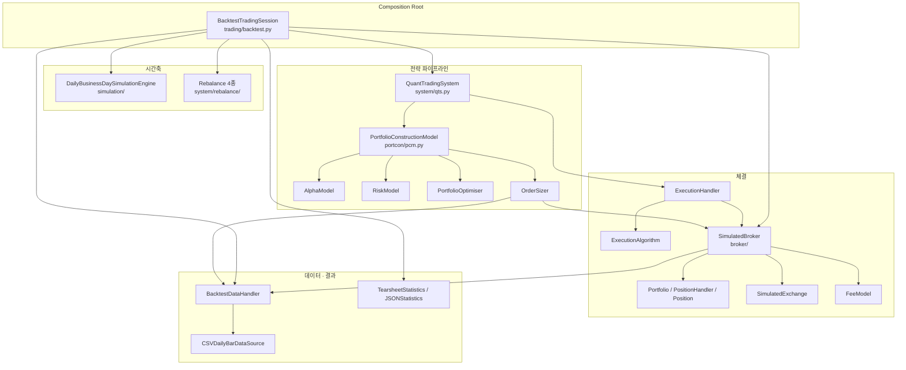
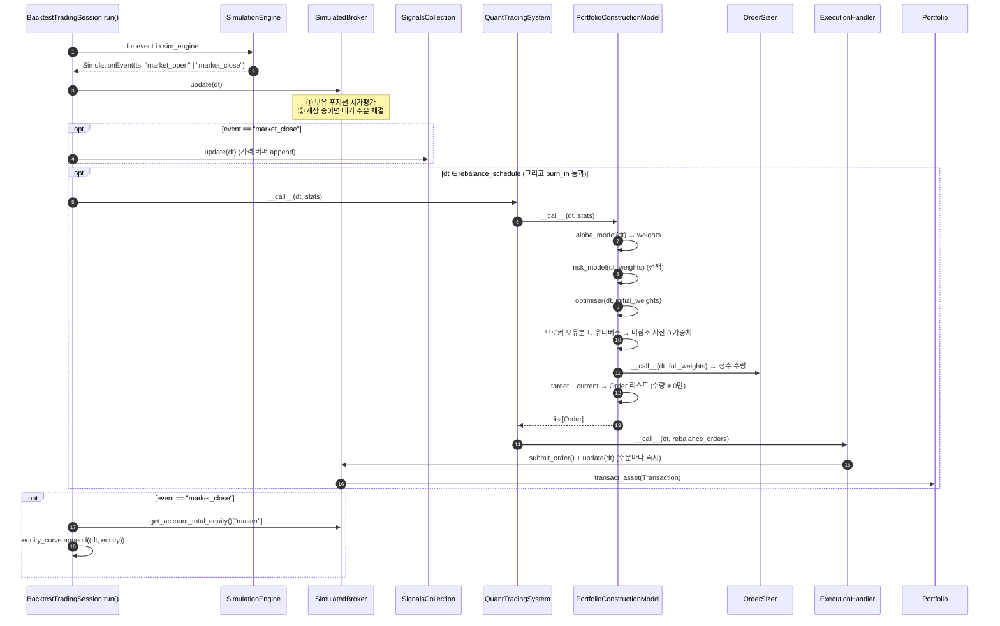
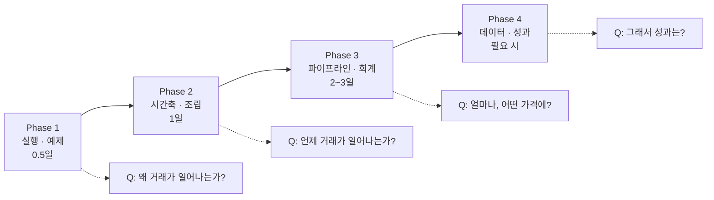
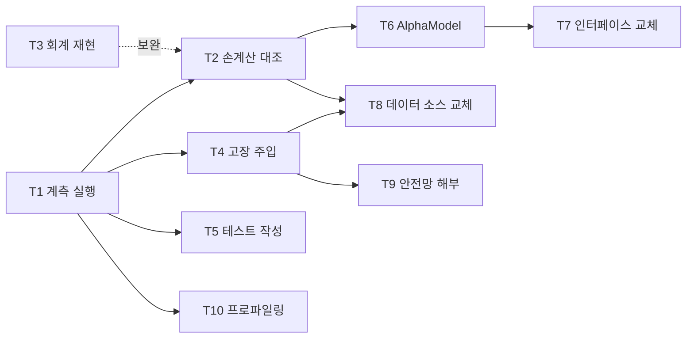

# QSTrader 코드베이스 파악 전략

| 항목 | 내용 |
| --- | --- |
| 문서 ID | `20260818-01-codebase-comprehension-strategy` |
| 작성일 | 2026-08-18 |
| 관점 | Software Architect |
| 대상 독자 | QSTrader를 확장·유지보수할 개발자 |
| 조사 기준 | `master` @ `b94c6c0` (v0.3.10) |
| 조사 방법 | 전체 소스 정적 분석 + `uv run pytest --cov=qstrader` 및 예제 백테스트 실행 실측 |

> **대체 (2026-08-23, v0.3.16)**: 본 문서는 [20260823-01](20260823-01-codebase-comprehension-strategy.md)로 **대체되었다.** 그 문서가 조사한 v0.3.16에는 라이브 평면(`trading/live.py`, `broker/kis_broker.py`, `broker/kis/`)이 존재하며, 패키지명도 `qstrader`에서 `vmtrader`로 바뀌었다. 아래 본문은 **백테스트 엔진 단독 시절의 기록**으로 읽을 것.

> **후속 (2026-08-18, v0.3.13)**: §8-1(데이터 계층 계약 부재)은 v0.3.12에서, §8-7의 실행 알고리즘·옵티마이저 주입 불가는 v0.3.13에서 해소되었다. §6의 T5~T10은 수행 완료이며, T9·T10의 결과는 [20260818-06](20260818-06-safety-net-and-profiling.md)에 있다. 그 실측이 §8-5와 §8-7의 심각도 판단을 모두 뒤집었으므로, 두 절은 결론이 아니라 측정 이전의 추정으로 읽어야 한다. 아래 본문은 **작성 시점(`b94c6c0`, v0.3.10)의 기록**이며, 보고서는 스냅샷이므로 갱신하지 않는다. 테스트 수와 커버리지를 비롯한 수치는 그 시점의 것이다.

---

## 1. 조사 기준선 (Baseline)

측정 결과는 모두 이 문서 작성 시점에 직접 실행하여 얻은 값이다.

| 지표 | 값 |
| --- | --- |
| 패키지 소스 | 68개 `.py`, 6,813 LOC (`qstrader/` 하위) |
| 서브패키지 | 12개 (`alpha_model`, `asset`, `broker`, `data`, `exchange`, `execution`, `portcon`, `risk_model`, `signals`, `simulation`, `statistics`, `system`, `trading`, `utils`) |
| 추상 기반 클래스 (ABC) | 15개 / 추상 메서드 30개 |
| 테스트 | 함수 99개 → 파라미터화 포함 **221 케이스, 전부 통과 (2.14s)** |
| 커버리지 | **74.06%** (1,762 statements, 457 miss) / 하한선 `fail_under = 70` |
| 런타임 의존성 | matplotlib, numpy, pandas, pytz, seaborn (5개뿐) |
| Python | `>= 3.10`, CI는 3.10 ~ 3.14 매트릭스 |

> **핵심 관찰**: 소스가 6.8k LOC에 불과하고 런타임 의존성이 5개뿐이다. 즉 **다 읽을 수 있는 크기**다.
> 따라서 파악 전략의 목표는 "요약본을 만드는 것"이 아니라 **어디를 어떤 순서로 읽어야 오해 없이 읽히는가**를 정하는 것이다.

---

## 2. 아키텍처 한눈에 보기

QSTrader는 **schedule-driven(스케줄 구동) 백테스트 엔진**이다. 흔히 말하는 event-driven 큐 아키텍처가 아니다.
`SimulationEngine`이 시간축을 생성하고, 그 위에서 리밸런스 시점에만 전략 파이프라인이 동기적으로 호출된다.



### 2.1 서브패키지 역할표

| 패키지 | 책임 | 진입점 | 파악 난이도 |
| --- | --- | --- | --- |
| `trading/` | 백테스트 전체 조립 + 메인 루프 | `BacktestTradingSession.run()` | ★★★ (여기가 전부의 시작) |
| `simulation/` | 시간축 이벤트 생성 (`market_open` / `market_close`) | `DailyBusinessDaySimulationEngine.__iter__` | ★ |
| `system/` | 전략 파이프라인 조립 + 리밸런스 일정 | `QuantTradingSystem.__call__` | ★★ |
| `alpha_model/` | 자산별 시그널(가중치 후보) 산출 | `AlphaModel.__call__(dt)` | ★ |
| `risk_model/` | 알파 가중치 오버라이드 (구현체 없음, 인터페이스만) | `RiskModel.__call__(dt, weights)` | ★ |
| `portcon/` | 가중치 → 정수 수량 변환 | `PortfolioConstructionModel.__call__` | ★★★ (핵심 로직 밀도 최고) |
| `execution/` | 주문 목록 → 브로커 제출 | `ExecutionHandler.__call__` | ★ |
| `broker/` | 체결 시뮬레이션, 현금·포지션·손익 회계 | `SimulatedBroker.update()` | ★★★ (부작용 집중) |
| `exchange/` | 장 개장 여부 판정 | `SimulatedExchange.is_open_at_datetime` | ★ |
| `data/` | 가격 조회 파사드 + CSV 로딩 | `BacktestDataHandler.get_asset_latest_*` | ★★ (예외 처리 함정) |
| `signals/` | 롤링 가격 버퍼 기반 지표 (모멘텀·SMA·변동성) | `SignalsCollection.update(dt)` | ★★ |
| `statistics/` | 티어시트 / JSON 성과 산출 | `TearsheetStatistics.get_results` | ★ (단 커버리지 최저) |
| `asset/` | 자산 심볼 및 유니버스 | `Universe.get_assets(dt)` | ★ |
| `utils/` | 콘솔 색상 유틸 (9줄) | — | ☆ |

---

## 3. 런타임 시퀀스 — "돈이 움직이는 한 바퀴"

코드를 이해했다는 것은 **아래 한 바퀴를 타임스탬프 단위로 재현할 수 있다**는 뜻이다.



### 3.1 이 시퀀스에서 반드시 체득해야 할 4가지

1. **주문은 "다음 시점"이 아니라 "같은 시점"에 체결된다.**
   `ExecutionHandler`는 주문을 제출한 직후 `broker.update(dt)`를 호출한다. 리밸런스 타임스탬프의 가격으로 즉시 체결된다는 뜻이다. 실거래 지연(latency)이나 다음 봉 시가 체결 모델이 아니다.
2. **매도가 매수보다 먼저 체결된다.**
   `SimulatedBroker.update()`가 `sorted(orders, key=lambda x: x[1].direction)`으로 정렬한다. direction이 `-1`(매도)이 `+1`(매수)보다 앞선다. 현금 확보를 위한 의도적 순서다.
3. **가격은 "봉"이 아니라 "시각별 bid/ask 행"으로 변환되어 있다.**
   `CSVDailyBarDataSource`가 OHLCV를 Open→14:30 UTC, Close→21:00 UTC 두 행으로 분해한다. bid = ask = 동일가(스프레드 없음)다.
4. **에쿼티 커브는 `market_close`에만 기록된다.**
   즉 일별 1포인트다. 성과 지표(`periods=252`)가 이 전제 위에 있다.

---

## 4. 확장 지점 지도 (15개 ABC)

QSTrader의 설계 의도는 README가 밝히듯 **"모든 모듈을 상속·교체할 수 있게"** 하는 것이다.
v0.3.9에서 `__metaclass__ = ABCMeta` (Python 2 관용구) → `abc.ABC`로 전환되면서 **비로소 30개 `@abstractmethod`가 실제로 강제**되기 시작했다. 그 전에는 인터페이스가 사실상 문서에 불과했다.

| 인터페이스 | 계약 | 동봉된 구현체 | 교체 난이도 | 비고 |
| --- | --- | --- | --- | --- |
| `AlphaModel` | `__call__(dt) -> dict{str: float}` | `FixedSignalsAlphaModel`, `SingleSignalAlphaModel` | ★ | **가장 먼저 만들게 될 확장점** |
| `RiskModel` | `__call__(dt, weights) -> dict` | **없음** | ★ | 인터페이스만 존재 |
| `PortfolioOptimiser` | `__call__(dt, initial_weights)` | `FixedWeight`, `EqualWeight` | ★ | 평균-분산 최적화 등 추가 여지 |
| `OrderSizer` | `__call__(dt, weights) -> dict{str: dict}` | `DollarWeightedCashBuffered`(롱온리), `LongShortLeveraged` | ★★ | 브로커·데이터핸들러 양쪽 의존 |
| `Universe` | `get_assets(dt) -> list[str]` | `StaticUniverse`, `DynamicUniverse` | ★ | |
| `Signal` | `__call__(asset, lookback)` | `SMASignal`, `MomentumSignal`, `VolatilitySignal` | ★ | `AssetPriceBuffers` 상속 |
| `FeeModel` | `calc_total_cost(asset, qty, consideration, broker)` | `ZeroFeeModel`, `PercentFeeModel` | ★ | IB 계단식 수수료 등 |
| `ExecutionAlgorithm` | `__call__(dt, initial_orders)` | `MarketOrderExecutionAlgorithm` (26줄, 사실상 pass-through) | ★★ | TWAP/VWAP 확장점 |
| `Rebalance` | `_generate_rebalances() -> list[pd.Timestamp]` | `BuyAndHold`, `Daily`, `Weekly`, `EndOfMonth` | ★ | v0.3.9에서 계약 수정됨 |
| `SimulationEngine` | `__iter__` → `SimulationEvent` | `DailyBusinessDaySimulationEngine` | ★★★ | 일중(intraday) 지원 시 최대 관문 |
| `Exchange` | `is_open_at_datetime(dt)` | `SimulatedExchange` (NYSE 하드코딩) | ★ | 휴장일 캘린더 미지원 |
| `Broker` | 12개 메서드 | `SimulatedBroker` (175 stmt) | ★★★ | 실거래 연동 시의 관문 |
| `Statistics` | `update/get_results/plot_results/save` | `TearsheetStatistics` | ★★ | |
| `TradingSession` | `run()` | `BacktestTradingSession` | ★★★ | |
| `Asset` | (추상 메서드 없음) | `Cash`, `Equity` | ☆ | 의도적으로 인스턴스화 가능 |

> **아키텍처 관점의 공백**: `DataHandler` / `DataSource`에는 **ABC가 없다**.
> `qstrader/data/`에는 `backtest_data_handler.py`와 `daily_bar_csv.py` 두 개의 구상 클래스만 있다.
> 즉 15개 모듈 중 **데이터 계층만 유일하게 계약이 문서화되어 있지 않다.** Parquet/DB/실시간 피드로 교체하려는 순간 가장 먼저 부딪히는 지점이다. (§8-1 참조)

---

## 5. 파악 전략 — 4단계 학습 경로

### 원칙: **Composition Root부터 Top-Down으로 읽는다**

`BacktestTradingSession.__init__`은 `_create_exchange` → `_create_data_handler` → `_create_broker` → `_create_simulation_engine` → `_create_rebalance_event_times` → `_create_quant_trading_system` 순으로 **전체 객체 그래프를 한 곳에서 조립**한다.
따라서 이 파일 하나가 곧 아키텍처 목차다. Bottom-up(예: `position.py`부터)으로 읽으면 각 클래스가 왜 존재하는지 모른 채 회계 로직만 읽게 되어 비효율적이다.

---

### Phase 1 — 실행부터 시킨다 (0.5일)

읽기 전에 **돌아가는 것을 본다.** 이 단계의 산출물은 "내 손에 재현 가능한 백테스트 1건"이다.

```bash
uv sync
uv run python examples/download_data.py     # SPY.csv, AGG.csv 등 생성
uv run python examples/sixty_forty.py
uv run pytest -q --cov=qstrader             # 221 passed, 74%
```

| 읽을 파일 | 왜 |
| --- | --- |
| `examples/sixty_forty.py` (75줄) | 사용자 관점의 **최소 완성 조립도**. 유니버스 → 알파모델 → 세션 → 티어시트 전 과정이 한 화면에 있다 |
| `examples/momentum_taa.py` | `AlphaModel`을 직접 상속하는 유일한 예제. 확장 방식의 정답지 |
| `README.md` Quickstart | 환경변수 `QSTRADER_CSV_DATA_DIR`의 역할 |

**검증 질문**: `sixty_forty.py`에서 `data_handler`를 명시적으로 만들어 주입하는 이유는? (→ 전략과 벤치마크 두 세션이 CSV 로딩을 공유하기 위해. 생략하면 `_create_data_handler`가 디렉터리 전체 CSV를 두 번 로딩한다.)

---

### Phase 2 — 시간축과 조립부 (1일)

| 순서 | 파일 | 읽는 목적 |
| --- | --- | --- |
| 1 | `trading/backtest.py` (140 stmt) | **전체 목차.** `__init__`의 `_create_*` 6개 → `run()` 루프 |
| 2 | `simulation/daily_bday.py` + `event.py` | 14:30 / 21:00 UTC 이벤트가 어떻게 생기는지 |
| 3 | `system/rebalance/*.py` (4종) | 리밸런스 타임스탬프가 **사전 계산된 리스트**라는 사실 |
| 4 | `system/qts.py` | PCM + ExecutionHandler 조립. `long_only` 분기로 OrderSizer가 갈린다 |

**이 단계의 핵심 통찰**:
`BacktestTradingSession._is_rebalance_event(dt)`는 `dt in self.rebalance_schedule`, 즉 **타임스탬프 완전 일치 비교**다.
스케줄 타임스탬프가 시뮬레이션 이벤트 타임스탬프와 1초라도 어긋나면 **오류 없이 조용히 거래가 0건**이 된다. (§8-6 함정 참조)

**검증 실험**:

```python
bt = BacktestTradingSession(...)
print(bt.rebalance_schedule[:5])          # 리밸런스 시각
print([e.ts for e in list(bt.sim_engine)[:5]])  # 이벤트 시각
# 두 집합의 교집합이 비어 있으면 그 백테스트는 절대 거래하지 않는다
```

---

### Phase 3 — 전략 파이프라인과 회계 (2~3일, 가장 밀도 높음)

| 순서 | 파일 | 반드시 붙잡을 개념 |
| --- | --- | --- |
| 1 | `portcon/pcm.py` (65 stmt) | `_obtain_full_asset_list` = 유니버스 ∪ 브로커 보유분. **유니버스에서 빠진 종목을 청산하는 장치** |
| 2 | `portcon/order_sizer/dollar_weighted.py` | 롱온리 + 현금버퍼. `cash_buffer_percentage`가 전체 에쿼티에 곱해진다 |
| 3 | `portcon/order_sizer/long_short.py` | `gross_leverage` 기반 정규화(`_normalise_weights`), 수수료 선차감 후 정수 절사 |
| 4 | `execution/execution_handler.py` (16 stmt) | 주문마다 `broker.update(dt)` 재호출 — 순차 체결 |
| 5 | `broker/simulated_broker.py` (175 stmt) | `update()` → `_execute_order()`. 시가평가와 체결이 한 메서드에 있다 |
| 6 | `broker/portfolio/position.py` (110 stmt) | **평균단가·실현손익 회계.** 롱↔숏 전환 처리가 가장 까다로운 부분 |
| 7 | `broker/portfolio/portfolio.py` | 현금 + 포지션 = 총자산. `PortfolioEvent` 이력 |

**검증 실험 (회계 이해도 테스트)**:

```python
# 100주 매수 → 50주 매도 → 200주 숏 전환
# 각 단계의 avg_price / realised_pnl / unrealised_pnl 을 손으로 계산한 뒤
# Position 클래스 결과와 대조한다. 불일치하면 Phase 3을 통과하지 못한 것이다.
```

**추천 도구**: `settings.PRINT_EVENTS = True`(기본값)면 모든 이벤트·주문·체결이 콘솔에 찍힌다. 짧은 기간(1개월)으로 백테스트를 돌려 로그를 통째로 읽는 것이 디버거보다 빠르다.

---

### Phase 4 — 데이터·성과·확장 (2일 이후, 필요할 때)

| 파일 | 시점 |
| --- | --- |
| `data/daily_bar_csv.py` | 데이터 소스를 교체할 때. `_convert_bar_frame_into_bid_ask_df`의 unstack 트릭이 전부다 |
| `data/backtest_data_handler.py` | **광범위 `except Exception` 때문에 디버깅이 어려운 지점** (§8-2) |
| `signals/buffer.py` + `signals/signal.py` | 지표를 추가할 때. `deque(maxlen=lookback+1)` 구조 |
| `statistics/tearsheet.py` (201 stmt) | 결과 시각화를 바꿀 때. **커버리지 13%** — 수정 시 회귀 위험 최고 |
| `statistics/json_statistics.py` (109 stmt) | **커버리지 0%.** `scripts/static_backtest.py`가 유일한 소비자 |

---

### 5.1 학습 경로 요약



이 경로는 §6의 실습 과제와 **병행한다.** Phase를 다 읽고 나서 과제를 시작하는 것이 아니라, 각 Phase의 끝에서 대응하는 과제를 수행한다 (배치 예시는 §6.3).

---

## 6. 실습 과제 — "읽은 코드"를 "아는 코드"로

§5가 **무엇을 어떤 순서로 읽을지**를 정했다면, 이 절은 **손으로 무엇을 할지**를 정한다.
읽기만으로는 §8의 함정들을 절대 발견하지 못한다. 실제로 이 보고서에 실린 결함 대부분은 코드를 눈으로 읽어서가 아니라 호출 경로를 따라가며 시그니처를 대조하는 과정에서 드러났다.

### 6.0 과제 설계 원칙 3가지

1. **모든 과제는 기계가 판정할 수 있는 성공 기준을 갖는다.**
   "이해했다"는 자기 보고는 신뢰할 수 없다. 숫자 일치, 테스트 통과, 커버리지 상승처럼 반박 가능한 기준만 쓴다.
2. **산출물이 저장소에 남는 과제를 우선한다.**
   학습 비용을 부채 상환과 결합한다. T5·T8·T9는 완료 시점에 그대로 PR이 된다.
3. **정상 동작보다 고장이 더 많이 가르쳐 준다.**
   T4(고장 주입)가 단위 시간당 학습량이 가장 크다. 이 코드베이스는 **조용히 실패하는 경로**(§8-2, §8-4, §8-6)를 여럿 갖고 있어, 고장을 일부러 내보지 않으면 그 존재를 알 수 없다.

### 6.1 과제 목록

| ID | 과제 | 선행 | 소요 | 검증하는 이해 | 산출물 |
| --- | --- | --- | --- | --- | --- |
| **T1** | 계측 실행과 이벤트 수 예측 | — | 1h | 시간축의 물리적 크기 (§3) | 로그 파일 |
| **T2** | 단일 리밸런스 손계산 대조 | T1 | 3h | 가중치 → 수량 변환 전 과정 | 계산 노트 |
| **T3** | Position 손익 회계 재현 | — | 3h | 평균단가·실현/미실현 손익 | 스크래치 스크립트 |
| **T4** | **고장 주입 4종** | T1 | 3h | 조용히 실패하는 경로 (§8) | 증상 대조표 |
| **T5** | `performance.py` 테스트 작성 | T1 | 4h | 성과 지표 정의 + 테스트 관례 | **PR** |
| **T6** | 나만의 AlphaModel | T2 | 4h | 최상위 확장 계약 (§4) | 예제 스크립트 |
| **T7** | FeeModel / ExecutionAlgorithm 교체 | T6 | 4h | 비용 모델과 실행 계층의 한계 | 비교 티어시트 |
| **T8** | 데이터 소스 교체 | T2, T4 | 6h | 계약 부재 지점 (§8-1) | **PR (DataSource ABC 초안)** |
| **T9** | 회귀 안전망 해부 | T4 | 2h | e2e 픽스처의 감지 범위 (§7) | 파괴 시나리오 목록 |
| **T10** | 프로파일링 | T1 | 2h | 성능 특성 + §8-5 / §8-7 실측 | 프로파일 리포트 |



---

### T1. 계측 실행과 이벤트 수 예측 (1h)

**목적**: 시뮬레이션 시간축이 실제로 몇 개의 이벤트를 만드는지 몸으로 안다. 이후 모든 디버깅의 기준점이 된다.

```bash
export QSTRADER_CSV_DATA_DIR=$PWD/data
uv run python examples/sixty_forty.py > /tmp/qst.log 2>&1
grep -c "market_open"  /tmp/qst.log
grep -c "market_close" /tmp/qst.log
grep -c "target weights" /tmp/qst.log
```

**먼저 예측한 뒤 확인한다.** `sixty_forty.py`는 전략과 벤치마크 **두 개의 세션**을 돌리고, 각 세션은 영업일마다 `market_open`과 `market_close`를 하나씩 만든다.

```python
import pandas as pd
n_bdays = len(pd.bdate_range('2003-09-30', '2019-12-31'))
print(n_bdays * 2)   # market_open 라인 수 예측치 (두 세션 합)
```

`target weights` 줄도 예측할 수 있다. 전략은 `end_of_month`, 벤치마크는 `buy_and_hold`이므로 **월말 영업일 수 + 1**이다.

**성공 기준**: 예측치와 실측치가 일치한다.
**빗나갔다면**: `DailyBusinessDaySimulationEngine`이 `pre_market=False, post_market=False`로 생성된다는 사실(§3)을 놓친 것이다.

> **실측 정답** (2026-08-18 확인): `market_open` 8,482 / `market_close` 8,482 / `target weights` 197.
> 영업일 4,241 × 2세션 = 8,482으로 정확히 일치하며, 197 = 월말 영업일 196 + 벤치마크의 단일 리밸런스 1이다.

> **덤**: `settings.set_print_events(False)`로 로그를 끌 수 있다. 다만 파악 단계에서는 **끄지 말 것.** 이 코드베이스에는 디버거보다 로그가 빠른 구간이 훨씬 많다.

---

### T2. 단일 리밸런스 손계산 대조 (3h) — 가장 중요한 과제

**목적**: 알파 가중치가 정수 주문 수량이 되기까지의 변환을 **한 번도 건너뛰지 않고** 재현한다.

**절차**

1. 1개월짜리 짧은 백테스트를 만든다 (`tests/integration/trading/test_backtest_e2e.py`의 설정을 그대로 베끼는 것이 가장 빠르다 — 픽스처 CSV가 3종목뿐이라 손계산이 가능하다).
2. 로그에서 첫 리밸런스의 `target weights` 줄과 `executed order` 줄을 찾는다.
3. 아래 식을 손으로 계산한다 (롱온리 = `DollarWeightedCashBufferedOrderSizer`).

```text
qty = floor( ( total_equity × (1 − cash_buffer_percentage) × normalised_weight − est_costs )
             / ask_price )
```

4. `est_costs`는 `fee_model.calc_total_cost(asset, 0, pre_cost_dollar_weight, broker)`다. `ZeroFeeModel`이면 0이다.
5. `ask_price`는 그 타임스탬프의 값이며, **bid와 같다**(§3.1-3).

**성공 기준**: 모든 종목에서 손계산 수량과 로그의 체결 수량이 **정확히 일치**(오차 0주)한다.

**빗나가는 흔한 원인 3가지**

| 증상 | 원인 |
| --- | --- |
| 전 종목이 조금씩 크게 나옴 | `cash_buffer_percentage`를 빠뜨림 |
| 가중치 합이 1이 아닌 경우에만 틀림 | `_normalise_weights`의 정규화를 빠뜨림 |
| 1주씩 크게 나옴 | 반올림으로 계산함 — 실제 구현은 `np.floor` 절사 |

**심화**: 같은 계산을 `LongShortLeveragedOrderSizer`로 반복한다. `cash_buffer` 대신 `gross_leverage`가 곱해지고 음수 가중치가 허용된다는 차이를 확인한다.

---

### T3. Position 손익 회계 재현 (3h)

**목적**: 이 코드베이스에서 **가장 틀리기 쉬운 부분**인 평균단가와 실현손익을 검증한다.

```python
from qstrader.broker.portfolio.position import Position
from qstrader.broker.transaction.transaction import Transaction
```

아래 시나리오를 **먼저 손으로 계산한 뒤** 코드에 먹여 대조한다.

| 단계 | 거래 | 손으로 구할 값 |
| --- | --- | --- |
| 1 | +100주 @ 10.0 | `avg_price`, `market_value` |
| 2 | +100주 @ 12.0 | `avg_price` (가중평균) |
| 3 | −50주 @ 15.0 | `realised_pnl`, 남은 `avg_price` |
| 4 | −250주 @ 9.0 (**롱→숏 전환**) | `realised_pnl` 확정분, 숏 포지션의 `avg_price` |

**성공 기준**: 4단계 모두 일치. 특히 **3단계에서 `avg_price`가 변하지 않는다**는 점과, **4단계에서 방향이 뒤집힐 때 실현손익이 어느 시점에 확정되는지**를 설명할 수 있어야 한다.

**대조 답안**: `tests/unit/broker/portfolio/test_position.py`(11 케이스)가 사실상 이 회계 규칙의 명세서다. 먼저 풀고 나서 열어볼 것.

---

### T4. 고장 주입 4종 (3h) — 단위 시간당 학습량 최대

**목적**: 이 엔진이 **어떻게 조용히 실패하는지**를 직접 만든다. 예외가 나는 실패는 쉽다. 문제는 예외 없이 틀린 결과를 내는 실패다.

> **필수**: 각 실험 전후로 `git stash` 또는 `git checkout -- <file>`로 원상 복구할 것. 네 건 모두 **커밋하지 않는다.**

| # | 주입 | 예측할 증상 | 배우는 것 |
| --- | --- | --- | --- |
| 1 | `examples/buy_and_hold.py`의 `start_dt` 시각을 `14:30:00` → `00:00:00`으로 | ? | §8-6. 리밸런스 스케줄과 이벤트 타임스탬프가 **완전 일치 비교**라는 사실 |
| 2 | `data/backtest_data_handler.py`의 `except Exception:` 두 곳에 `raise` 추가 | ? | §8-2. 평소 무엇이 삼켜지고 있었는지 |
| 3 | `broker/simulated_broker.py`의 `sorted(orders, key=lambda x: x[1].direction)`에서 `sorted(` 제거 | ? | §3.1-2. 매도 선행 체결이 현금 흐름에 왜 필요한지 |
| 4 | `cash_buffer_percentage`를 `0.0`으로 | ? | §8-4. 현금 잔고가 음수가 될 수 있다는 사실과 그때의 경고 문구 |

**성공 기준**: **증상을 먼저 적고** 실행한다. 4건 중 3건 이상 예측이 맞으면 §3과 §8을 체득한 것이다.

1번은 특히 중요하다. 예외도 경고도 없이 **거래 0건 · 초기자금 그대로인 평평한 에쿼티 커브**가 나오며, 티어시트는 정상적으로 그려진다. 이 증상을 한 번 본 사람과 못 본 사람의 디버깅 속도는 몇 시간 차이가 난다.

---

### T5. `statistics/performance.py` 테스트 작성 (4h) → **PR**

**목적**: 커버리지 26%의 성과 지표 모듈에 안전망을 만들면서, 이 저장소의 테스트 관례를 익힌다.

**왜 이 모듈인가**: 커버리지가 낮은 모듈은 대부분 "결과 보고" 계층이라 위험도가 낮다(§7.1). 그런데 `performance.py`만은 예외다 — CAGR·샤프·소르티노·최대낙폭은 **사용자가 의사결정에 직접 쓰는 숫자**인데 검증이 거의 없다.

**절차**

1. `create_drawdowns(returns)`부터 시작한다. 입력을 인위적으로 만들면(예: 1.0 → 1.5 → 0.75 → 1.2) 최대 낙폭과 지속 기간을 손으로 확정할 수 있다.
2. `create_sharpe_ratio(returns, periods=252)`는 상수 수익률 시계열이면 분모가 0이 되는 경계를 먼저 다룬다.
3. `create_cagr(equity, periods=252)`는 정확히 1년치 데이터로 알려진 값을 만든다.
4. 기존 테스트의 형식을 따른다: `tests/unit/statistics/test_performance.py`, `@pytest.mark.parametrize` 사용, `pytest.approx`로 부동소수 비교.

**성공 기준**

```bash
uv run pytest -q --cov=qstrader          # 전부 통과, performance.py 커버리지 상승
uv run ruff check                        # All checks passed!
```

`.coveragerc`의 `fail_under = 70`은 **낮추지 않는다**(파일 주석에 명시된 정책).

---

### T6. 나만의 AlphaModel (4h)

**목적**: 가장 먼저, 그리고 가장 자주 만들게 될 확장을 실제로 만든다.

**절차**

1. `examples/momentum_taa.py`의 `TopNMomentumAlphaModel`을 템플릿으로 삼는다. `AlphaModel`을 직접 상속하는 유일한 예제다.
2. `SMASignal`을 쓰는 단순 크로스오버 전략을 만든다 (단기 SMA > 장기 SMA면 비중 부여).
3. `SignalsCollection`에 시그널을 등록하고 `BacktestTradingSession(signals=...)`로 넘긴다.
4. **`burn_in_dt`를 반드시 설정한다.** 시그널 버퍼가 채워지기 전에는 지표가 무의미하다.

**성공 기준**: 티어시트가 그려지고, 60/40 벤치마크와 나란히 비교된다.

**여기서 마주칠 설계 관찰 2가지**

- `SignalsCollection.update()`는 `market_close`에만 호출된다. 즉 시그널은 **종가 기준 일별 1회** 갱신된다. 리밸런스가 `market_open`(14:30)이면 그날 종가는 아직 반영되지 않은 상태다.
- `SignalsCollection`에 `self.warmup` 카운터가 있지만 **패키지 내 어느 곳도 이 값을 읽지 않는다.** 워밍업 판단은 전적으로 `burn_in_dt`가 담당한다. 미완성 확장점을 알아보는 연습이다.

---

### T7. FeeModel / ExecutionAlgorithm 교체 (4h)

**(a) 비용 모델 — 이미 준비된 A/B 실험**

```bash
uv run python examples/sixty_forty.py
uv run python examples/sixty_forty_fees.py   # PercentFeeModel(0.1% 수수료, 0.5% 세금)
```

두 스크립트는 `fee_model` 인자 하나만 다르다. 티어시트를 나란히 놓고 CAGR 차이를 정량화한다.
**확인할 것**: 수수료는 **두 번** 관여한다 — 주문 수량 산정 시(`OrderSizer`의 `est_costs`)와 실제 체결 시(`SimulatedBroker._execute_order`의 `total_commission`). 이 이중 구조를 설명할 수 있어야 한다.

**(b) 실행 알고리즘 — 아키텍처 한계를 확인하는 과제**

`ExecutionAlgorithm`을 상속해 각 주문을 절반씩 두 개로 쪼개는 알고리즘을 만든다.

**예상과 다른 결과가 나온다.** `ExecutionHandler.__call__`은 주문마다 `broker.submit_order()` 직후 `broker.update(dt)`를 호출하므로, 쪼갠 두 조각이 **같은 타임스탬프·같은 가격**에 체결된다. 즉 현재 구조에서는 **시간 분할 실행(TWAP/VWAP)을 구현할 수 없다.**

**성공 기준**: 이 한계의 원인을 코드 위치로 지목하고, 해결하려면 어느 계층을 바꿔야 하는지(→ `SimulationEngine`의 이벤트 해상도, §4에서 ★★★로 표시한 이유) 설명한다.

---

### T8. 데이터 소스 교체 (6h) → **PR**

**목적**: 이 코드베이스에서 **계약이 문서화되지 않은 유일한 계층**(§8-1)을 직접 통과해 본다.

**절차**

1. CSV가 아니라 인메모리 `pd.DataFrame`을 받는 `InMemoryDailyBarDataSource`를 만든다.
2. **ABC가 없으므로** `CSVDailyBarDataSource`의 구현을 읽어 계약을 역추출해야 한다. 필요한 것은 `get_bid(dt, asset)`, `get_ask(dt, asset)`, `get_assets_historical_closes(...)` 세 개다.
3. `tests/integration/trading/fixtures/`의 `ABC.csv`, `DEF.csv`를 DataFrame으로 올려 주입한다.
4. `test_backtest_sixty_forty`와 **동일한 포트폴리오 결과**가 나오는지 확인한다.

**성공 기준**: 기존 e2e 테스트의 기대값과 수치가 일치한다.

**이 과제의 진짜 산출물**: 작업 중 역추출한 계약을 `DataSource` ABC 초안으로 정리한다. 그 과정에서 §8-1의 시그니처 불일치(`get_assets_historical_closes`가 `adjusted` 인자를 받지 않는데 호출부는 넘긴다)를 스스로 재발견하게 된다. **직접 부딪혀 본 뒤에 §8-1을 읽는 것**을 권한다.

---

### T9. 회귀 안전망 해부 (2h)

**목적**: 무엇을 고쳐도 되고 무엇을 고치면 안 되는지의 경계를 안다.

`tests/integration/trading/test_backtest_e2e.py`는 이 저장소의 최후 방어선이다. 두 가지를 검사한다.

- `portfolio.portfolio_to_dict()` — 종목별 수량·시장가치·실현/미실현 손익을 `pytest.approx`로 비교
- `portfolio.history_to_df()` — **모든 거래 이력 전체**를 `sixty_forty_history.dat`와 `assert_frame_equal`로 완전 일치 비교

두 번째가 핵심이다. 픽스처 첫 줄이 `subscription,SUBSCRIPTION,0.00,1000000.0,1000000.0`이고 이어서 모든 체결이 기록된다. **주문 하나만 달라져도 깨진다.**

**과제**: 이 테스트를 깨뜨리는 변경을 3가지 이상 찾아 실제로 확인한다. (예: `fee_model` 주입, 리밸런스 요일 변경, 절사를 반올림으로 변경)

**성공 기준**: "이 테스트가 통과하면 체결 로직은 건드리지 않은 것"이라고 말할 수 있는 근거를 갖는다. 동시에 **이 테스트가 잡지 못하는 것**(티어시트 렌더링, JSON 통계, 변동성 시그널 — 전부 커버리지 0~13%)도 열거할 수 있어야 한다.

---

### T10. 프로파일링 (2h)

**목적**: §8-5와 §8-7의 성능 관련 주장을 **실측으로 검증**한다. 보고서를 믿지 말고 재보는 연습이다.

```bash
export QSTRADER_CSV_DATA_DIR=$PWD/data
uv run python -m cProfile -s cumtime examples/sixty_forty.py 2>/dev/null | head -30
```

**확인할 것**

| 관찰 대상 | 검증할 주장 |
| --- | --- |
| `get_bid` / `get_indexer` 누적 시간 | 가격 조회가 병목인가 (§8-5의 `lru_cache`가 필요한 이유) |
| `lru_cache` 히트율 (`CSVDailyBarDataSource.get_bid.cache_info()`) | 캐시가 실제로 효과가 있는가 |
| `_is_rebalance_event`의 호출 횟수 × 리스트 길이 | `dt in list`의 O(n)이 실제로 문제인가 (§8-7) |

**성공 기준**: 상위 5개 함수를 특정하고, 위 세 주장 각각에 대해 **실측 근거로** 동의 또는 반박한다.

> 아키텍트 관점의 부연: §8-7의 `dt in list`는 리스트 길이가 최대 수천(일별 리밸런스 × 수십 년)이므로 실무 영향은 대체로 무시할 만하다. 이 과제의 목적은 최적화가 아니라 **부채 목록에 적혀 있다고 다 고칠 가치가 있는 것은 아니다**를 실측으로 판별하는 감각을 기르는 것이다.

---

### 6.2 안티패턴 — 이렇게 파악하지 말 것

| 안티패턴 | 왜 실패하는가 |
| --- | --- |
| 디렉터리·알파벳 순으로 전량 정독 | `alpha_model/`이 첫 디렉터리라 **가장 단순한 모듈**부터 읽게 되고, 전체 구조는 마지막에야 보인다. §5의 Composition Root 우선 원칙과 정반대 |
| 디버거 스텝인만으로 파악 | 메인 루프가 영업일 × 2 이벤트를 돈다. 리밸런스 한 번에 도달하기까지 수십 번 스텝오버해야 하고, 그 사이 맥락을 잃는다. **로그가 더 빠르다** |
| `tearsheet.py`부터 읽기 | 최대 모듈(201 stmt)이지만 커버리지 13%에 본질과 무관한 matplotlib 배치 코드다. 시간 대비 학습량 최저 |
| 예제를 복사해 파라미터만 바꾸기 | §8-6 함정에 그대로 빠진다. 예제가 `14:30:00`을 쓰는 **이유**를 모르면 날짜를 바꾸는 순간 거래가 0건이 된다 |
| `PRINT_EVENTS`를 끈 채 디버깅 | 이 엔진의 관측 수단은 사실상 이 로그뿐이다. 구조화된 로깅 핸들러는 아직 없다(`pcm.py`의 `# TODO: Improve this with a full statistics logging handler`) |
| 테스트를 읽지 않음 | `test_position.py`와 `test_simulated_broker.py`는 **회계 규칙의 유일한 명세서**다. 소스 주석보다 정확하다 |

### 6.3 2주 배치 예시

| 주차 | 일자 | 과제 | 누적 도달점 |
| --- | --- | --- | --- |
| 1주 | 1일 | §5 Phase 1 + **T1** | 돌아가는 백테스트와 이벤트 감각 |
| | 2일 | §5 Phase 2 + **T4** | 시간축·리밸런스, 조용한 실패 경로 |
| | 3~4일 | §5 Phase 3 + **T2**, **T3** | 주문 수량과 손익 회계를 손으로 재현 |
| | 5일 | **T9**, **T10** | 안전망 범위와 성능 특성 |
| 2주 | 1~2일 | **T5** | 첫 PR. 테스트 관례 습득 |
| | 3일 | **T6** | 첫 전략 확장 |
| | 4일 | **T7** | 실행 계층의 구조적 한계 인식 |
| | 5일 | **T8** | 아키텍처 경계 검증 + 두 번째 PR |

2주차를 마치면 §9의 체크리스트 10문항에 코드를 열지 않고 답할 수 있어야 한다.

---

## 7. 테스트 스위트를 "명세서"로 읽기

커버리지 74%는 숫자 자체보다 **어디가 비어 있는지**가 중요하다. 테스트는 사실상 두 번째 문서다.

| 테스트 | 케이스 수 | 문서로서의 가치 |
| --- | --- | --- |
| `tests/integration/trading/test_backtest_e2e.py` | 4 | **최고 가치.** 60/40과 롱숏 전략의 에쿼티 커브를 `.dat` 픽스처와 전량 대조. 회귀의 최후 방어선 |
| `tests/unit/broker/test_simulated_broker.py` | 21 | 브로커 계약의 사실상 유일한 명세 |
| `tests/unit/broker/portfolio/test_position.py` | 11 | 손익 회계 규칙 명세. Phase 3 답안지 |
| `tests/unit/test_abstract_base_classes.py` | 9 (56 assert) | v0.3.9에서 추가. **"모든 ABC가 진짜 ABC인가"를 고정** |
| `tests/integration/portcon/test_pcm_e2e.py` | 1 | 가중치 → 주문 변환 전체 경로 |

### 7.1 커버리지 공백 지도 (실측)

| 모듈 | 커버리지 | 리스크 해석 |
| --- | --- | --- |
| `statistics/json_statistics.py` | **0%** (109 stmt) | 손대는 순간 무방비. 수정 전 테스트 선작성 필요 |
| `signals/vol.py` | **0%** (18 stmt) | 변동성 시그널 검증 전무. 다른 시그널은 테스트 있음 |
| `signals/signals_collection.py` | **0%** (16 stmt) | 시그널 오케스트레이터가 통합 테스트로도 안 잡힘 |
| `statistics/tearsheet.py` | **13%** (201 stmt) | 최대 모듈인데 최저 커버리지 |
| `statistics/performance.py` | 26% | CAGR/샤프/소르티노/드로다운 — **성과 수치의 정확성이 미검증** |
| `data/backtest_data_handler.py` | 62% | 미검증 경로 대부분이 `except Exception` 분기 |
| `broker/simulated_broker.py` | 93% | 양호 |
| `portcon/*` | 91~100% | 양호 |
| `system/rebalance/*` | 100% | 양호 |

> **아키텍트 판단**: 커버리지가 낮은 곳은 전부 **"결과 보고" 계층**(statistics)이고, 높은 곳은 전부 **"돈이 움직이는" 계층**(broker, portcon)이다.
> 이는 우연이 아니라 합리적 우선순위의 결과로 보인다. 다만 `performance.py`의 26%는 예외다 — 성과 지표는 보고 계층이지만 **사용자가 의사결정에 직접 쓰는 숫자**이므로 위험 등급이 다르다.

---

## 8. 리스크 · 기술부채 지도

코드를 읽다가 마주치면 **"내가 잘못 이해한 것"이 아니라 "코드가 그런 것"임**을 알아야 하는 항목들이다. 파악 단계에서 가장 많은 시간을 잡아먹는 지점이므로 미리 명시한다.

### 8-1. 데이터 계층에 인터페이스가 없다 (설계 공백)

`BacktestDataHandler`와 `CSVDailyBarDataSource`는 **덕 타이핑으로만 연결**되어 있고 ABC가 없다.
그 결과 계약 불일치가 실제로 존재한다:

```python
# backtest_data_handler.py:75
prices_df = ds.get_assets_historical_closes(
    start_dt, end_dt, asset_symbols, adjusted=adjusted   # ← adjusted 전달
)

# daily_bar_csv.py:250
def get_assets_historical_closes(self, start_dt, end_dt, assets):   # ← adjusted 미수용
```

호출 시 `TypeError`가 나며, 감싼 `except Exception`은 `raise`로 재던진다.
현재 **이 메서드를 호출하는 코드가 패키지 내에 없어서**(grep 결과 정의 2곳 + 호출 1곳뿐) 드러나지 않는 사실상의 죽은 코드다.
→ *영향*: 다중 자산 히스토리컬 종가 조회를 쓰려는 순간 즉시 막힌다. 데이터 계층을 확장할 때 최우선 정리 대상.

### 8-2. 광범위 예외 삼킴 (디버깅 최대 장애물)

```python
# backtest_data_handler.py
try:
    bid = ds.get_bid(dt, asset_symbol)
    ...
except Exception:
    bid = np.nan
```

`KeyError`(심볼 없음), `IndexError`(범위 밖), 오타로 인한 `AttributeError`가 **전부 동일하게 `NaN`으로 수렴**한다.
데이터 문제로 백테스트가 이상해질 때 원인 추적이 매우 어렵다.
→ *파악 요령*: 데이터 관련 이슈를 디버깅할 때는 이 `except` 두 곳에 임시로 `raise`를 넣고 시작하라.

### 8-3. NaN 가드가 객체 동일성에 의존

```python
# simulated_broker.py:_execute_order
bid_ask = self.data_handler.get_asset_latest_bid_ask_price(dt, order.asset)
if bid_ask == (np.nan, np.nan):
    raise ValueError(price_err_msg)
```

`NaN != NaN`이므로 이 비교는 값 비교로는 항상 `False`다. 파이썬 튜플 비교가 요소별로 **동일성(`is`)을 먼저 검사**하기 때문에, `np.nan` 싱글턴 객체가 그대로 전달된 경우에만 우연히 참이 된다.
pandas 연산에서 생성된 다른 NaN 객체가 오면 가드를 통과해 버리고, 이후 `round(nan * qty)`에서 다른 예외가 난다.
→ *올바른 형태*: `np.isnan(bid_ask[0]) and np.isnan(bid_ask[1])`.

### 8-4. `scaled_quantity`는 실제로 스케일되지 않는다

```python
scaled_quantity = order.quantity
if est_total_cost > total_cash:
    print("WARNING: ... Transaction will still occur with a negative cash balance.")
```

변수명이 의도(현금 부족 시 수량 축소)를 암시하지만 구현은 **경고 출력 후 그대로 체결**이다. 현금 잔고가 음수가 될 수 있다.
→ *영향*: 레버리지 없는 롱온리 전략에서도 음수 현금이 나올 수 있으므로, 에쿼티 커브 해석 시 유의.

### 8-5. 인스턴스 메서드에 `lru_cache`

```python
@functools.lru_cache(maxsize=1024 * 1024)
def get_bid(self, dt, asset):
```

`self`가 캐시 키에 포함되므로 **데이터 소스 인스턴스가 프로세스 종료까지 해제되지 않는다.** 캐시 최대 항목 수도 1,048,576개다.
단일 백테스트에서는 의도된 최적화지만, 파라미터 스윕처럼 데이터 소스를 반복 생성하는 사용에서는 메모리가 선형 증가한다.

### 8-6. `buy_and_hold` 시작 시각 함정 (신규 사용자 최다 실수)

`BuyAndHoldRebalance`는 `start_dt`를 **그대로** 유일한 리밸런스 시각으로 반환한다.
그런데 시뮬레이션 엔진이 만드는 이벤트는 `14:30`과 `21:00` UTC뿐이다(백테스트는 pre/post market을 끈다).

```python
# 정상 — 예제들이 14:30:00을 쓰는 이유
start_dt = pd.Timestamp('2003-09-30 14:30:00', tz=pytz.UTC)

# 위험 — 오류 없이 거래 0건, 에쿼티 커브는 초기자금 평평한 직선
start_dt = pd.Timestamp('2003-09-30', tz=pytz.UTC)
```

→ *증상*: 예외도 경고도 없이 "전략이 아무것도 안 사는" 백테스트. 원인 파악에 몇 시간이 걸릴 수 있다.

### 8-7. 기타 하드코딩 · 미구현

| 항목 | 위치 | 상태 |
| --- | --- | --- |
| NYSE 개장시간 하드코딩 (`14:30`~`21:00` UTC) | `simulated_exchange.py` | `# TODO: Eliminate hardcoding of NYSE` |
| 거래소 휴장일 캘린더 | 전역 | 미지원. 월~금 = 영업일 |
| 슬리피지 모델 | `simulated_broker.py` | `self.slippage_model = None  # TODO` |
| 마켓 임팩트 모델 | `simulated_broker.py` | `self.market_impact_model = None  # TODO` |
| Bid/Ask 스프레드 | `daily_bar_csv.py` | `Bid = Ask = Price` (스프레드 0) |
| 자산 타입 | 전역 | Equity 하드코딩 (`asset_type` 파라미터는 미사용) |
| `DynamicUniverse` 자산 제거 | `dynamic.py` | 추가만 지원, 제거/재편입 미지원 |
| `PRINT_EVENTS` 전역 상태 | `settings.py` | 모듈 전역 변수 + `global` 문. 병렬 백테스트 시 공유됨 |
| 리밸런스 판정 | `backtest.py` | `dt in list` — O(n). `set`이면 O(1) |

> 이 목록은 **결함 보고가 아니라 파악 지도**다. 오픈소스 백테스터로서 의도된 단순화(스프레드 0, 휴장일 무시)와 실제 정리 대상(§8-1, §8-3)이 섞여 있으며, 후자만 별도 이슈로 분리할 것을 권고한다.

---

## 9. 파악 완료 판정 체크리스트

아래 10문항에 **코드를 다시 열지 않고** 답할 수 있으면 Phase 3까지 통과한 것으로 본다.

| # | 질문 | 관련 절 |
| --- | --- | --- |
| 1 | 하루에 시뮬레이션 이벤트는 몇 개 발생하며, 각각 몇 시(UTC)인가? | §3 |
| 2 | 리밸런스 시점 판정은 어떤 자료구조로, 어떤 비교 방식으로 이루어지는가? | §5 Phase 2 |
| 3 | 알파모델이 반환한 가중치가 정수 주문 수량이 되기까지 거치는 4단계는? | §3 시퀀스 |
| 4 | 유니버스에서 빠진 종목은 어떻게 청산되는가? | §5 Phase 3 |
| 5 | 매수와 매도 중 어느 쪽이 먼저 체결되며, 그 이유는? | §3.1-2 |
| 6 | `long_only=True`와 `False`에서 각각 어떤 OrderSizer가 선택되고, 필수 kwargs는? | §2.1 |
| 7 | 에쿼티 커브의 샘플링 주기는? `burn_in_dt`는 무엇에 영향을 주는가? | §3.1-4 |
| 8 | 데이터 소스에서 가격 조회가 실패하면 시스템은 어떻게 반응하는가? | §8-2 |
| 9 | 수수료는 주문 수량 산정 시점과 체결 시점 중 어디서 계산되는가? (답: **양쪽 모두**) | §5 Phase 3 |
| 10 | 새 지표(예: RSI)를 추가하려면 어떤 클래스를 상속하고 어떤 메서드를 구현하는가? | §4 |

---

## 10. 문서화 로드맵 제안 — `docs/user` / `docs/dev` 분리

이번 요청에서 제기된 폴더 구조 질문에 대한 아키텍트 의견은 **분리 찬성**이다. 근거와 구조는 다음과 같다.

### 10.1 근거

QSTrader에는 **성격이 근본적으로 다른 두 독자**가 존재한다.

- **사용자(전략 개발자)**: `AlphaModel`을 상속해 전략을 쓰는 사람. 내부 회계 로직을 몰라도 된다. 필요한 것은 조립법, 파라미터 의미, 함정(§8-6) 목록이다.
- **개발자(엔진 기여자)**: `SimulatedBroker`나 `PortfolioConstructionModel`을 수정하는 사람. 필요한 것은 계약, 불변식, 커버리지 공백, 부채 목록이다.

이 둘을 한 디렉터리에 섞으면 사용자는 압도되고, 개발자는 자기 문서를 못 찾는다. 이미 저장소에 그 조짐이 있다 — 루트 `README.md`(18KB)가 설치·퀵스타트·예제·스크립트를 모두 떠안고 있고, `examples/README.md`가 별도로 존재한다.

### 10.2 제안 구조

```text
docs/
├── README.md                  # 문서 지도 (두 갈래로 안내)
├── user/                      # 전략 개발자용
│   ├── getting-started.md     # 설치 → 데이터 → 첫 백테스트
│   ├── configuration.md       # 환경변수, .env, 리밸런스 옵션
│   ├── writing-an-alpha-model.md
│   ├── interpreting-results.md# 티어시트 지표 해석
│   └── pitfalls.md            # §8-6 등 사용자가 밟는 함정 모음
└── dev/                       # 엔진 기여자용
    ├── architecture.md        # §2, §3 (본 보고서에서 승격)
    ├── extension-points.md    # §4 ABC 지도
    ├── testing.md             # §7 테스트 전략 · 커버리지 정책
    ├── contributing.md        # 릴리스 · CHANGELOG 관례
    └── reports/               # 시점별 조사 보고서 (본 문서 위치)
        └── {yyyymmdd-nn}-{topic}.md
```

### 10.3 `reports/`를 별도로 두는 이유

`docs/dev/*.md`(architecture.md 등)는 **현재 상태를 서술하는 살아있는 문서**로 코드와 함께 갱신되어야 한다.
반면 `reports/*`는 **특정 시점의 스냅샷**이다. 본 문서가 "`master` @ `b94c6c0`, 커버리지 74.06%" 기준임을 명시하는 이유가 그것이다.
둘을 섞으면 낡은 조사 결과가 현재 명세처럼 읽히는 사고가 난다. 날짜 접두 파일명(`{yyyymmdd-nn}`)은 이 구분을 파일명 수준에서 강제한다.

### 10.4 후속 작업 제안 (우선순위순)

| 순위 | 작업 | 근거 |
| --- | --- | --- |
| 1 | `docs/user/pitfalls.md` 작성 (§8-6 우선) | 오류 없이 조용히 실패하는 함정. 사용자 손실이 가장 큼 |
| 2 | `docs/dev/architecture.md`로 §2·§3 승격 | 살아있는 문서로 전환 |
| 3 | `README.md` 슬림화 → `docs/user/`로 이관 | 18KB는 진입 장벽 |
| 4 | §8-1, §8-3을 별도 이슈로 등록 | 의도된 단순화가 아닌 실제 결함 |
| 5 | `statistics/performance.py` 테스트 추가 | 26% 커버리지 + 사용자 의사결정 직결 |

> 5번은 §6의 **T5**와, 4번의 `§8-1`은 **T8**과 같은 작업이다. 신규 인력의 파악 과제를 그대로 부채 상환에 배정하면 온보딩 비용이 산출물로 회수된다 — §6.0의 설계 원칙 2가 노리는 바다.

---

## 부록 A. 모듈 규모 · 커버리지 상위표 (실측)

| 모듈 | statements | 커버리지 | 파악 우선순위 |
| --- | --- | --- | --- |
| `statistics/tearsheet.py` | 201 | 13% | 낮음 (필요 시) |
| `broker/simulated_broker.py` | 175 | 93% | **최상** |
| `trading/backtest.py` | 140 | 90% | **최상** |
| `broker/portfolio/position.py` | 110 | 96% | 높음 |
| `statistics/json_statistics.py` | 109 | 0% | 낮음 |
| `broker/portfolio/portfolio.py` | 96 | 95% | 높음 |
| `data/daily_bar_csv.py` | 92 | 83% | 중간 |
| `portcon/pcm.py` | 65 | 91% | **최상** |
| `env_file.py` | 55 | 95% | 낮음 |
| `data/backtest_data_handler.py` | 45 | 62% | 중간 |
| `portcon/order_sizer/dollar_weighted.py` | 40 | 95% | 높음 |
| `portcon/order_sizer/long_short.py` | 39 | 95% | 높음 |
| `system/qts.py` | 37 | 95% | 높음 |
| `execution/order.py` | 31 | 74% | 중간 |
| `statistics/performance.py` | 31 | 26% | 중간 |

## 부록 B. 용어집

| 용어 | 코드상 의미 |
| --- | --- |
| **심볼 표기** | `'EQ:SPY'` — `EQ:` 접두는 `CSVDailyBarDataSource._obtain_asset_symbol_from_filename`이 파일명에서 생성 |
| **weights** | `dict{str: float}`. 정규화 전 상태로 알파모델에서 나온다 |
| **target_portfolio** | `dict{str: {"quantity": int}}`. OrderSizer 출력 |
| **rebalance_orders** | 목표 − 현재의 차분. 수량 0인 항목은 제외 |
| **consideration** | `round(price * quantity)`. 수수료 계산의 기준 금액 |
| **cash buffer** | 롱온리 사이저에서 미투자 현금 비율. `1 - cash_buffer_percentage`가 투자 비중 |
| **gross leverage** | 롱숏 사이저에서 `sum(&#124;weights&#124;)`를 맞출 목표 총노출 |
| **burn_in_dt** | 이 시각 이전에는 리밸런스도 에쿼티 기록도 하지 않는다 (지표 워밍업용) |
| **master** | `get_account_total_equity()` 반환 dict의 계좌 전체 합계 키 |

---

*본 보고서는 `master` @ `b94c6c0` (v0.3.10) 기준이며, 커버리지·테스트 수치는 2026-08-18 로컬 실행 결과다. 코드 변경 시 §6(T1 실측 정답), §7, §8, 부록 A의 수치는 재측정이 필요하다.*
