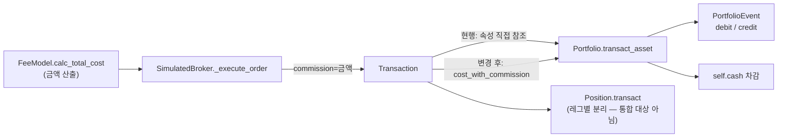

# `Transaction.cost_with_commission` 통합 — 구현 준비서

| 항목 | 내용 |
| --- | --- |
| 문서 ID | `20260818-02-transaction-cost-consolidation` |
| 작성일 | 2026-08-18 |
| 관점 | Software Architect |
| 상태 | **준비 완료 · 미구현** (본 문서는 설계와 검증 계획만 담는다. 코드는 변경하지 않았다) |
| 조사 기준 | `master` @ `b94c6c0` + 미커밋 라이선스 변경분 |
| 선행 문서 | [20260818-01-codebase-comprehension-strategy.md](20260818-01-codebase-comprehension-strategy.md) |

---

## 1. 요약

`Transaction`은 거래 총비용을 계산하는 `cost_with_commission` 프로퍼티를 갖고 있으나 **패키지 어디에서도 호출되지 않는다.** 한편 `Portfolio.transact_asset`은 같은 공식을 지역 변수로 **다시 구현**하고 있다. 즉 하나의 회계 규칙이 두 곳에 존재하며, 그중 하나는 죽어 있고 테스트도 없다.

본 작업은 `Portfolio`가 그 프로퍼티를 사용하도록 바꿔 **단일 정의 지점**을 만든다. 계산 결과는 바뀌지 않는다(§4의 동치성 분석). 얻는 것은 죽은 코드의 부활, 중복 제거, 그리고 `transaction.py`의 커버리지 80% → 100%다.

> **범위 밖으로 명시적으로 분리한 것**: `SimulatedBroker._execute_order`의 `est_total_cost`는 같은 공식처럼 보이지만 **반올림된 값을 쓰므로 동치가 아니다.** 통합해서는 안 된다. 그 과정에서 발견한 별개의 결함은 §8에 기록한다.

---

## 2. 현행 구조

### 2.1 정의 (사용되지 않음)

`qstrader/broker/transaction/transaction.py:59-86`

```python
@property
def cost_without_commission(self):
    return self.quantity * self.price

@property
def cost_with_commission(self):
    if self.commission == 0.0:
        return self.cost_without_commission
    else:
        return self.cost_without_commission + self.commission
```

### 2.2 중복 구현 (실제로 쓰이는 쪽)

`qstrader/broker/portfolio/portfolio.py:216-217`

```python
txn_share_cost = txn.price * txn.quantity
txn_total_cost = txn_share_cost + txn.commission
```

`txn_total_cost`는 이후 5곳에서 쓰인다 — 현금 부족 경고(219), 현금 차감(232), `PortfolioEvent`의 debit(244)/credit(259), 로그 출력(252, 267).
반면 `txn_share_cost`는 **217행 한 곳에서만** 쓰이므로, 통합 시 지역 변수 자체가 사라진다.

### 2.3 근거 자료

| 확인 항목 | 결과 |
| --- | --- |
| `cost_with_commission` 호출처 (`.venv` 제외 전체 검색) | **0건** (정의부 제외) |
| `cost_without_commission` 호출처 | **1건** — `cost_with_commission` 내부뿐 |
| `transaction.py` 커버리지 | **80%** (20 stmt, 4 miss) — 미커버 라인이 정확히 `70, 83-86`, 즉 두 프로퍼티 본문 전체 |
| `tests/unit/broker/transaction/test_transaction.py` | 테스트 1개(`test_transaction_representation`)뿐. 두 프로퍼티를 검증하지 않음 |

---

## 3. 왜 통합하는가 — 아키텍처 관점

| 관점 | 현행의 문제 |
| --- | --- |
| **단일 책임** | "거래 하나의 총비용은 얼마인가"는 `Transaction`의 질문이다. `Portfolio`는 그 값을 **소비**해야 하지 계산해서는 안 된다 |
| **변경 취약성** | 수수료 회계를 바꾸려면 지금은 두 곳을 동시에 고쳐야 하고, 한쪽만 고쳐도 테스트가 잡지 못한다 (§2.3의 커버리지 0%) |
| **죽은 코드** | 호출되지 않는 프로퍼티는 시간이 지나면 실제 동작과 어긋난다. 실제로 `Transaction`에는 `__eq__`가 없어 이미 검증 수단이 빈약하다 |
| **테스트 가능성** | `Transaction`은 의존성이 없는 값 객체다. 같은 규칙을 `Portfolio` 안에서 테스트하려면 포트폴리오·현금·이벤트 이력을 전부 세워야 한다 |

> 반대 논거도 기록해 둔다: 지역 변수 2줄은 그 자체로 읽기 쉽고, 프로퍼티 호출은 간접 참조를 하나 더한다. 다만 **정의가 이미 존재하고 테스트도 없이 방치되어 있다**는 점이 결정적이다. 선택지는 "통합" 아니면 "프로퍼티 삭제"이며, 현상 유지는 최악이다.

---

## 4. 동치성 분석 — 결과가 바뀌지 않는 근거

### 4.1 곱셈

| 현행 | 프로퍼티 |
| --- | --- |
| `txn.price * txn.quantity` | `self.quantity * self.price` |

IEEE 754에서 부동소수 곱셈은 교환법칙이 **정확히** 성립한다(`a * b`와 `b * a`는 비트 단위로 동일). 피연산자 순서 차이는 무해하다.

### 4.2 덧셈과 분기

`commission == 0.0`일 때 현행 프로퍼티는 덧셈을 건너뛴다. `x + 0.0`은 `x`와 값이 같으므로 **단 하나의 예외를 빼면** 분기 유무는 결과에 영향이 없다.

**유일한 예외: `x`가 `-0.0`인 경우.** `-0.0 + 0.0`은 IEEE 754 반올림 규칙(round-to-nearest)에 따라 `+0.0`이 된다.

| 도달 경로 | 가능한가 |
| --- | --- |
| `quantity == 0` | 불가. `PortfolioConstructionModel._generate_rebalance_orders`가 수량 0인 주문을 생성하지 않고, `Position.transact`도 조기 반환한다 |
| `price == 0.0` **and** `quantity < 0` | 이론상 가능 (가격 0인 데이터가 들어온 매도). 이때만 `-0.0` 발생 |

그 경우에도 실무 영향은 없다. `-0.0 == 0.0`은 `True`이므로 219행의 비교, 232행의 차감, `assert_frame_equal`의 수치 비교가 모두 동일하게 동작한다. 차이가 드러나는 곳은 `repr` 출력과 `PortfolioEvent`의 credit 필드 부호 표기(`-1.0 * round(-0.0, 2)` → `0.0` vs `-0.0`)뿐이며, 어느 쪽도 회계 결과가 아니다.

**결론**: 수치 결과는 동일하다. e2e 픽스처도 변경되지 않을 것으로 예상하며, §7에 그 검증 절차를 둔다.

---

## 5. 변경 설계

### 5.1 Option A — `Portfolio`가 프로퍼티를 사용 (필수)

`qstrader/broker/portfolio/portfolio.py`

```diff
-        txn_share_cost = txn.price * txn.quantity
-        txn_total_cost = txn_share_cost + txn.commission
+        txn_total_cost = txn.cost_with_commission
```

`txn_share_cost`는 다른 사용처가 없으므로 함께 사라진다(§2.2).

### 5.2 Option B — 불필요한 분기 제거 (권고: 함께 수행)

`qstrader/broker/transaction/transaction.py`

```diff
     @property
     def cost_with_commission(self):
         """
         Calculate the cost of the transaction including
         any commission costs.

         Returns
         -------
         `float`
             The transaction cost with commission.
         """
-        if self.commission == 0.0:
-            return self.cost_without_commission
-        else:
-            return self.cost_without_commission + self.commission
+        return self.cost_without_commission + self.commission
```

§4.2에서 보였듯 분기는 `-0.0`이라는 도달 불가에 가까운 경우를 제외하면 무의미하다. 남겨두면 "0일 때는 뭔가 다른가?"라는 잘못된 질문을 계속 유발한다.

**A와 B를 한 PR로 묶는다.** B만 하면 여전히 죽은 코드이고, A만 하면 통합한 대상에 군더더기가 남는다.

### 5.3 Option C — `Position`까지 통합 (비채택)

`Position._transact_buy` / `_transact_sell`은 매수·매도 **레그별로** 수수료를 나누어 누적한다(`buy_commission`, `sell_commission`). `cost_with_commission`은 이 둘을 구분하지 않는 단일 스칼라이므로 대체할 수 없다. `Position`의 평균단가 계산(`position.py:168-170`)은 매수 단가에 `+ buy_commission`, 매도 단가에 `- sell_commission`을 적용하는 **부호가 다른 공식**이다.

→ **적용하지 않는다.** 표면적 유사성에 이끌린 통합은 회계를 망가뜨린다.

---

## 6. 영향 범위



| 파일 | 변경 | 성격 |
| --- | --- | --- |
| `broker/portfolio/portfolio.py` | 2줄 → 1줄 | 필수 |
| `broker/transaction/transaction.py` | 분기 제거 | 권고 |
| `tests/unit/broker/transaction/test_transaction.py` | 테스트 추가 | 필수 (§7.1) |
| `CHANGELOG.md`, `pyproject.toml` | 0.3.12 항목 + 버전 | 저장소 관례 |

**변경하지 않는 파일**: `simulated_broker.py`(§8), `position.py`(§5.3), 모든 e2e 픽스처(§7.2).

---

## 7. 검증 계획

### 7.1 신규 단위 테스트

`tests/unit/broker/transaction/test_transaction.py`에 아래 4조합을 `@pytest.mark.parametrize`로 추가한다. 현재 이 두 프로퍼티는 **테스트가 전무**하므로, 통합 이전에 먼저 고정해 두는 것이 순서상 맞다.

| # | quantity | price | commission | `cost_without_commission` | `cost_with_commission` | 확인하는 것 |
| --- | --- | --- | --- | --- | --- | --- |
| 1 | `100` | `10.0` | `0.0` | `1000.0` | `1000.0` | 수수료 없는 매수 |
| 2 | `100` | `10.0` | `5.0` | `1000.0` | `1005.0` | 매수 시 비용 증가 |
| 3 | `-100` | `10.0` | `0.0` | `-1000.0` | `-1000.0` | 매도의 부호 |
| 4 | `-100` | `10.0` | `5.0` | `-1000.0` | `-995.0` | **매도 시 수수료가 유입액을 줄인다** |

4번이 핵심이다. `+`가 매도에서도 옳은 이유(수수료는 `PercentFeeModel._calc_commission`의 `abs(consideration)` 때문에 항상 양수이고, 방향과 무관하게 현금에 불리하게 작용한다)를 고정하는 유일한 케이스다.

**목표**: `transaction.py` 커버리지 80% → **100%** (Option B 적용 시 미커버 4줄이 사라지고 남는 2줄을 새 테스트가 덮는다).

### 7.2 회귀 검증

```bash
uv run pytest -q                          # 221 케이스 + 신규, 전부 통과
uv run pytest -q --cov=qstrader           # fail_under=70 유지, transaction.py 100% 확인
uv run ruff check                         # All checks passed!
```

**e2e 픽스처 무변경 확인** — 가장 중요한 관문이다. `tests/integration/trading/test_backtest_e2e.py`는 `portfolio.history_to_df()` 전체를 `sixty_forty_history.dat`와 `assert_frame_equal`로 완전 비교한다. 주문 하나만 달라져도 깨지므로, 이 테스트가 통과하면 회계 결과가 비트 수준까지 같다는 강한 증거가 된다.

```bash
uv run pytest tests/integration -q
git diff --stat tests/integration/trading/fixtures/    # 반드시 빈 출력이어야 한다
```

> **픽스처를 재생성해서는 안 된다.** 픽스처가 깨진다면 그것은 §4의 동치성 분석이 틀렸다는 뜻이며, 픽스처가 아니라 구현을 재검토해야 한다.

### 7.3 수동 확인 (선택)

수수료가 실제로 붙는 경로를 한 번 눈으로 본다.

```bash
export QSTRADER_CSV_DATA_DIR=$PWD/data
uv run python examples/sixty_forty_fees.py --no-save   # PercentFeeModel(0.1%, 0.5%)
```

변경 전후의 티어시트 지표가 동일한지 비교한다.

---

## 8. 부수 발견 — 통합해서는 안 되는 지점 (별도 이슈 권고)

`SimulatedBroker._execute_order`에도 겉보기가 같은 식이 있다.

```python
# qstrader/broker/simulated_broker.py:579, 586
consideration = round(price * order.quantity)      # ← 정수로 반올림
...
est_total_cost = consideration + total_commission
```

**이것은 `cost_with_commission`과 동치가 아니다.** `consideration`은 `round()`로 반올림된 값인 반면, `Transaction.cost_without_commission`은 반올림하지 않은 `quantity * price`다. 무심코 통합하면 동작이 바뀐다.

여기서 드러나는 **별개의 결함**을 기록한다.

| 위치 | 사용하는 값 | 용도 |
| --- | --- | --- |
| `simulated_broker.py:586, 590` | **반올림된** `consideration + commission` | 현금 부족 사전 경고 |
| `portfolio.py:217, 232` | **반올림되지 않은** `price * quantity + commission` | 실제 현금 차감 |

같은 거래에 대해 두 값이 최대 0.5 통화단위만큼 다르다. 또한 `PercentFeeModel`은 반올림된 `consideration`을 기준으로 수수료를 계산하므로, 수수료 자체도 미세하게 어긋난다.

실무 영향은 작지만(경고 문구의 경계값), **하나의 거래에 두 개의 거래대금 정의가 존재한다**는 점은 회계 코드에서 바람직하지 않다. 본 작업과 **분리하여** 이슈로 등록할 것을 권고한다 — 이쪽은 동치 변경이 아니라 **동작이 바뀌는 변경**이며, e2e 픽스처 갱신이 필요할 수 있다.

---

## 9. 구현 체크리스트

순서를 지킨다. 특히 1번을 2번보다 먼저 하는 것이 중요하다 — 테스트를 먼저 세워야 통합이 무해했음을 증명할 수 있다.

| # | 단계 | 검증 |
| --- | --- | --- |
| 1 | `test_transaction.py`에 §7.1의 4케이스 추가 (**코드 변경 전**) | `uv run pytest tests/unit/broker/transaction -q` 통과 |
| 2 | Option B 적용 (`transaction.py` 분기 제거) | 1번 테스트가 여전히 통과 |
| 3 | Option A 적용 (`portfolio.py` 2줄 → 1줄) | `uv run pytest -q` 전체 통과 |
| 4 | e2e 픽스처 무변경 확인 | `git diff --stat tests/` 가 픽스처를 포함하지 않음 |
| 5 | 커버리지 확인 | `transaction.py` 100%, 전체 `fail_under=70` 유지 |
| 6 | `uv run ruff check` | All checks passed! |
| 7 | `pyproject.toml` 0.3.12, `uv.lock` 동기화 | `uv sync --locked` 통과 (CI가 `--locked`로 검증) |
| 8 | `CHANGELOG.md` 항목 추가 (§10 초안) | — |
| 9 | §8의 반올림 불일치를 **별도 이슈**로 등록 | 이 PR에 섞지 않는다 |

---

## 10. CHANGELOG 초안

저장소 관례(변경 사유를 산문으로 서술)를 따랐다. 그대로 사용 가능하다.

```text
# 0.3.12

* Uses Transaction.cost_with_commission in Portfolio.transact_asset, which
  previously recomputed the same figure as 'txn.price * txn.quantity +
  txn.commission' in two local variables. The property existed but nothing in
  the package called it, so one accounting rule lived in two places and the
  copy that was actually used was the one without tests. The values are
  identical: floating point multiplication commutes exactly, and the addition
  is the same one the property performs.
* Removes the 'if self.commission == 0.0' branch from
  Transaction.cost_with_commission. Adding 0.0 does not change a value, so the
  branch only differed for a '-0.0' cost, which requires a zero price on a sell
  and is indistinguishable in every subsequent comparison, subtraction and
  DataFrame assertion.
* Adds four cases to tests/unit/broker/transaction/test_transaction.py covering
  both cost properties across buy/sell and zero/non-zero commission. Neither
  property had any test at all, which is how a dead code path went unnoticed.
  The sell-with-commission case pins the reason the operator is '+' rather than
  '-': the fee models return an absolute amount via abs(consideration), so the
  commission reduces the proceeds of a sale and increases the cost of a
  purchase with the same addition.
```

---

## 11. 결정이 필요한 사항

| # | 질문 | 권고 |
| --- | --- | --- |
| 1 | Option B(분기 제거)를 이번 PR에 포함할 것인가 | **포함.** 통합의 목적이 단일 정의 지점 확보이므로 군더더기를 남길 이유가 없다 |
| 2 | §8의 반올림 불일치를 함께 다룰 것인가 | **분리.** 이번 작업은 동치 변경이라 픽스처가 그대로여야 하고, §8은 동작이 바뀌어 픽스처 갱신이 필요할 수 있다. 섞으면 "픽스처가 왜 바뀌었는가"를 판별할 수 없다 |
| 3 | 버전을 0.3.12로 올릴 것인가 | **올린다.** 이 저장소는 0.3.1 이후 모든 변경에 버전과 CHANGELOG 항목을 부여해 왔다 |
| 4 | `Transaction`에 `__eq__`를 추가할 것인가 | **이번 작업 범위 밖.** 값 객체로서 있어야 마땅하지만 별도 판단이 필요하다 |

---

*본 문서는 구현 준비서이며, 작성 시점에 코드는 변경되지 않았다. §4의 동치성 주장은 정적 분석에 근거하며, §7.2의 e2e 픽스처 검증으로 실증되어야 최종 확정된다.*
