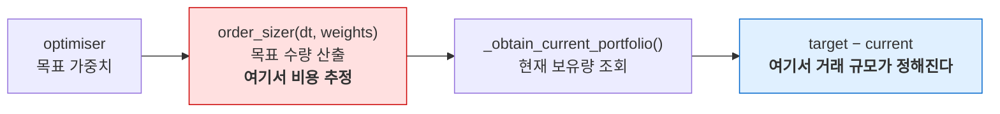

# 실행 계층과 비용 계층의 구조적 한계 — T7 실험 보고서

| 항목 | 내용 |
| --- | --- |
| 문서 ID | `20260818-04-execution-and-cost-layer-limits` |
| 작성일 | 2026-08-18 |
| 관점 | Software Architect |
| 상태 | **F1·F2는 v0.3.13에서 수정됨. L1은 구조적 한계로 남음** |
| 근거 | [20260818-01](20260818-01-codebase-comprehension-strategy.md) §6의 **T7** (FeeModel / ExecutionAlgorithm 교체) |
| 실험 조건 | 60/40 SPY·AGG, 2003-09-30 ~ 2019-12-31, 월말 리밸런스, 현금 버퍼 1%, 초기 자본 $1,000,000 |

> **후속 (2026-08-18, v0.3.13)**: F1은 증분 기준 추정으로, F2는 optimiser·execution_algo 주입 인자 추가로 수정되었다. §3.4의 "분할이 무료" 문제는 FixedFeeModel 추가로 해소되었다. L1(시간 분할 실행 불가)은 그대로다. 아래 본문은 **수정 이전 시점의 기록**이며, 보고서는 스냅샷이므로 갱신하지 않는다. 현재 코드의 동작은 CHANGELOG와 테스트를 참조할 것.

---

## 1. 요약

T7은 두 개의 확장 지점(`FeeModel`, `ExecutionAlgorithm`)을 실제로 교체해 보는 과제다. 교체 자체보다 **교체가 무엇을 바꾸지 못하는지**를 확인하는 것이 목적이었고, 결과적으로 결함 2건과 설계 한계 1건이 드러났다.

| # | 항목 | 성격 | 심각도 |
| --- | --- | --- | --- |
| **F1** | `OrderSizer`가 수수료를 **거래 규모가 아니라 목표 포지션 전체**에 대해 추정한다 | 결함 | **중간** |
| **F2** | `ExecutionAlgorithm`을 주입할 방법이 없다 (`qts.py:144` 하드코딩) | 설계 공백 | 낮음 |
| **L1** | 주문을 분할해도 **모두 같은 시각·같은 가격에 체결**된다. 시간 분할 실행(TWAP/VWAP)이 구현 불가능하다 | 구조적 한계 | — |

F1은 실측으로 정량화했다. 0.6% 수수료 조건에서 이 과대 추정만으로 최종 자산이 **$20,897 (전체 성과 손실의 22.2%)** 줄어든다. 이는 지불된 수수료가 아니라 **투자되지 않은 돈**이다.

---

## 2. (a) FeeModel 교체 — A/B 실험

### 2.1 결과

동일한 60/40 전략을 `ZeroFeeModel`과 `PercentFeeModel(commission_pct=0.1%, tax_pct=0.5%)`로 각각 실행했다.

| | `ZeroFeeModel` | `PercentFeeModel` | 차이 |
| --- | ---: | ---: | ---: |
| 최종 자산 | $3,250,475 | $3,156,136 | **−$94,340** |
| 총 수익률 | 225.05% | 215.61% | −9.43%p |
| CAGR | 7.256% | 7.068% | **−0.188%p** |
| 샤프 | 0.739 | 0.725 | −0.013 |

거래당 왕복 0.6%의 비용이 16년간 연 0.188%p의 성과를 갉아먹는다. 월말 리밸런스라는 낮은 회전율에서도 이 정도다.

### 2.2 수수료는 두 번 계산된다

보고서 01 §9의 체크리스트 9번이 묻는 내용을 실측으로 확인했다. `calc_total_cost`는 **서로 다른 두 계층**에서 호출된다.

| 호출 계층 | 코드 위치 | 전달하는 `quantity` | 호출 횟수 | 합계 |
| --- | --- | --- | ---: | ---: |
| `DollarWeightedCashBufferedOrderSizer` (사전 추정) | `dollar_weighted.py:152-155` | **`0`** (`est_quantity = 0  # TODO`) | 392 | **$2,027,438.52** |
| `SimulatedBroker._execute_order` (실제 청구) | `simulated_broker.py:580-582` | `order.quantity` | 390 | **$34,673.27** |

호출 횟수는 정확히 설명된다. 월말 리밸런스 196회 × 종목 2개 = **392회의 사이저 평가**, 그중 2건은 목표 수량이 현재 보유와 같아 주문이 생성되지 않아 **390건의 체결**이 남는다. 체결이 발생한 타임스탬프는 195개이므로, 주문이 하나도 나가지 않은 리밸런스가 한 차례 있었다.

> 두 계층이 `quantity` 인자로 구분된다는 점은 계측에 유용하다. `quantity == 0`이면 사이저의 추정, 그 외는 브로커의 실제 청구다.

### 2.3 F1 — 추정치가 실제의 58배인 이유

```python
# qstrader/portcon/order_sizer/dollar_weighted.py:147-159
pre_cost_dollar_weight = cash_buffered_total_equity * weight     # 목표 '포지션 전체' 금액

est_quantity = 0  # TODO: Needs to be added for IB
est_costs = self.broker.fee_model.calc_total_cost(
    asset, est_quantity, pre_cost_dollar_weight, broker=self.broker
)

after_cost_dollar_weight = pre_cost_dollar_weight - est_costs    # 그만큼 덜 산다
asset_quantity = int(np.floor(after_cost_dollar_weight / asset_price))
```

사이저는 **매 리밸런스마다 목표 포지션 전체를 새로 매수하는 것처럼** 비용을 추정한다. 실제로는 이미 대부분을 보유하고 있어 증분만 거래하는데도 그렇다.

SPY 목표 포지션이 약 $1.9M이면 매 리밸런스마다 0.6% = 약 $11,400을 비용으로 예약한다. 392회 누적하면 $2.03M이 되고, 실제 청구된 $34,673의 **58배**다.

### 2.4 과대 추정의 실제 비용 — 분리 실험

추정치는 그냥 버려지는 숫자가 아니다. `after_cost_dollar_weight`를 통해 **목표 수량 자체를 줄인다.** 그 효과만 분리하기 위해, 브로커에는 실제 수수료를 청구하되 사이저의 추정 요청에는 `0.0`을 돌려주는 `FeeModel`로 한 번 더 실행했다.

| 시나리오 | 최종 자산 | 실제 청구 수수료 | A 대비 손실 | CAGR |
| --- | ---: | ---: | ---: | ---: |
| **A.** 수수료 없음 | $3,250,475 | $0 | — | 7.256% |
| **B.** 현행 (추정 + 청구) | $3,156,136 | $34,673 | $94,340 | 7.068% |
| **C.** 청구만 (추정 0) | $3,177,033 | $34,937 | $73,442 | 7.110% |

**B와 C의 차이 $20,897이 과대 추정만의 비용이다.** 전체 성과 손실 $94,340의 **22.2%에 해당**하며, CAGR로는 0.042%p다.

메커니즘은 수치가 스스로 증명한다.

```text
$20,897 / $3,250,475 = 0.643%   ≈   수수료율 0.6% (0.1% + 0.5%)
```

사이저가 매 리밸런스마다 목표 포지션의 0.6%를 비용으로 예약하므로, **포트폴리오는 항상 의도한 노출의 약 99.4%로 운용된다.** 그 상시 미투자분이 16년간 복리로 누적되어 최종 자산의 0.64%가 되었다. 지불된 적 없는 돈이다.

> A와 C의 차이($73,442)가 실제 수수료($34,937)보다 큰 것은 정상이다. 초기에 지출된 수수료는 이후 16년간 복리로 자라날 기회를 함께 잃기 때문이다.

### 2.5 F1의 근본 원인 — 정보가 없는 곳에 책임이 놓였다

`est_quantity = 0`은 게으름이 아니다. **사이저는 거래 규모를 알 수 없다.**

```python
# qstrader/portcon/order_sizer/order_sizer.py
def __call__(self, dt, weights):     # ← 현재 보유량이 인자에 없다
```

호출 순서를 보면 명확하다 (`pcm.py:__call__`).



거래 규모는 사이저가 결과를 반환한 **뒤에** 결정된다. 즉 비용 추정이 필요한 정보를 갖지 못한 계층에 놓여 있다.

### 2.6 F1의 수정 방향 (선택지)

| 안 | 내용 | 평가 |
| --- | --- | --- |
| **1** | 사이저에 현재 포트폴리오를 전달하고 증분 기준으로 추정 | 정확하지만 `OrderSizer` 인터페이스 변경 → 사용자 구현체 파손 |
| **2** | 비용 추정을 PCM으로 옮겨 `target − current` 계산 후 적용 | 계층 책임이 맞다. 다만 수량 재조정 루프가 필요 |
| **3** | 사이저의 사전 추정을 없애고 현금 버퍼가 비용을 흡수하게 함 | 가장 단순. 현금 버퍼(기본 1%)가 이미 이 목적에 가깝고, 실험 C가 이 안의 결과다 |
| **4** | 현행 유지 + 문서화 | 최소 비용. 다만 사용자가 원인을 알 수 없다 |

**권고는 3안 또는 2안이다.** 3안은 한 줄 삭제로 실험 C의 결과를 얻는다. 다만 어느 쪽이든 **e2e 픽스처가 바뀐다** — 목표 수량이 달라지므로 `sixty_forty_history.dat`와 `long_short_history.dat`를 재생성해야 한다. 보고서 02 §8의 반올림 불일치와 달리, 이것은 명백히 **동작이 바뀌는 변경**이다.

---

## 3. (b) ExecutionAlgorithm 교체

### 3.1 F2 — 주입 지점이 없다

`ExecutionAlgorithm`은 보고서 01 §4에서 확장 지점으로 분류한 15개 ABC 중 하나이지만, **`BacktestTradingSession`을 통해 공급할 방법이 없다.**

```python
# qstrader/system/qts.py:118-121, 144
def _initialise_models(self, **kwargs):
    """
    ...
    TODO: Add TransactionCostModel
    TODO: Ensure this is dynamically generated from config.
    """
    ...
    execution_algo = MarketOrderExecutionAlgorithm()      # ← 하드코딩, kwargs 무시
```

`QuantTradingSystem`은 `**kwargs`를 받지만 `execution_algo`는 그중 어느 것도 참조하지 않는다. `BacktestTradingSession._create_quant_trading_system` 역시 고정된 인자로 `QuantTradingSystem`을 만든다.

사용자에게 남는 선택지는 세 가지뿐이다.

1. 모듈 속성 몽키패치 (`qts_module.MarketOrderExecutionAlgorithm = ...`)
2. `QuantTradingSystem`과 `BacktestTradingSession`을 함께 상속
3. 객체 그래프를 직접 조립

본 실험은 1번을 사용했다. 같은 문제가 `FixedWeightPortfolioOptimiser`(`qts.py:126-128`)에도 있다 — 그래서 `EqualWeightPortfolioOptimiser`가 패키지에 있는데도 예제에서 쓸 수가 없다.

> **비교**: `FeeModel`은 `BacktestTradingSession(fee_model=...)`으로 정상적으로 주입된다. 즉 이것은 프레임워크의 방침이 아니라 **일관성의 공백**이다.

### 3.2 L1 — 분할 주문은 경제적으로 무의미하다

각 주문을 n개로 균등 분할하는 `SplitOrderExecutionAlgorithm`을 작성해 주입했다 (부록 A).

| 실행 알고리즘 | 최종 자산 | 체결 건수 | 고유 타임스탬프 | 기본 대비 차이 |
| --- | ---: | ---: | ---: | ---: |
| `MarketOrderExecutionAlgorithm` | $3,250,475.49 | 390 | 195 | — |
| `SplitOrderExecutionAlgorithm(2)` | $3,250,475.49 | 778 | 195 | **$0.0000** |
| `SplitOrderExecutionAlgorithm(5)` | $3,250,475.49 | 1,936 | 195 | **$0.0000** |

체결 건수는 5배가 되었지만 **최종 자산은 소수점까지 동일**하다. 고유 타임스탬프도 195개로 변하지 않는다.

첫 리밸런스의 체결 내역이 이유를 보여준다.

```text
Split(5)   dt=2003-10-01 14:30:00+00:00
    EQ:AGG   qty=1605.0  price=49.3116
    EQ:AGG   qty=1605.0  price=49.3116
    EQ:AGG   qty=1605.0  price=49.3116
    EQ:AGG   qty=1605.0  price=49.3116
    EQ:AGG   qty=1605.0  price=49.3116
    EQ:SPY   qty=1803.0  price=66.0557
    ...
```

**모든 조각이 같은 타임스탬프, 같은 가격에 체결된다.** 전 구간에서 `(시각, 종목)` 하나당 서로 다른 체결가의 개수는 항상 **1**이었다.

### 3.3 원인 — 두 개의 코드 위치

**첫째, 실행 핸들러가 주문마다 같은 `dt`로 브로커를 전진시킨다.**

```python
# qstrader/execution/execution_handler.py:83-86
if self.submit_orders:
    for order in final_orders:
        self.broker.submit_order(self.broker_portfolio_id, order)
        self.broker.update(dt)          # ← 루프 전체에서 dt 가 동일
```

`broker.update(dt)`는 대기 주문 큐를 비우고 즉시 체결시킨다. 시각이 전진하지 않으므로 조각들이 서로 다른 가격을 만날 수 없다.

**둘째, 시간축의 해상도가 하루 두 점뿐이다.**

`DailyBusinessDaySimulationEngine`은 `market_open`(14:30)과 `market_close`(21:00)만 만들고, `CSVDailyBarDataSource`는 일봉을 그 두 시각의 행으로만 변환한다. 하루 안에 나눠 체결할 **가격 자체가 존재하지 않는다.**

**보조 증거**: `Order`에는 `created_dt`와 `cur_dt` 두 개의 시각 필드가 있는데, `cur_dt`는 생성 시 `created_dt`와 같은 값으로 설정된 뒤 **패키지 어디에서도 갱신되지 않는다.** 유일한 사용처는 테스트용 동등성 비교(`order.py:65`)다. 주문이 시간에 따라 상태를 갖는 설계가 의도되었다가 구현되지 않은 흔적으로 보인다.

### 3.4 수수료 모델도 분할을 벌하지 못한다

수수료가 있으면 분할이 비용을 늘릴 것 같지만, 실측 결과는 거의 차이가 없다.

| 실행 알고리즘 | 체결 건수 | 총 수수료 | 최종 자산 |
| --- | ---: | ---: | ---: |
| `MarketOrderExecutionAlgorithm` | 390 | $34,673.27 | $3,156,135.89 |
| `SplitOrderExecutionAlgorithm(5)` | 1,933 | $34,692.70 | $3,156,131.26 |

체결이 5배로 늘었는데 수수료는 **$19.43 (0.056%)** 증가에 그친다. 이 차이조차 비용 모델 때문이 아니라 `consideration = round(price * quantity)`를 조각마다 따로 반올림하기 때문에 생긴 것이다.

원인은 동봉된 두 `FeeModel`이 **순수 비례식**이라는 데 있다.

```python
# percent_fee_model.py:45
return self.commission_pct * abs(consideration)
```

주문 건수당 고정 비용이 없으므로 `n`개로 쪼개도 총액은 동일하다. `FeeModel` 인터페이스 자체는 고정 비용을 표현할 수 있으므로(사용자가 `calc_total_cost`에서 상수를 더하면 된다) 이것은 인터페이스의 한계가 아니라 **동봉 구현의 한계**다. 다만 그런 모델이 없으므로 현재 시뮬레이터는 **과도한 주문 분할을 아무런 대가 없이 허용한다.**

### 3.5 T7 성공 기준에 대한 답 — 어느 계층을 바꿔야 하는가

시간 분할 실행(TWAP/VWAP)을 구현하려면 **네 계층을 함께** 바꿔야 한다. `ExecutionAlgorithm` 하나를 교체하는 것으로는 불가능하다.

| 순서 | 계층 | 필요한 변경 | 난이도 |
| --- | --- | --- | --- |
| 1 | `SimulationEngine` | 하루 안에 여러 이벤트를 생성 (일중 해상도) | ★★★ (보고서 01 §4에서 ★★★로 분류한 이유) |
| 2 | `DataSource` / `DataHandler` | 그 시각들의 가격 제공. 현행 CSV 소스는 하루 2행뿐 | ★★★ (§8-1의 계약 부재와 맞물림) |
| 3 | `ExecutionHandler` | 자식 주문을 즉시 전부 제출하지 말고 **이벤트에 걸쳐 보류**. 현재는 상태 없는 pass-through | ★★ |
| 4 | `Order` | 예정 실행 시각을 갖도록 확장. `cur_dt`가 그 자리로 보인다 | ★ |

즉 `ExecutionAlgorithm`은 **주문의 모양(수량·분할)은 바꿀 수 있지만 시각은 바꿀 수 없다.** 현재 이 확장 지점으로 유의미하게 구현할 수 있는 것은 수량 변형(부분 체결, 최소 주문 단위 반올림, 주문 크기 상한) 정도이며, 그마저도 §3.1 때문에 주입할 방법이 없다.

---

## 4. 권고

| 순위 | 작업 | 근거 |
| --- | --- | --- |
| 1 | **F1** 수정 (§2.6의 3안 또는 2안) | 실측 $20,897 (성과 손실의 22.2%). e2e 픽스처 재생성 필요 |
| 2 | **F2** 수정 — `BacktestTradingSession` / `QuantTradingSystem`에 `execution_algo`, `optimiser` 주입 인자 추가 | `fee_model`은 이미 주입 가능하므로 일관성 회복. 기본값 유지 시 회귀 없음 |
| 3 | 고정 비용 성분을 갖는 `FeeModel` 구현체 추가 | 주문 건수를 벌할 수단이 없다는 §3.4의 공백 해소 |
| 4 | `ExecutionAlgorithm` docstring에 시각 제어 불가를 명시 | L1은 결함이 아니라 설계 범위다. 다만 문서에 없어 사용자가 §3.2를 직접 겪게 된다 |
| 5 | `Order.cur_dt` 제거 또는 용도 확정 | 갱신되지 않는 필드는 잘못된 기대를 만든다 |

1번과 2번은 **분리해야 한다.** 2번은 회귀 없는 순수 추가이고, 1번은 모든 백테스트 결과를 바꾼다.

---

## 부록 A. 실험에 사용한 실행 알고리즘

```python
from qstrader.execution.execution_algo.execution_algo import ExecutionAlgorithm
from qstrader.execution.order import Order


class SplitOrderExecutionAlgorithm(ExecutionAlgorithm):
    """각 주문을 n 개의 자식 주문으로 균등 분할한다."""

    def __init__(self, n_slices=2):
        self.n_slices = n_slices

    def __call__(self, dt, initial_orders):
        split = []
        for order in initial_orders:
            total = int(order.quantity)
            base = total // self.n_slices
            remainder = total - base * self.n_slices
            for i in range(self.n_slices):
                quantity = base + (remainder if i == self.n_slices - 1 else 0)
                if quantity != 0:
                    split.append(Order(dt, order.asset, quantity))
        return split
```

음수 수량에서도 성립한다. 파이썬의 바닥 나눗셈은 `-7 // 2 == -4`이고 나머지가 `1`이 되어, 마지막 조각이 `-3`, 합계가 `-7`로 보존된다.

주입에는 다음이 필요하다 (§3.1).

```python
from qstrader.system import qts as qts_module

qts_module.MarketOrderExecutionAlgorithm = lambda: SplitOrderExecutionAlgorithm(5)
```

## 부록 B. 수수료 계층 분리용 FeeModel

`calc_total_cost`에 전달되는 `quantity`로 두 호출 계층을 구분한다 (§2.2).

```python
from qstrader.broker.fee_model.fee_model import FeeModel


class BrokerOnlyFeeModel(FeeModel):
    """브로커에는 실제 수수료를 청구하되, OrderSizer 의 추정 요청에는 0 을 돌려준다."""

    def __init__(self, inner):
        self.inner = inner
        self.broker_total = 0.0

    def _calc_commission(self, asset, quantity, consideration, broker=None):
        return self.inner._calc_commission(asset, quantity, consideration, broker)

    def _calc_tax(self, asset, quantity, consideration, broker=None):
        return self.inner._calc_tax(asset, quantity, consideration, broker)

    def calc_total_cost(self, asset, quantity, consideration, broker=None):
        if quantity == 0:          # OrderSizer 의 사전 추정
            return 0.0
        cost = self.inner.calc_total_cost(asset, quantity, consideration, broker)
        self.broker_total += cost
        return cost
```

---

*본 보고서의 모든 수치는 2026-08-18에 `data/SPY.csv`, `data/AGG.csv`로 직접 실행하여 얻었다. 조사 기준은 `master` @ `b94c6c0` 시점의 엔진 코드이며, 이후의 라이선스·문서·테스트 변경은 엔진 동작에 영향을 주지 않는다.*
