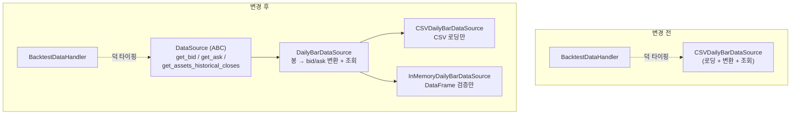

# 데이터 소스 계약 확립과 인메모리 구현 — T8 실험 보고서

| 항목 | 내용 |
| --- | --- |
| 문서 ID | `20260818-05-data-source-contract` |
| 작성일 | 2026-08-18 |
| 관점 | Software Architect |
| 상태 | **구현 완료 · 신규 결함 1건은 특성 테스트로 고정, 수정 미실시** |
| 근거 | [20260818-01](20260818-01-codebase-comprehension-strategy.md) §6의 **T8** (데이터 소스 교체) |
| 결함 번호 | `F3` — 보고서 04의 `F1`, `F2`에서 이어짐 |

---

## 1. 요약

T8은 보고서 01 §8-1이 지목한 **계약이 문서화되지 않은 유일한 계층**을 직접 통과해 보는 과제다. 인메모리 데이터 소스를 새로 구현하려면 `CSVDailyBarDataSource`의 구현을 읽어 계약을 역추출해야만 했고, 그 과정에서 예상한 결함 하나를 재발견하고 예상하지 못한 결함 하나를 새로 찾았다.

| 항목 | 결과 |
| --- | --- |
| `DataSource` ABC 신설 | `qstrader/data/data_source.py` — 추상 메서드 3개 |
| 공통 로직 분리 | `qstrader/data/daily_bar.py` — `DailyBarDataSource` |
| 신규 구현체 | `qstrader/data/daily_bar_memory.py` — `InMemoryDailyBarDataSource` |
| 해소한 결함 | 보고서 01 §8-1의 `adjusted` 인자 불일치 |
| **새로 발견한 결함** | **F3 — 데이터 시작일 이전 조회가 시계열의 마지막 가격을 반환한다 (룩어헤드)** |
| 검증 | 파리티 테스트 4건 + 단위 테스트 24건, 총 268 케이스 통과 |
| 커버리지 | 75.37% → **76.79%** |

F3은 실측으로 확인했다. AGG의 데이터가 시작되기 3년 전인 2000-01-03을 조회하면 **2026-08-14의 종가**가 돌아온다.

---

## 2. 역추출한 계약

ABC가 없었으므로 `BacktestDataHandler`가 무엇을 호출하는지, `CSVDailyBarDataSource`가 무엇을 반환하는지를 대조해 계약을 확정했다.

| 메서드 | 시그니처 | 반환 |
| --- | --- | --- |
| `get_bid` | `(dt, asset)` | `float`, 없으면 `NaN` |
| `get_ask` | `(dt, asset)` | `float`, 없으면 `NaN` |
| `get_assets_historical_closes` | `(start_dt, end_dt, assets, adjusted=False)` | `pd.DataFrame`, 타임스탬프 인덱스 × 자산 컬럼 |

명시적으로 문서화한 암묵적 규칙 4가지다. 어느 것도 기존 코드에는 적혀 있지 않았다.

1. **심볼은 QSTrader 심볼**이다 (`'EQ:SPY'`). 맨 티커가 아니다. CSV 소스는 파일명에서 `'EQ:%s'`로 만들고, 인메모리 소스는 호출자가 직접 준다.
2. **타임스탬프는 tz-aware UTC**다. CSV 소스는 파싱한 naive 인덱스를 UTC로 localize한다.
3. **보유하지 않은 자산에 대해 예외를 던져도 된다.** `BacktestDataHandler`가 `except Exception`으로 잡아 `NaN`으로 바꾼 뒤에야 호출자에게 전달되기 때문이다.
4. **`get_assets_historical_closes`는 모르는 자산을 컬럼에서 누락시킨다.** 전부 `NaN`인 컬럼을 만들지 않는다.

3번은 계약이라기보다 보고서 01 §8-2(광범위 예외 삼킴)의 부산물이지만, 현재 구조에서 실제로 성립하는 규칙이므로 ABC docstring에 명시했다.

---

## 3. 구조 변경



`CSVDailyBarDataSource`의 공개 API는 그대로다. 생성자 시그니처, `asset_bar_frames`, `asset_bid_ask_frames`, 세 조회 메서드가 모두 동일하며, 변환·조회 로직은 한 글자도 바뀌지 않고 기반 클래스로 옮겼을 뿐이다.

`BacktestDataHandler`는 여전히 `isinstance` 검사를 하지 않으므로, **ABC를 상속하지 않은 기존 사용자 정의 소스도 그대로 동작한다.** 계약을 문서화하되 강제하지는 않는 선택이다.

### 3.1 인메모리 구현이 추가로 하는 일

CSV 소스는 파일 형식을 알기 때문에 컬럼 존재를 가정할 수 있다. 인메모리 소스는 호출자가 프레임을 만들어 주므로 그럴 수 없어, 생성 시점에 검증한다.

- `DatetimeIndex`가 아니면 거부
- `Open`/`Close`(+`adjust_prices`면 `Adj Close`) 누락 시 자산명과 컬럼명을 담아 거부
- naive 인덱스는 UTC로 localize, tz-aware는 UTC로 convert
- 인덱스 정렬

검증이 없으면 컬럼 누락이 한참 뒤 봉 변환 내부에서 `KeyError`로 터진다.

---

## 4. 해소한 결함 — `adjusted` 인자 불일치

보고서 01 §8-1이 지목한 결함이다.

```python
# backtest_data_handler.py:75 — adjusted 를 넘기는데
prices_df = ds.get_assets_historical_closes(start_dt, end_dt, asset_symbols, adjusted=adjusted)

# 기존 daily_bar_csv.py:250 — 받지 않는다
def get_assets_historical_closes(self, start_dt, end_dt, assets):
```

`TypeError`가 나고 `except Exception: raise`가 그대로 다시 던진다. 호출하는 코드가 패키지 안에 없어 드러나지 않던 죽은 경로였다.

ABC가 시그니처를 확정해야 하므로 이번에 함께 정리했다. `adjusted=True`면 `Adj Close`, 아니면 `Close`를 사용하고, 해당 컬럼이 없으면 자산명을 담은 `ValueError`를 던진다. **기존 호출부가 없었으므로 회귀 위험은 없다.**

---

## 5. F3 — 데이터 시작일 이전 조회가 미래 가격을 반환한다

### 5.1 코드

```python
# qstrader/data/daily_bar.py:125-131 (기존 daily_bar_csv.py 에서 그대로 이동)
bid_ask_df = self.asset_bid_ask_frames[asset]
bid_series = bid_ask_df.iloc[bid_ask_df.index.get_indexer([dt], method='pad')]['Bid']
try:
    bid = bid_series.iloc[0]
except KeyError:  # Before start date
    return np.nan
return bid
```

`get_indexer(..., method='pad')`는 **선행하는 행이 없을 때 `-1`을 반환**한다. 그 `-1`이 `.iloc[[-1]]`에 그대로 들어가 **마지막 행**을 선택한다. 예외가 나지 않으므로 `except KeyError` 분기는 **도달 불가능**하며, 주석 `# Before start date`가 의도한 동작은 한 번도 일어나지 않는다.

### 5.2 실측

`data/AGG.csv`(2003-09-29 ~ 2026-08-14, 마지막 조정 종가 97.48)를 `CSVDailyBarDataSource`로 읽고 조회했다.

| 조회 시각 | 반환값 | 해석 |
| --- | ---: | --- |
| 2003-09-29 14:30 (데이터 첫날 개장) | 49.1434 | 정상 |
| **2000-01-03 14:30 (데이터 시작 3년 8개월 전)** | **97.4800** | **2026-08-14 종가 — 26년 후의 미래 가격** |

인메모리 소스로 만든 3행짜리 합성 곡선에서도 동일하다. 첫 바 이전을 조회하면 마지막 바의 종가가 돌아온다.

### 5.3 왜 중요한가

**첫째, 룩어헤드 편향이다.** 백테스트 시작일이 어느 자산의 데이터 시작일보다 이르면, 그 자산은 데이터가 시작될 때까지 **시계열 전체의 마지막 가격**으로 평가되고 거래된다. 백테스트가 아직 알 수 없는 가격이다.

**둘째, 이 상황을 잡으라고 만든 가드가 무력화된다.** 두 OrderSizer가 모두 아래 검사를 갖고 있다.

```python
# long_short.py:151-157, dollar_weighted.py:164-170
if np.isnan(asset_price):
    raise ValueError(
        'Asset price for "%s" at timestamp "%s" is Not-a-Number (NaN). '
        'This can occur if the chosen backtest start date is earlier '
        'than the first available price for a particular asset. ...'
    )
```

오류 메시지가 명시하는 원인("시작일이 첫 가격보다 이르다")은 **`NaN`을 만들어 내지 못한다.** 현재 `NaN`이 나오는 유일한 경로는 자산이 데이터 소스에 아예 없는 경우뿐이며, 그것은 `BacktestDataHandler`가 `KeyError`를 삼켜 만들어 낸다(§2의 규칙 3).

**셋째, 조용하다.** 예외도 경고도 없이 그럴듯한 가격이 나온다. 보고서 01 §8-6의 리밸런스 타임스탬프 함정과 같은 부류다.

### 5.4 심각도: **중간**

| 근거 | 평가 |
| --- | --- |
| 동봉 예제 | 모두 데이터 시작일 이후에서 시작하므로 영향 없음 |
| 사용자가 흔히 하는 실수 | 시작일을 넉넉히 잡는 것은 흔하다. `momentum_taa.py`처럼 자산마다 상장일이 다르면 더 그렇다 |
| 오류의 방향 | 미래 가격이므로 성과가 낙관적으로 왜곡될 가능성이 크다 |
| 검출 가능성 | 매우 낮음. 가드가 무력화되어 있어 사용자에게 아무 신호가 없다 |

`DynamicUniverse`를 쓰면 자산이 편입 시점 전에는 유니버스에 없으므로 사이저가 조회하지 않아 노출이 줄어든다. 다만 이는 사용자가 상장일 사전을 정확히 채운 경우에 한한다.

### 5.5 수정 방향

```diff
     bid_ask_df = self.asset_bid_ask_frames[asset]
-    bid_series = bid_ask_df.iloc[bid_ask_df.index.get_indexer([dt], method='pad')]['Bid']
-    try:
-        bid = bid_series.iloc[0]
-    except KeyError:  # Before start date
-        return np.nan
-    return bid
+    index = bid_ask_df.index.get_indexer([dt], method='pad')[0]
+    if index < 0:  # Before the first bar
+        return np.nan
+    return bid_ask_df['Bid'].iloc[index]
```

`get_ask`도 동일하다. 수정하면 §5.3의 가드가 비로소 의도대로 동작하며, **시작일이 이른 백테스트는 조용히 잘못된 결과를 내는 대신 명시적으로 실패한다.**

회귀 영향은 제한적일 것으로 본다. e2e 픽스처는 데이터 범위 안에서만 조회하므로 바뀌지 않아야 하지만, **실제로 확인한 뒤에 확정해야 한다.** 바뀐다면 그것은 해당 백테스트가 룩어헤드를 사용하고 있었다는 뜻이다.

---

## 6. 검증

### 6.1 파리티 테스트 — 교체가 결과를 바꾸지 않음을 증명

`tests/integration/data/test_in_memory_data_source.py`는 e2e 백테스트가 쓰는 것과 **같은 픽스처**를 사용한다. 재사용이 핵심이다 — 인메모리 소스는 CSV 소스의 결과를 정확히 재현할 때만 옳다.

| 테스트 | 검증 내용 |
| --- | --- |
| `test_bar_and_bid_ask_frames_are_identical` | 두 소스의 봉 프레임과 bid/ask 프레임이 `assert_frame_equal` |
| `test_every_price_query_agrees` | 데이터가 가진 모든 타임스탬프에서 `get_bid`/`get_ask` 일치 |
| `test_historical_closes_agree` | 다중 자산 범위 조회 일치 |
| **`test_backtest_through_the_in_memory_source_matches_the_csv_fixture`** | **인메모리 소스로 전체 백테스트를 돌려 `sixty_forty_history.dat` 및 기대 보유 내역과 일치** |

마지막 테스트가 T8의 성공 기준이다. 엔진 전체를 교체된 데이터 소스로 통과시키고, CSV 경로로 작성된 픽스처에 고정한다.

### 6.2 전체 결과

```text
268 passed          (기존 240 + 신규 28)
커버리지 76.79%      (기존 75.37%)
ruff check          All checks passed!
```

| 모듈 | statements | 커버리지 |
| --- | ---: | ---: |
| `data/data_source.py` | 8 | 100% |
| `data/daily_bar.py` | 70 | 93% |
| `data/daily_bar_csv.py` | 33 | 100% |
| `data/daily_bar_memory.py` | 24 | 100% |

`daily_bar.py`의 미커버 5줄 중 **4줄(129-130, 154-155)이 §5의 도달 불가능한 `except KeyError` 분기**다. 커버리지 도구가 결함을 가리키고 있는 셈이다. 나머지 1줄(59)은 CSV에 `Adj Close`가 없을 때의 검사로, 인메모리 소스가 더 이른 시점에 검증하므로 도달하지 않는다.

---

## 7. 남은 공백

| # | 항목 | 비고 |
| --- | --- | --- |
| 1 | `BacktestDataHandler`에는 여전히 ABC가 없다 | `DataSource`만 정의했다. 핸들러 자체의 계약(`get_asset_latest_bid_price` 등 5개)은 미정의 |
| 2 | §8-2의 광범위 `except Exception`은 그대로다 | 계약 규칙 3번이 이 위에 서 있어, 예외 처리를 좁히려면 계약도 함께 바꿔야 한다 |
| 3 | `asset_type` 인자는 여전히 미사용 | `CSVDailyBarDataSource(csv_dir, Equity)`의 두 번째 인자는 어디에서도 읽히지 않는다 (기존 TODO) |
| 4 | Bid = Ask | 스프레드 모델링은 여전히 없다 (기존 TODO) |
| 5 | 일중 데이터 | 보고서 04 §3.5가 요구하는 해상도. 현재 계약은 하루 2점을 전제로 하지 않지만 구현체는 그렇다 |

1번과 2번은 함께 다루는 것이 자연스럽다. 별건으로 남긴다.

---

## 8. 결정이 필요한 사항

| # | 질문 | 권고 |
| --- | --- | --- |
| 1 | F3을 이번 변경에 포함할 것인가 | **분리한다.** 이번 변경은 결과를 바꾸지 않지만(§6.1), F3 수정은 룩어헤드에 의존하던 백테스트의 결과를 바꾼다 |
| 2 | `DataSource` 상속을 강제할 것인가 | **강제하지 않는다.** `BacktestDataHandler`가 `isinstance`를 검사하지 않으므로 기존 사용자 소스가 계속 동작한다. 강제는 이득 없이 파손만 만든다 |
| 3 | `InMemoryDailyBarDataSource`를 패키지에 넣을 것인가, 테스트에만 둘 것인가 | **패키지에 넣는다.** DB·API 클라이언트가 이미 DataFrame을 만드는 경우와 파라미터 스윕에서 실사용 가치가 있고, 두 번째 구현체가 있어야 ABC가 실제로 검증된다 |
| 4 | 버전을 올릴 것인가 | **올린다.** 공개 API가 늘었다 |

---

*본 보고서의 실측값은 2026-08-18에 얻었다. §5.2의 AGG 수치는 데이터 파일이 갱신되면 달라진다 — 반환되는 값이 항상 '시계열의 마지막 가격'이라는 성질은 바뀌지 않는다.*
