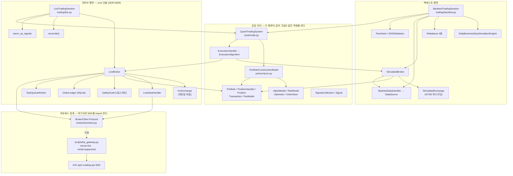
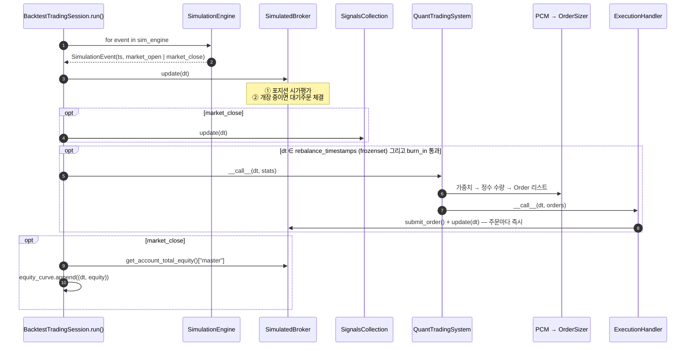
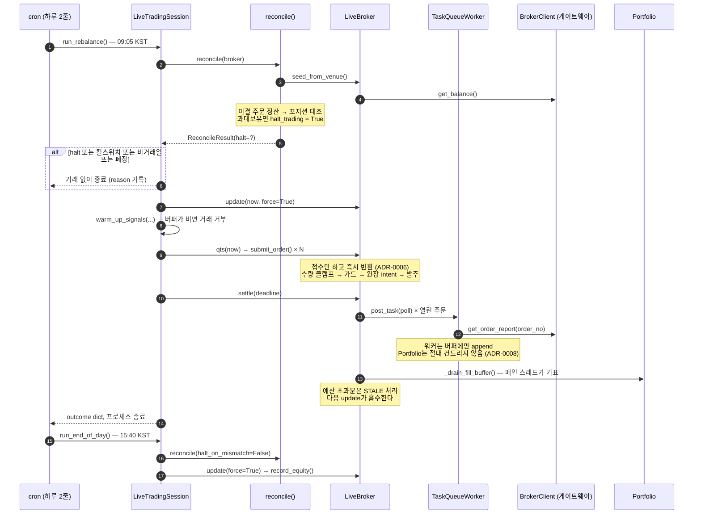
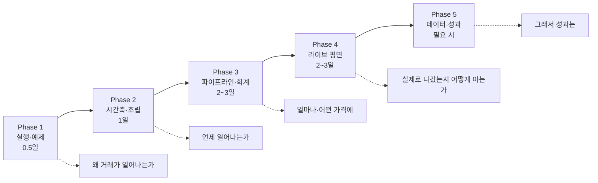
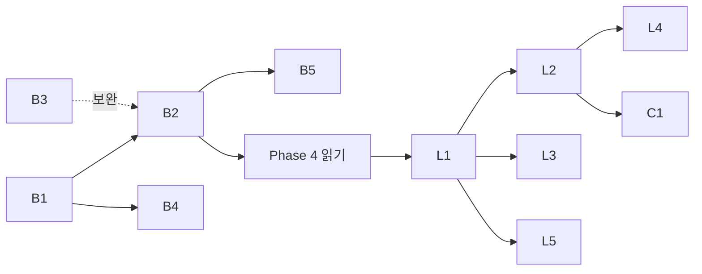

# VMTrader 코드베이스 파악 전략 — 백테스트·라이브 2평면 판

| 항목 | 내용 |
| --- | --- |
| 문서 ID | `20260823-01-codebase-comprehension-strategy` |
| 작성일 | 2026-08-23 |
| 관점 | Software Architect |
| 대상 독자 | VMTrader를 확장·유지보수할 개발자, 그리고 두 번째 증권사를 붙이려는 사람 |
| 조사 기준 | `master` (v0.3.17) — §5의 권고 R1~R3 적용 및 ADR-0015~0017 반영 후 |
| 조사 방법 | 전체 소스 정적 분석 + `uv run pytest --cov=vmtrader` 실측 + DB증권·KIS Open API 목록 대조 |
| 갱신 | 2026-08-23 (v0.3.17). 같은 날의 조사이므로 새 문서를 만들지 않고 본문을 현행 `master`에 맞춰 갱신했다 |
| 대체 대상 | [20260818-01](20260818-01-codebase-comprehension-strategy.md) (`b94c6c0` / v0.3.10 기준) |

> **이 문서는 v0.3.17 기준으로 갱신되었다.** 초판(v0.3.16)이 §5.5에서 권고한 **R1~R3이 적용**되었고([ADR-0015](../adr/0015-venue-neutral-live-package.md)), 이어서 **자금 이체 4종이 `Broker` ABC에서 제거**([ADR-0016](../adr/0016-drop-funding-from-broker-abc.md))되었으며, **모의투자를 브로커가 아니라 모드로 다루는 결정**([ADR-0017](../adr/0017-paper-is-a-mode-not-a-broker.md))이 내려졌다. 소견 **B-1·B-5는 해소**, B-2·B-3·B-4는 유효하다. 권고는 **R1·R2·R3·R5(부분)이 적용**, R4·R6·R7·R8이 미해소다. 각 절에 조치 여부를 표시했다.

> **왜 갱신이 아니라 재작성인가**: `reports/`는 스냅샷이며 본문을 갱신하지 않는다는 것이 이 저장소의 규칙이다(`docs/README.md`). 그리고 20260818-01은 갱신으로 따라잡을 수 있는 격차가 아니다 — 그 문서가 조사한 v0.3.10에는 **라이브 평면 자체가 존재하지 않았다.** 패키지명이 바뀌었고(`qstrader` → `vmtrader`), 소스가 6.8k에서 10.7k LOC로, 테스트가 221에서 734 케이스로 늘었으며, 서브패키지 `broker/live/`·`broker/kis/`·모듈 `trading/live.py`·`data/live_data_handler.py`·`exchange/krx_exchange.py`·`signals/warmup.py`가 전부 그 이후의 것이다. 이전 문서는 **백테스트 엔진 단독 시절의 기록**으로 남겨 두고 읽는 편이 정확하다.

---

## 1. 조사 기준선 (Baseline)

모두 이 문서 작성 시점에 직접 실행하여 얻은 값이다.

| 지표 | v0.3.10 (20260818-01) | **v0.3.17 (현재)** |
| --- | --- | --- |
| 패키지 소스 | 68개 `.py`, 6,813 LOC | **101개 `.py`, 10,666 LOC** |
| 커버리지 측정 대상 statements | 1,762 | **2,646** |
| 서브패키지 | 12개 | **15개** (`broker/live/` · `broker/kis/` 신설, `data/` 확장) |
| 추상 기반 클래스 | ABC 15개 / 추상 메서드 30개 | **ABC 16개 + Protocol 1개 / 추상 메서드 30개** (v0.3.17에서 `Broker` 13 → 9) |
| 테스트 | 221 케이스 | **734 케이스(732 통과 · 2 skip, 8.9s)** |
| 커버리지 | 74.06% | **83.71%** (431 miss) / 하한선 `fail_under = 70` |
| 런타임 의존성 | 5개 | **5개** (matplotlib, numpy, pandas, pytz, seaborn) — 증가 없음 |
| 예제·스크립트 | 예제 7 | 예제 9 + 스크립트 6 |
| 설계 문서 | 없음 | **ADR 17건**, 스펙 2건, 보고서 7건 |

> **핵심 관찰 (v0.3.10과 달라진 점)**: 소스가 1.5배로 늘었는데 **런타임 의존성은 하나도 늘지 않았다.** KIS SDK도, `requests`도, SQLite 래퍼도 들어오지 않았다. 이것은 우연이 아니라 [ADR-0003](../adr/0003-port-lab-code.md)과 `BrokerClient` Protocol이 강제한 결과이며, **파악 전략에서 가장 먼저 이해해야 할 사실**이다: 라이브 코드가 생겼는데도 테스트 스위트 전체가 네트워크 없이·SDK 없이 10초에 돈다.

---

## 2. 아키텍처 — 하나의 코어, 두 개의 평면

v0.3.10의 아키텍처는 "백테스트 엔진 하나"였다. 지금은 **공유 코어 위에 두 개의 평면**이 얹힌 구조다.



### 2.1 두 평면이 공유하는 것 — 그리고 공유하지 않는 것

| 계층 | 백테스트 | 라이브 | 공유 여부 |
| --- | --- | --- | --- |
| 전략 파이프라인 (`QuantTradingSystem`) | ✅ | ✅ | **동일 객체.** `LiveTradingSession`이 `self.qts(now)`를 호출하는 것이 전부 |
| 가중치→수량 (`OrderSizer`, `PCM`) | ✅ | ✅ | **동일** |
| 회계 (`Portfolio`/`Position`/`Transaction`) | ✅ | ✅ | **동일** |
| 수수료 (`FeeModel`) | 실제 부과 | **추정에만** 사용 — 실제 비용은 `OrderReport.fees`로 venue가 보고 | **의미가 다름** ⚠️ |
| 시간축 | `SimulationEngine`이 생성 | **cron이 프로세스를 띄우는 것이 곧 이벤트** | 공유 안 함 |
| 데이터 | `BacktestDataHandler` + `DataSource` | `LiveDataHandler` + `BrokerClient` | **ABC를 공유하지 않는 덕타이핑** ⚠️ |
| 거래소 | `SimulatedExchange` (NYSE 14:30–21:00 UTC) | `KrxExchange` (KST 09:00–15:30 + 휴장일) | 공유 안 함 |
| 시그널 워밍업 | 불필요 (시작부터 채워짐) | **매 기동마다 필수** (ADR-0012) | 라이브 전용 |

> **파악상의 함정 하나**: `FeeModel`은 두 평면에 모두 주입되지만 **역할이 다르다.** 백테스트에서는 이것이 실제로 차감되는 비용이고, 라이브에서는 사이저가 목표 수량을 깎을 때 쓰는 **추정치**일 뿐 실제 비용은 `OrderReport.fees`로 venue가 알려준다. `LiveBroker`의 기본값이 `ZeroFeeModel()`인 이유다. 같은 이름의 객체가 두 곳에서 다른 뜻을 갖는, 이 코드베이스에서 몇 안 되는 지점이다.

### 2.2 서브패키지 역할표

| 패키지 | 책임 | 진입점 | 평면 | 난이도 |
| --- | --- | --- | --- | --- |
| `trading/backtest.py` | 백테스트 조립 + 메인 루프 | `BacktestTradingSession.run()` | BT | ★★★ |
| `trading/live.py` | 라이브 1사이클 (cron 단발) | `LiveTradingSession.run_rebalance()` | LV | ★★★ |
| `system/` | 전략 파이프라인 조립 + 리밸런스 일정 | `QuantTradingSystem.__call__` | 공유 | ★★ |
| `portcon/` | 가중치 → 정수 수량 | `PortfolioConstructionModel.__call__` | 공유 | ★★★ |
| `execution/` | 주문 목록 → 브로커 제출 | `ExecutionHandler.__call__` | 공유 | ★ |
| `broker/simulated_broker.py` | 체결 시뮬레이션·회계 | `update()` | BT | ★★★ |
| `broker/live_broker.py` | 실주문·비동기 체결 수집·시가평가 | `submit_order()` / `settle()` | LV | ★★★ |
| `broker/live/` | **venue 중립** 라이브 인프라 6모듈 — Protocol·워커·가드·원장·대조·예외 | — | LV | ★★★ |
| `broker/kis/` | **KIS 고유** — 응답 필드 파싱 1모듈 | `parse.*` | LV | ★★ |
| `broker/portfolio/` | 현금·포지션·손익 회계 | `Portfolio.transact_asset` | 공유 | ★★★ |
| `broker/fee_model/` | 비용 모델 5종 (`Korea` 포함) | `calc_total_cost` | 공유 | ★ |
| `data/` | 가격 조회 파사드 + 소스 3종 + 라이브 핸들러 | `get_asset_latest_*` | 분리 | ★★ |
| `exchange/` | 개장 판정 | `is_open_at_datetime` | 분리 | ★ |
| `signals/` | 롤링 지표 + **워밍업** | `SignalsCollection.update` / `warm_up_signals` | 공유+LV | ★★ |
| `simulation/` | 시간축 이벤트 생성 | `__iter__` | BT | ★ |
| `statistics/` | 티어시트 / JSON 성과 | `get_results` | BT | ★ |
| `alpha_model/` `risk_model/` `asset/` `utils/` | 시그널·유니버스·유틸 | — | 공유 | ★ |

---

## 3. 두 개의 런타임 시퀀스

"코드를 이해했다"의 기준이 v0.3.10에서는 한 바퀴였다. 지금은 **두 바퀴**다.

### 3.1 백테스트 한 바퀴 — "돈이 움직이는 시뮬레이션"



**반드시 체득할 4가지 (v0.3.10에서 유효, 변경 없음)**

1. **주문은 "같은 시점"에 체결된다.** `ExecutionHandler`가 제출 직후 `broker.update(dt)`를 호출한다. 지연도, 다음 봉 시가 체결도 없다.
2. **매도가 매수보다 먼저 체결된다.** `sorted(orders, key=lambda x: x[1].direction)` — `-1`이 `+1`보다 앞선다. 현금 확보를 위한 의도적 순서.
3. **가격은 봉이 아니라 시각별 bid/ask 행이다.** `DailyBarDataSource`가 OHLCV를 Open→14:30 UTC, Close→21:00 UTC로 분해한다. bid = ask (스프레드 0).
4. **에쿼티 커브는 `market_close`에만 기록된다.** 일별 1포인트, `periods=252`.

**v0.3.16에서 달라진 것 (5번째 항목)**

5. **리밸런스 판정은 이제 `frozenset` 조회다.** `backtest.py:139`가 `self._rebalance_timestamps = frozenset(self.rebalance_schedule)`를 만들고 `_is_rebalance_event`가 이것을 본다. 공개 속성 `rebalance_schedule`(순서 있는 리스트)은 그대로다. **비교 방식이 완전 일치라는 사실은 변하지 않았으므로 §9-6의 함정도 그대로다.**

### 3.2 라이브 한 사이클 — "cron이 프로세스를 띄우는 것이 곧 이벤트"

이것이 v0.3.10 문서에 통째로 없던 절반이다. 상주 데몬이 아니다([ADR-0009](../adr/0009-cron-oneshot-live-session.md)).



**라이브 평면에서 반드시 체득할 6가지**

1. **접수와 체결이 분리되어 있다** ([ADR-0006](../adr/0006-decouple-submit-from-fill.md)). `submit_order()`는 체결을 기다리지 않는다. 사이저가 한 스냅샷으로 전 종목 목표를 냈으므로, 체결마다 직렬화하면 마지막 주문이 첫 주문보다 몇 분 뒤에 나가 백테스트와 **덜** 닮게 된다.
2. **회계 작성자는 메인 스레드 하나뿐이다** ([ADR-0008](../adr/0008-task-queue-fill-pump.md)). 워커는 폴링 후 락 아래 버퍼에 append만 한다. `Portfolio`에는 락이 없고 타임스탬프 단조성을 강제하므로, 작성자가 정확히 하나여야 한다.
3. **타임스탬프는 엔진 시계다** ([ADR-0007](../adr/0007-engine-clock-timestamps.md)). venue의 체결시각이 아니다. `_now()`가 절대 뒤로 가지 않게 클램프한다 — 늦게 도착한 체결이 이른 타임스탬프를 들고 오면 `Portfolio`가 그대로 raise 하기 때문.
4. **`update(dt)`는 스로틀된다.** `ExecutionHandler`가 주문마다 호출하는데, 백테스트에서는 공짜지만 라이브에서는 rate limit을 태운다. 기본 1분, `force=True`로 우회.
5. **주문은 절대 재시도되지 않는다.** venue의 주문 엔드포인트가 멱등이 아니다. 조회는 재시도하되 **체결 조회만은 예외** — 미체결과 throttle 응답이 구별되지 않는다.
6. **시그널은 매 기동마다 워밍업된다** ([ADR-0012](../adr/0012-signal-history-from-venue.md)). 그리고 **히스토리가 0인 자산이 하나라도 있으면 그날은 거래하지 않는다**(`live.py`). 아무것도 없는 데이터로 계산된 이동평균에 사이징하는 것보다 쉬는 편이 낫다는 판단이다.

---

## 4. 확장 지점 지도 — ABC 16개 + Protocol 1개

| 인터페이스 | 계약 | 동봉 구현체 | 난이도 | v0.3.10 대비 |
| --- | --- | --- | --- | --- |
| `AlphaModel` | `__call__(dt) -> dict{str: float}` | `FixedSignals`, `SingleSignal` | ★ | — |
| `RiskModel` | `__call__(dt, weights) -> dict` | **없음** | ★ | 여전히 인터페이스만 |
| `PortfolioOptimiser` | `__call__(dt, initial_weights)` | `FixedWeight`, `EqualWeight` | ★ | **주입 가능해짐** (v0.3.13) |
| `OrderSizer` | `__call__(dt, weights) -> dict{str: dict}` | `DollarWeightedCashBuffered`, `LongShortLeveraged` | ★★ | 수수료를 **거래분만** 추정하도록 수정 (v0.3.13) |
| `Universe` | `get_assets(dt) -> list[str]` | `Static`, `Dynamic` | ★ | — |
| `Signal` | `__call__(asset, lookback)` | `SMA`, `Momentum`, `Volatility` | ★ | — |
| `FeeModel` | `calc_total_cost(asset, qty, consideration, broker)` | `Zero`, `Percent`, `Fixed`, **`KoreaStock`** | ★ | **2종 신설.** `KoreaStock`은 v0.3.17에서 `tax_exempt_assets`(ETF 면제) 추가 |
| `ExecutionAlgorithm` | `__call__(dt, initial_orders)` | `MarketOrder` (사실상 pass-through) | ★★ | **주입 가능해짐** (v0.3.13) |
| `Rebalance` | `_generate_rebalances() -> list[pd.Timestamp]` | `BuyAndHold`, `Daily`, `Weekly`, `EndOfMonth` | ★ | — |
| `SimulationEngine` | `__iter__ -> SimulationEvent` | `DailyBusinessDay` | ★★★ | 일중 지원 시 최대 관문 (유효) |
| `Exchange` | `is_open_at_datetime(dt)` | `Simulated`(NYSE), **`Krx`**(KST+휴장일) | ★ | **`KrxExchange` 신설.** 단 백테스트는 `SimulatedExchange` 하드코딩 (§9-2) |
| **`Broker`** | **9개 메서드** (v0.3.17에서 13 → 9) | `SimulatedBroker`, **`LiveBroker`** | ★★★ | **`update()` 승격**(ADR-0004), 실브로커 등장, **자금이체 4종 제거**(ADR-0016) — **§5 전체가 이 항목의 리뷰다** |
| `DataSource` | `get_bid` / `get_ask` / `get_assets_historical_closes` | `CSVDailyBar`, `InMemoryDailyBar` (`DailyBarDataSource` 공유) | ★★ | **ABC 신설** (v0.3.12) |
| `Statistics` | `update/get_results/plot_results/save` | `Tearsheet` | ★★ | — |
| `TradingSession` | `run()` | `Backtest`, **`Live`** | ★★★ | **`LiveTradingSession` 신설** |
| `Asset` | (추상 메서드 없음) | `Cash`, `Equity` | ☆ | — |
| **`BrokerClient`** (Protocol) | **6개 메서드** — `place_market_order` / `get_order_report` / `get_balance` / `get_price` / `get_daily_closes` / `get_trading_day` — 그리고 **속성 `venue` · `mode`** | 패키지 내 **없음** (게이트웨이가 구현) | ★★ | **두 번째 증권사의 실제 확장점.** `venue`/`mode`는 v0.3.17 추가 (ADR-0017) |

> **v0.3.10 문서의 "데이터 계층만 계약이 없다"는 공백은 해소되었다.** `DataSource` ABC가 v0.3.12에 들어왔고 `adjusted` 시그니처 불일치도 함께 고쳐졌다. **다만 라이브 데이터 계층에는 같은 공백이 그대로 있다** — `LiveDataHandler`는 어떤 ABC도 구현하지 않으며 `BacktestDataHandler`와도 상속 관계가 없다. 둘이 같은 4개 접근자를 갖는 것은 덕타이핑일 뿐이고, 그 사실이 어디에도 적혀 있지 않다. (§9-1)

---

## 5. Broker 인터페이스 리뷰 — 4가지 운용 모드가 가능한 구조인가

이 절이 본 보고서의 중심이다. 질문은 "**DB증권(DBS)·KIS·모의투자·시뮬레이션 백테스트가 하나의 인터페이스 아래 가능한 구조인가**"이며, 결론부터 적는다.

| 모드 | 조립 | 현재 상태 | 근거 |
| --- | --- | --- | --- |
| **simulated_backtest** | `BacktestTradingSession` + `SimulatedBroker` | ✅ **동작** | e2e 5건이 픽스처와 완전 일치 대조 |
| **paper trading (모의투자)** | `LiveTradingSession` + `LiveBroker` + 게이트웨이 `svr='vps'` | ✅ **동작 · 현재 기본값** | `kis_gateway.py`의 기본 서버가 `vps`. 실전은 명시 인자 필요 |
| **KIS 실전** | 같은 조립, `svr='prod'` | ⚠️ **구조적으로 가능 · 게이트로 차단** | 코드 경로 동일. [ADR-0013](../adr/0013-real-money-promotion-criteria.md)의 자동 **8항** + 수동 5항 통과가 조건 |
| **DB증권(DBS) 실전/모의** | `LiveBroker(client=DbsGateway(...))` | ⚠️ **게이트웨이 미작성 · 엔진 측 준비 완료** | v0.3.17에서 R1~R3 적용. 엔진 코드 변경 없이 `scripts/dbs_gateway.py` 하나로 붙는 상태 |

> **v0.3.17에서 달라진 것**: 초판이 "DB증권은 지금 구조로 깨끗하게 붙지 않는다"고 판정했던 근거는 인터페이스가 아니라 **이름과 위치**였고(§5.4), 그것이 [ADR-0015](../adr/0015-venue-neutral-live-package.md)로 해소되었다. 남은 작업은 게이트웨이 작성이며 엔진은 건드리지 않는다.
>
> 또한 **모의투자를 별도 브로커로 만들지 않기로 결정**했다([ADR-0017](../adr/0017-paper-is-a-mode-not-a-broker.md)). 증권사의 모의투자는 시뮬레이터가 아니라 실제 venue이고, 모의가 실전과 **같은 코드 경로를 타는 것**이 리허설의 유일한 가치이기 때문이다. 대신 `BrokerClient`가 `venue`/`mode`를 선언하고 원장이 배포 신원을 기억한다(§5.6).

### 5.1 `Broker` ABC 그 자체 — 13개에서 9개로

초판 조사 시점의 `vmtrader/broker/broker.py`는 254줄, 추상 메서드 13개였다. 성격별로 나누면 이렇게 갈렸다.

| 분류 | 메서드 | `SimulatedBroker` | `LiveBroker` | 평가 |
| --- | --- | --- | --- | --- |
| ~~**자금 이체 4종**~~ | ~~`subscribe_funds_to_account`, `withdraw_funds_from_account`, `subscribe_funds_to_portfolio`, `withdraw_funds_from_portfolio`~~ | 실동작 | **4개 전부 `NotImplementedError`** | ⚠️ ISP 위반 → **v0.3.17에서 ABC에서 제거** |
| **조회 6종** | `get_account_cash_balance`, `get_account_total_equity`, `get_portfolio_cash_balance`, `get_portfolio_total_equity`, `get_portfolio_as_dict`, `list_all_portfolios` | 실동작 | 실동작 | ✅ 양쪽 자연스러움 |
| **포트폴리오 생성** | `create_portfolio` | 실동작 | 로컬 뷰만 생성 | ✅ |
| **주문** | `submit_order` | 즉시 체결 | 접수만 | ✅ 의미는 다르나 계약은 유지 |
| **진행** | `update(dt)` | 시가평가+체결 | 폴링+시가평가 (스로틀) | ⚠️ 시그니처 확장 (B-2, **미해소**) |

**소견 B-1 (설계 결함 · 중간) — ✅ v0.3.17에서 해소.** 자금 이체 4종은 라이브 브로커에게 의미가 없다. `LiveBroker`는 이 4개를 구현하되 전부 `_reject_funding()`으로 동일한 `NotImplementedError`를 던졌다 — 즉 **ABC가 강제해서 존재하는, 거절만 하는 메서드 4개**였다. 인터페이스 분리 원칙(ISP) 위반의 교과서적 형태다.

> **조치** ([ADR-0016](../adr/0016-drop-funding-from-broker-abc.md)): 넷을 `Broker` ABC에서 제거해 추상 메서드가 **9개**가 되었다. `SimulatedBroker`는 그대로 유지한다 — 백테스트는 어딘가에서 초기 자금이 나와야 하기 때문이며, 이제 추상이 아닌 평범한 메서드다. `LiveBroker`에서는 넷과 `_reject_funding`을 **삭제**했다. ABC가 강제하지 않는 이상 존재 이유가 없고, `AttributeError`가 `NotImplementedError`보다 정직하기 때문이다 — 라이브 계좌에 입금 API는 앞으로도 생기지 않는다. 그 메시지가 담고 있던 운영 지식은 운용 문서와 `seed_from_venue()` docstring에 이미 있다.
>
> `FundableBroker` 하위 인터페이스를 새로 만드는 안(초판 R5의 원안)은 **기각**했다. 다형적 호출자가 없기 때문이다 — `backtest.py:238`과 `test_pcm_e2e.py:55` 둘 다 구상 `SimulatedBroker`를 상대로 부른다. 아무도 통과하지 않을 계약을 새로 만드는 것은 방금 지운 문제의 반복이다.

**소견 B-2 (계약 드리프트 · 중간) — ⚠️ 미해소.** ABC는 `update(self, dt)`인데 `LiveBroker.update(self, dt, force=False)`다. 선택 인자 추가이므로 LSP상 문제없다 — **호출부가 그 확장에 의존하지 않는다면.** 그런데 `trading/live.py`가 `self.broker.update(now, force=True)`를 두 곳에서 호출한다. 즉 라이브 세션은 `Broker` 계약이 아니라 `LiveBroker`의 확장에 묶여 있고, `SimulatedBroker`를 넣으면 `TypeError`가 난다. `force`가 진짜 계약의 일부라면 ABC로 올라가야 하고(R6), 아니라면 세션이 그것을 알면 안 된다.

### 5.2 진짜 문제 — 라이브 세션이 의존하는 것의 대부분이 ABC에 없다 (⚠️ 미해소)

`LiveTradingSession`이 `self.broker.*`로 만지는 멤버를 전수 조사하면 **7개**다.

| `self.broker.<멤버>` | `Broker` ABC에 있나 | 실체 |
| --- | --- | --- |
| `get_account_total_equity()` | ✅ | 계약 |
| `update(now, force=True)` | ⚠️ 부분 | `force`는 `LiveBroker` 확장 (B-2) |
| `settle(deadline)` | ❌ | `LiveBroker` 전용 |
| `record_equity()` | ❌ | `LiveBroker` 전용 |
| `exchange` | ❌ | 속성 |
| `data_handler` | ❌ | 속성 |
| `guard` | ❌ | 속성 |

**7개 중 계약이 보장하는 것은 1개다.** `LiveTradingSession`의 docstring도 이를 정직하게 인정하고 있다 — `broker : LiveBroker`. 즉 **라이브 세션은 브로커 인터페이스에 대해 쓰인 것이 아니라 구상 라이브 브로커에 대해 쓰였다.** v0.3.15의 개명은 이 사실을 바꾸지 않았다 — 이름만 중립이 되었을 뿐, 결합은 그대로다.

`reconcile()`은 더 깊다. `broker.seed_from_venue()`, `broker.open_orders`, `broker.trading_halted`, `broker.account_id`, `broker.ledger`에 더해 **비공개 메서드 4개** — `broker._now()`, `broker._poll_once()`, `broker._drain_fill_buffer()`, `broker._close_order()` — 를 직접 호출한다.

**소견 B-3 (구조 결함 · 높음) — ⚠️ 미해소.** `Broker` ABC 9개를 구현하는 것만으로는 라이브 평면이 돌지 않는다. `LiveBroker`를 상속하지 않는 별도 라이브 브로커를 쓰려 한다면 다음을 **정확히 같은 이름으로** 갖춰야 `LiveTradingSession`과 `reconcile()`이 동작한다:

```
공개: settle(deadline, ...) · record_equity() · seed_from_venue()
      update(dt, force=...) · get_portfolio_total_market_value(portfolio_id)
속성: exchange · data_handler · guard · ledger · account_id
      open_orders(dict, 특정 키 스키마) · trading_halted
비공개: _now() · _poll_once(order_no, ledger)
        _drain_fill_buffer() · _close_order(order_no, state, note=)
```

이것은 인터페이스가 아니라 **문서화되지 않은 12개짜리 암묵 계약**이며, 그중 4개는 밑줄로 시작한다. 파이썬에서 비공개 메서드를 크로스 모듈로 호출하는 코드가 있다는 것은, 그 메서드가 사실은 공개 계약인데 이름이 거짓말을 하고 있다는 뜻이다.

> **왜 급하지 않은가**: ADR-0015 이후 `LiveBroker`가 모든 증권사의 공통 상위이므로, DB증권은 이 12개를 **상속으로 그냥 받는다.** 즉 두 번째 증권사가 막히지는 않는다. 이 부채가 청구되는 시점은 `LiveBroker`를 상속하지 않는 라이브 브로커(선물 계좌, 해외 계좌, 또는 실시간 시세 기반 로컬 모의체결)가 필요해질 때다. 권고 **R4**.

### 5.3 venue 추상화는 이미 제대로 되어 있다 (✅ 경계 테스트로 고정됨)

위 소견들이 부정적이므로 균형을 위해 분명히 적는다. **DBS 연동에서 가장 어려운 부분은 이미 풀려 있다.**

`BrokerClient` Protocol(`broker/live/client.py`)은 venue 연동을 **6개 메서드**로 압축한다. 그리고 이 Protocol은 KIS를 전혀 언급하지 않는다 — 엔진은 `EQ:005930`을 말하고 venue는 `005930`을 말하며, 그 번역이 경계의 책임이라고만 명시한다. 반환 타입 3종(`OrderReport`, `Holding`, `AccountBalance`)도 벤더 중립적인 frozen dataclass다.

이 경계가 실제로 유지되고 있음은 **세 가지**로 검증된다: (1) 런타임 의존성 5개에 SDK도 `requests`도 없다, (2) 732개 테스트가 네트워크 없이 9초에 돈다, (3) v0.3.17부터 `tests/unit/test_vendor_import_boundary.py`가 AST로 패키지 전체를 읽어 **SDK import 0건 · 벤더 코드는 벤더 패키지 안에서만 · `broker/live/`는 벤더 무참조**를 기계로 고정한다. 세 번째는 스펙 NFR-3이 요구하던 검사이고, 실제 위반을 주입해 검출됨을 확인했다.

**DB증권 Open API와의 대조** (MCP `dbsec-code-assistant`로 실제 목록 확인, 19그룹 170 API):

| `BrokerClient` 메서드 | DB증권 대응 | 모의투자 |
| --- | --- | --- |
| `place_market_order` | `kr_stock_order` 주식종합주문 (TR:CSPAT00600, TPS 10) | ✅ |
| `get_order_report` | `kr_stock_inquire_executions` 체결/미체결조회 (TR:CSPAQ04800, TPS 2) | ✅ |
| `get_balance` | `kr_stock_inquire_balance` 주식잔고조회 (CSPAQ03420) + `kr_stock_inquire_deposit` 계좌예수금조회 (CDPCQ00100) | ✅ |
| `get_price` | `kr_stock_inquire_price_multi` 멀티현재가조회 (1회 50종목) | ✅ |
| `get_daily_closes` | `kr_chart_chart_day` 일차트조회 (TR:CHARTDAY, TPS 4) | ✅ |
| `get_trading_day` | **대응 없음** (`휴장일` 검색 결과 0건) | — |

**즉 6개 중 5개가 그대로 대응하고, 전부 모의투자를 지원한다.** 유일한 공백인 휴장일 조회는 이미 구조적으로 분리되어 있다 — `KrxExchange`는 휴장일을 **인자로 받고**, `scripts/fetch_holidays.py`가 파일로 캐시하며([ADR-0014](../adr/0014-holiday-calendar-from-real-account.md)), 그 이유가 "KIS 모의 서버가 이 엔드포인트를 제공하지 않기 때문"이다. DBS에도 없다는 사실은 이 결정을 다시 한 번 지지한다. **DBS 게이트웨이는 `get_trading_day`를 KIS 것으로 채운 파일에 위임하거나 그대로 미구현으로 두면 된다.**

**소견 B-4 (구조 강점).** venue 계층에서 DBS는 **게이트웨이 파일 하나**(`scripts/dbs_gateway.py`)로 끝난다. 엔진 코드는 한 줄도 바뀌지 않는다. 이것이 이 설계의 성취이며, 다음 절의 문제와 혼동하면 안 된다.

### 5.4 무엇이 막고 있었는가 — 이름과 위치 (✅ v0.3.17에서 해소)

문제는 인터페이스가 아니라 **venue 중립적인 코드가 벤더 이름 아래 놓여 있다**는 것이었다.

| 모듈 | KIS 고유한가 | 초판 위치 | **현재 위치** |
| --- | --- | --- | --- |
| `client.py` (`BrokerClient` Protocol, dataclass 3종) | ❌ **완전 중립** | `kis/` | **`live/`** |
| `worker.py` (`TaskQueueWorker`) | ❌ **완전 중립** — 범용 FIFO 워커 | `kis/` | **`live/`** |
| `guards.py` (`SafetyGuard`, 킬스위치) | ❌ **완전 중립** | `kis/` | **`live/`** |
| `ledger.py` (`OrderLedger`, SQLite) | ❌ **완전 중립** | `kis/` | **`live/`** |
| `reconcile.py` | ❌ 중립 — 다만 브로커 비공개 API에 의존 (B-3) | `kis/` | **`live/`** |
| `errors.py` (`VenueError`·`VenueParseError`·`PriceUnavailable`) | ❌ 중립 | — | **`live/` (신설)** |
| `parse.py` | ✅ **KIS 응답 필드에 고유** | `kis/` | `kis/` — 유일하게 제자리 |
| `kis_broker.py` (`KisBroker`) | ⚠️ **거의 중립** — KIS를 import하지 않음. 이름만 KIS | `broker/` | **`live_broker.py` (`LiveBroker`)** |

그리고 이 벤더 이름이 **엔진 코어로 새어 나가 있었다**:

```text
vmtrader/trading/live.py:19            from vmtrader.broker.kis.guards import KillSwitchEngaged
vmtrader/trading/live.py:20            from vmtrader.broker.kis.reconcile import reconcile
vmtrader/data/live_data_handler.py:1   from vmtrader.broker.kis.parse import KisParseError
```

세 번째가 특히 나빴다. **venue 중립이어야 할 `LiveDataHandler`가 가격을 못 얻었을 때 `KisParseError`를 던졌다.** DBS 게이트웨이를 붙이면 DBS의 가격 실패가 KIS 예외로 보고된다.

**소견 B-5 (구조 결함 · 높음) — ✅ v0.3.17에서 해소.** `KisBroker`는 **KIS를 import하지 않았다.** 877줄 전체에서 벤더에 대해 아는 것은 로그 접두어 `'kis broker: '` 하나뿐이었고, 나머지는 전부 `BrokerClient` Protocol을 통해 말했다. **즉 그 클래스는 이름을 제외하면 이미 `LiveBroker`였다.**

> **조치** ([ADR-0015](../adr/0015-venue-neutral-live-package.md)): 중립 5모듈이 `broker/live/`로, `KisBroker`가 `LiveBroker`로 옮겨졌다. 코어의 벤더 import 3건이 사라졌고(`grep -rn "broker\.kis" vmtrader/`가 `broker/kis/` 밖에서 **0건**), `LiveDataHandler`는 중립 `PriceUnavailable`을 던진다. `KisParseError`는 새 `VenueParseError`를 상속하므로 기존 `except KisParseError`가 전부 그대로 돌고, DBS는 `DbsParseError(VenueParseError)`만 정의하면 된다. 로그 접두어는 `venue_name` 주입으로 바뀌었다.
>
> **순수 이동이라는 주장의 근거**: 이동 전후로 테스트 수와 결과가 동일했다(514 케이스 전부 통과). 경계 테스트 201건은 그 뒤에 추가되었다.

### 5.5 권고와 조치 현황

| # | 권고 | 성격 | 상태 |
| --- | --- | --- | --- |
| **R1** | `broker/kis/` 중 중립 모듈을 `broker/live/`로 이동. `parse.py`만 `broker/kis/`에 남긴다 | 파일 이동 | ✅ **v0.3.17** (ADR-0015). `reconcile.py`도 함께 옮겼다 — 코어가 이것을 import하므로 남겨 두면 R3이 성립하지 않는다 |
| **R2** | `KisBroker` → `LiveBroker` 개명, `broker/live_broker.py`로 이동. 로그 접두어를 주입 가능하게 | 개명 | ✅ **v0.3.17** (ADR-0015) |
| **R3** | 코어의 `broker.kis.*` import 3건 교체. `KisParseError` → 중립 예외 | import 교체 | ✅ **v0.3.17** (ADR-0015). 경계 테스트로 고정 |
| **R4** | `reconcile()`이 쓰는 비공개 4종을 공개 계약으로 승격하거나, 반대로 `reconcile`을 브로커 메서드로 흡수 | 계약 정리 | ⚠️ **미해소** (B-3). `LiveBroker` 상속으로 우회되고 있어 급하지 않다 |
| **R5** | `Broker` ABC 분리: 코어 / 자금이체 / 라이브 | **파괴적** | 🔸 **부분 적용** (ADR-0016). 자금이체 4종은 **제거**했으나 `FundableBroker`는 만들지 않았다 — 다형적 호출자가 없어 불필요. 라이브 전용(`settle`·`record_equity`·`seed_from_venue`) 분리는 미해소 |
| **R6** | `update(dt, force=False)`를 ABC 시그니처로 승격 | 소폭 파괴적 | ⚠️ **미해소** (B-2) |
| **R7** | `LiveDataHandler`용 ABC, 또는 공통 `DataHandler` ABC | 신설 | ⚠️ **미해소** (§9-1) |
| **R8** | `BacktestTradingSession`의 `_create_exchange`·`_create_broker` 주입 지점 | 신설 | ⚠️ **미해소** (§9-2). 이것이 막혀 있어 "실시간 시세 기반 로컬 모의체결" 형태의 페이퍼 트레이딩을 조립할 수 없다 |

**DB증권 착수 상태**: R1~R3이 끝났으므로 남은 것은 `scripts/dbs_gateway.py` 하나다. `BrokerClient` 6개를 §5.3 대조표대로 매핑하고 `LiveBroker(client=DbsGateway(...), venue_name='dbs')`로 조립하면 되며, **엔진 코드는 건드리지 않는다.** 그것이 실제로 되는지가 과제 **L4**의 성공 기준이다.

### 5.6 모의투자를 어떻게 다루는가 — 브로커가 아니라 모드 (신규, v0.3.17)

초판 이후 제기된 질문 두 개에 대한 조사 결과다: **`broker/paper_broker.py`가 필요한가**, 그리고 **모의 계좌에서 ETF를 매매하는 것이 모드 전환으로 이루어지는가.**

**먼저 사실관계.** KIS의 ETF/ETN API 그룹은 6개 전부 시세·NAV 조회이며 **주문 엔드포인트가 없다.** ETF 주문은 국내주식 주문 API를 그대로 쓴다. DB증권도 같아서 `kr_stock_order` 하나가 주식과 ETF를 모두 받는다. 즉 `place_market_order('EQ:069500', qty)`는 **이미 ETF 주문**이고, 유니버스에 심볼을 넣는 것 외에 할 일이 없다. 모의투자 연결도 이미 된다 — `KisGateway.connect(svr='vps')`가 기본값이다.

**결정 ①: `PaperBroker`를 만들지 않는다** ([ADR-0017](../adr/0017-paper-is-a-mode-not-a-broker.md)). 증권사의 모의투자는 시뮬레이터가 아니라 **실제 venue**다. 주문 접수·부분 체결·거절·rate limit이 전부 실전과 같은 엔드포인트에서 같은 모양으로 일어난다. **모의가 실전과 동일한 코드 경로를 탄다는 것이 리허설의 유일한 가치**이며, ADR-0013의 승격 기준은 전부 그 전제 위에 있다. 클래스를 가르면 모의에서 통과한 코드가 실전에서 도는 코드와 달라지고, 승격 판정이 아무것도 증명하지 못하게 된다.

**결정 ②: 대신 모드를 1급 개념으로 올린다.** 조사에서 드러난 실제 구멍이 여기 있었다 — `scripts/promotion_check.py`는 자기 docstring에 *"reads the ledger a paper deployment produced"*라고 쓰면서 그것을 **확인할 수단이 없었다.** 원장 스키마는 `orders`/`fills`/`equity_curve` 세 테이블뿐이고 venue·mode·account가 어디에도 없었으므로, **실전 원장을 넣어도 두 계좌가 섞인 원장을 넣어도 똑같은 PASS**가 나왔다. 실전 승격은 이 프로젝트에서 유일하게 되돌릴 수 없는 행위인데 그 판정의 입력이 검증되지 않고 있었다.

| 계층 | 변경 |
| --- | --- |
| `BrokerClient` | `venue: str`, `mode: str` 속성 추가 — 엔진은 모의와 실전을 **구별할 수 없으므로**(같은 엔드포인트가 같은 모양으로 답한다) 서버를 고른 게이트웨이가 선언한다 |
| `KisGateway` | `venue='kis'`, `mode = 'paper' if env_dv == 'demo' else 'real'` — 별도 인자가 아니라 **인증에 쓴 서버에서 파생**시켜 실제 접속 계좌와 어긋날 수 없게 한다 |
| `LiveBroker` | 생성 시 읽어 로그 접두어와 원장 스탬프에 쓴다 |
| `OrderLedger` | `meta` 테이블 + `equity_curve.mode` 컬럼. `stamp_identity()`가 **다른 배포가 열면 `LedgerIdentityConflict`** |
| `promotion_check.py` | 첫 기준으로 `ledger-is-paper` 추가 (자동 7항 → **8항**) |

**핵심은 검출이 아니라 예방이다.** 원장이 자기를 만든 배포를 기억하고 다른 배포를 거부한다 — 실수가 아직 싼 유일한 순간이 그때이며, 두 배포가 한 파일에 쓰기 시작하면 양쪽 다 유효한 행을 남기므로 사후에 조용히 오염된다. 행 단위 `mode`도 함께 두되 기본값은 `'paper'`가 아니라 **`'unknown'`**이다. 관대한 기본값은 기존 원장 전부를 공짜로 통과시키는데, 그것이 바로 이 결정이 대체하려는 신뢰다.

**결정 ③: ETF 증권거래세 면제.** 국내 상장 ETF는 증권거래세법상 과세대상 '주권'이 아니라 수익증권이므로 **매도 시 증권거래세가 없다.** 그런데 `KoreaStockFeeModel`은 `quantity` 부호만 보고 세금을 물렸고, `examples/sixty_forty_kr.py`는 KODEX 200·KOSEF 두 ETF에 `tax_pct=0.0018`을 적용하고 있었다. ETF만으로 구성된 포트폴리오에서 이것은 세율을 조금 틀린 것이 아니라 **내지 않는 세금 전액을 부과**한 것이고, 월간 리밸런싱이면 매달 걷힌다. 엔진은 여섯 자리 코드로 ETF와 개별주를 구별할 수 없으므로 조립부가 알려 준다:

```python
KoreaStockFeeModel(
    commission_pct=0.00015,
    tax_pct=0.0018,                                  # 개별주에 유효
    tax_exempt_assets={'EQ:069500', 'EQ:148070'},    # ETF는 면제
)
```

세율을 0으로 낮추는 대신 면제 집합을 둔 이유는 **ETF와 개별주를 섞은 유니버스**가 하나의 모델로 표현되어야 하기 때문이다. 기본값은 빈 집합이라 기존 동작이 보존된다. (세율 자체는 법정 형태이지 특정 증권사의 수수료표가 아니다 — 실제 값은 거래하는 증권사 기준으로 확인할 것.)

---

## 6. 파악 전략 — 5단계 학습 경로

### 원칙 1: **Composition Root부터 Top-Down으로 읽는다** (v0.3.10에서 유효)

`BacktestTradingSession.__init__`은 `_create_exchange` → `_create_data_handler` → `_create_broker` → `_create_simulation_engine` → `_create_rebalance_event_times` → `_create_quant_trading_system` 순으로 전체 객체 그래프를 한 곳에서 조립한다. 이 파일 하나가 아키텍처 목차다.

### 원칙 2: **백테스트를 먼저 끝내고 라이브로 간다** (신규)

라이브 평면은 백테스트 평면의 파이프라인을 **그대로 재사용**한다. `PortfolioConstructionModel`을 모르는 채로 `LiveBroker.settle()`을 읽으면 무엇이 왜 필요한지 알 수 없다. 역순은 성립하지 않는다.

### 원칙 3: **ADR을 소스보다 먼저 읽는다** (신규)

라이브 평면 코드의 상당 부분은 "왜 이렇게 되어 있는가"가 코드에 없고 [ADR](../adr/)에 있다. 특히 0006(접수/체결 분리), 0007(엔진 시계), 0008(단일 작성자), 0009(cron 단발), 0012(워밍업)는 **읽지 않으면 코드가 과잉 설계로 보인다.** 각 ADR은 한 페이지다.

---

### Phase 1 — 실행부터 시킨다 (0.5일)

```bash
uv sync
uv run python examples/download_data.py
uv run python examples/sixty_forty.py
uv run pytest -q --cov=vmtrader            # 732 passed, 2 skipped, 83.71%
```

| 읽을 파일 | 왜 |
| --- | --- |
| `examples/sixty_forty.py` | 사용자 관점의 최소 완성 조립도 |
| `examples/momentum_taa.py` / `examples/sma_crossover.py` | `AlphaModel`을 직접 상속하는 두 예제. 후자가 더 짧다 |
| `examples/sixty_forty_kr.py` | **한국 자산·원화·비대칭 비용**으로 같은 전략을 돌린 판. 라이브 평면으로 가는 다리 |
| `README.md` Quickstart | 환경변수 `VMTRADER_CSV_DATA_DIR` |

**검증 질문**: `sixty_forty.py`가 `data_handler`를 명시 주입하는 이유는? (→ 전략·벤치마크 두 세션이 CSV 로딩을 공유하기 위해. 생략하면 디렉터리 전체를 두 번 읽는다.)

---

### Phase 2 — 시간축과 조립부 (1일)

| 순서 | 파일 | 목적 |
| --- | --- | --- |
| 1 | `trading/backtest.py` (144 stmt) | 전체 목차. `_create_*` 6개 → `run()` |
| 2 | `simulation/daily_bday.py` + `event.py` | 14:30 / 21:00 UTC 이벤트 생성 |
| 3 | `system/rebalance/*.py` (4종) | 리밸런스 타임스탬프가 **사전 계산된 리스트**임 |
| 4 | `system/qts.py` | PCM + ExecutionHandler 조립. `long_only` 분기 + 주입 지점 4개(`fee_model`·`optimiser`·`execution_algo`·`data_handler`) |

**핵심 통찰**: `_is_rebalance_event(dt)`는 `dt in self._rebalance_timestamps` — **frozenset이지만 여전히 타임스탬프 완전 일치**다. 1초라도 어긋나면 오류 없이 거래가 0건이 된다. (§9-6)

```python
bt = BacktestTradingSession(...)
print(bt.rebalance_schedule[:5])
print([e.ts for e in list(bt.sim_engine)[:5]])
# 교집합이 비면 그 백테스트는 절대 거래하지 않는다
```

---

### Phase 3 — 전략 파이프라인과 회계 (2~3일, 가장 밀도 높음)

| 순서 | 파일 | 붙잡을 개념 |
| --- | --- | --- |
| 1 | `portcon/pcm.py` (65 stmt) | `_obtain_full_asset_list` = 유니버스 ∪ 브로커 보유분. 유니버스에서 빠진 종목 청산 장치 |
| 2 | `portcon/order_sizer/dollar_weighted.py` (47) | 롱온리 + 현금버퍼. **수수료를 거래분에만 추정**(v0.3.13 수정) |
| 3 | `portcon/order_sizer/long_short.py` (46) | `gross_leverage` 정규화, 절사 |
| 4 | `execution/execution_handler.py` (16) | 주문마다 `broker.update(dt)` — 순차 체결 |
| 5 | `broker/simulated_broker.py` (175) | `update()` → `_execute_order()` |
| 6 | `broker/portfolio/position.py` (110) | **평균단가·실현손익.** 롱↔숏 전환이 가장 까다롭다 |
| 7 | `broker/portfolio/portfolio.py` (95) | 현금 + 포지션 = 총자산. `Transaction.cost_with_commission` 사용(v0.3.13) |
| 8 | `broker/fee_model/korea_fee_model.py` | **매도 전용 세금을 `quantity` 부호로 판정**([ADR-0005](../adr/0005-sell-side-transaction-tax.md)) |

**추천 도구**: `settings.PRINT_EVENTS = True`(기본값). 1개월 백테스트 로그 통독이 디버거보다 빠르다.

---

### Phase 4 — 라이브 평면 (2~3일) ★신규★

**먼저 ADR 6건을 읽는다**: 0006 → 0007 → 0008 → 0009 → 0012 → **0017**. 40분이면 충분하고, 이걸 건너뛰면 Phase 4가 두 배로 걸린다.

| 순서 | 파일 | 붙잡을 개념 |
| --- | --- | --- |
| 1 | `broker/live/client.py` (37 stmt) | **`BrokerClient` Protocol 6개 + dataclass 3종 + `venue`/`mode`.** 여기가 venue 경계 전부다 |
| 2 | `trading/live.py` (85) | 한 사이클의 순서. 거래를 **거부하는** 조건 5가지가 먼저 나온다는 점 |
| 3 | `broker/live/reconcile.py` (44) | 과대보유 = halt, 미보유 = 무시. **비대칭이 의도적**이라는 것 |
| 4 | `broker/live_broker.py` (246) — `submit_order` → `_clamp_quantity` | 3중 클램프(공매도 불가·현금·정수). venue가 어차피 거절할 것을 여기서 이유와 함께 거절 |
| 5 | 같은 파일 — `settle` / `_poll_once` / `_drain_fill_buffer` | **워커/메인 스레드 경계.** 버퍼 락과 드레인 배리어가 회계의 단일 작성자 규율 |
| 6 | `broker/live/worker.py` (75) | non-daemon FIFO 워커. `join_tasks`의 하트비트 |
| 7 | `broker/live/ledger.py` (76) | intent → submitted → filled/rejected/stale. **발주 전에 intent를 쓰는 이유**, 그리고 배포 신원 스탬프(§5.6) |
| 8 | `broker/live/guards.py` (25) | 킬스위치가 **파일**인 이유 (프로세스가 항상 떠 있지 않다) |
| 9 | `signals/warmup.py` (35) | cron 단발이 시그널에 지불하는 비용 |
| 10 | `exchange/krx_exchange.py` (39) | 휴장일을 **주입받는** 이유 |
| 11 | `scripts/kis_gateway.py` | **저장소에서 SDK를 import하는 유일한 파일.** rate limit 상수 3종의 출처가 전부 실측이라는 점, 그리고 `mode`를 인증 서버에서 파생시키는 이유 |
| 12 | `broker/kis/parse.py` (88) | **KIS 고유의 전부.** 두 번째 증권사에서 다시 쓸 수 없는 유일한 모듈이 무엇인지 |

**검증 질문 3개**
- 주문 접수 직후 프로세스가 죽으면 무엇이 남고, 다음 기동은 그것을 어떻게 처리하는가? (→ 원장의 intent, `reconcile()`의 orphan → halt)
- 워커 스레드가 `Portfolio`를 직접 건드리면 무엇이 깨지는가? (→ 락 없음 + 타임스탬프 단조성)
- venue가 체결시각을 09:03으로 주고 엔진 시계가 09:05일 때 어느 쪽이 `Transaction`에 들어가며 왜인가? (→ 엔진 시계, ADR-0007)
- 모의 계좌로 돌던 프로세스를 실전으로 바꾸고 원장 경로를 그대로 두면 무슨 일이 일어나는가? (→ `LedgerIdentityConflict`, §5.6)

---

### Phase 5 — 데이터·성과·확장 (필요할 때)

| 파일 | 시점 |
| --- | --- |
| `data/daily_bar.py` (66) | 봉→bid/ask 변환. `pad` 정책이 핵심 |
| `data/daily_bar_csv.py` / `daily_bar_memory.py` | 소스 교체 시 |
| `data/backtest_data_handler.py` (45) | **광범위 `except Exception` 지점** (§9-3) |
| `signals/buffer.py` + `signal.py` | 지표 추가 시 |
| `statistics/tearsheet.py` (201) | **커버리지 13%** — 수정 시 회귀 위험 최고 |
| `statistics/json_statistics.py` (109) | **커버리지 0%** |

### 6.1 학습 경로 요약



---

## 7. 실습 과제

§6이 **무엇을 어떤 순서로 읽을지**를 정했다면 이 절은 **손으로 무엇을 할지**를 정한다.

### 7.0 설계 원칙 3가지 (v0.3.10에서 유효, 실적으로 검증됨)

1. **모든 과제는 기계가 판정할 수 있는 성공 기준을 갖는다.**
2. **산출물이 저장소에 남는 과제를 우선한다.** — 이전 판의 T5·T8·T9가 실제로 v0.3.12~0.3.16의 커밋이 되었다.
3. **정상 동작보다 고장이 더 많이 가르쳐 준다.** — 이전 판 T9(변형 주입)가 e2e 안전망이 **전면적 룩어헤드를 통과시킨다**는 사실을 찾아냈다([보고서 06](20260818-06-safety-net-and-profiling.md)). 읽어서는 나오지 않았을 발견이다.

### 7.1 과제 목록

이전 판의 T1~T10 중 **T5·T8·T9·T10은 수행 완료**되어 코드와 보고서로 남았다. 아래는 현재 코드베이스 기준으로 재편한 것이며, **L 계열이 신규**다.

| ID | 과제 | 선행 | 소요 | 검증하는 이해 | 산출물 |
| --- | --- | --- | --- | --- | --- |
| **B1** | 계측 실행과 이벤트 수 예측 | — | 1h | 시간축의 물리적 크기 (§3.1) | 로그 |
| **B2** | 단일 리밸런스 손계산 대조 | B1 | 3h | 가중치 → 수량 전 과정 | 계산 노트 |
| **B3** | Position 손익 회계 재현 | — | 3h | 평균단가·실현/미실현 손익 | 스크립트 |
| **B4** | 고장 주입 4종 | B1 | 3h | 조용히 실패하는 경로 (§9) | 증상 대조표 |
| **B5** | 나만의 AlphaModel | B2 | 4h | 최상위 확장 계약 | 예제 |
| **L1** | **라이브 사이클 드라이런** | Phase 4 | 3h | 거부 조건 5종과 그 순서 | 시나리오 로그 |
| **L2** | **가짜 venue로 `BrokerClient` 구현** | L1 | 4h | venue 경계의 실제 넓이 | 테스트용 스텁 |
| **L3** | **원장 상태기계 추적** | L1 | 3h | intent→submitted→fill의 크래시 내성 | 상태 전이표 |
| **L4** | **DBS 게이트웨이 스켈레톤** | L2 | 6h | §5 전체 | **PR** |
| **L5** | **동시성 고장 주입** | L1 | 3h | 단일 작성자 규율이 지키는 것 | 증상 대조표 |
| **C1** | 백테스트↔라이브 등가성 확인 | L2 | 4h | 두 평면이 정말 같은 파이프라인인가 | 대조표 |



---

### B1. 계측 실행과 이벤트 수 예측 (1h)

```bash
export VMTRADER_CSV_DATA_DIR=$PWD/data
uv run python examples/sixty_forty.py > /tmp/vmt.log 2>&1
grep -c "market_open"  /tmp/vmt.log
grep -c "market_close" /tmp/vmt.log
grep -c "target weights" /tmp/vmt.log
```

**먼저 예측한 뒤 확인한다.** 두 세션(전략+벤치마크) × 영업일 × 이벤트 2종.

```python
import pandas as pd
n_bdays = len(pd.bdate_range('2003-09-30', '2019-12-31'))
print(n_bdays * 2)
```

`target weights`는 월말 영업일 수 + 벤치마크의 단일 리밸런스 1이다.
**빗나갔다면**: `DailyBusinessDaySimulationEngine`이 `pre_market=False, post_market=False`로 생성된다는 사실을 놓친 것이다.

> 이전 판의 실측 정답(v0.3.10, 2026-08-18): `market_open` 8,482 / `market_close` 8,482 / `target weights` 197. 시간축 로직은 그 뒤로 바뀌지 않았으므로 같은 값이 나와야 한다 — **다르게 나오면 그것이 발견이다.**

---

### B2. 단일 리밸런스 손계산 대조 (3h) — 백테스트 트랙에서 가장 중요

1. `tests/integration/trading/test_backtest_e2e.py`의 설정을 베껴 1개월 백테스트를 만든다 (픽스처 CSV가 3종목이라 손계산 가능).
2. 첫 리밸런스의 `target weights` / `executed order` 줄을 찾는다.
3. 손으로 계산한다 (롱온리 = `DollarWeightedCashBufferedOrderSizer`):

```text
qty = floor( ( total_equity × (1 − cash_buffer_percentage) × normalised_weight − est_costs )
             / ask_price )
```

4. **`est_costs`의 정의가 v0.3.13에서 바뀌었다.** 예전에는 전체 목표 포지션 가치에 수수료율을 곱했고, 지금은 **거래분(목표 − 현재)에만** 곱한다. 이전 판 T2를 풀어 본 사람이라면 이 지점에서 답이 갈린다 — 그 차이가 16년 백테스트에서 202만 달러 대 3.5만 달러였다.
5. `ask_price`는 그 타임스탬프의 값이며 bid와 같다.

**성공 기준**: 전 종목 오차 0주.

| 증상 | 원인 |
| --- | --- |
| 전 종목이 조금씩 크게 | `cash_buffer_percentage` 누락 |
| 가중치 합 ≠ 1일 때만 틀림 | `_normalise_weights` 누락 |
| 1주씩 크게 | 반올림함 — 실제는 `np.floor` 절사 |
| **미묘하게 작게** | **구판 `est_costs` 공식을 씀** |

**심화**: `KoreaStockFeeModel`로 같은 계산을 반복한다. 매수 리밸런스와 매도 리밸런스에서 `est_costs`가 비대칭이 되는 것을 확인한다(ADR-0005).

---

### B3. Position 손익 회계 재현 (3h)

| 단계 | 거래 | 손으로 구할 값 |
| --- | --- | --- |
| 1 | +100주 @ 10.0 | `avg_price`, `market_value` |
| 2 | +100주 @ 12.0 | `avg_price` (가중평균) |
| 3 | −50주 @ 15.0 | `realised_pnl`, 남은 `avg_price` |
| 4 | −250주 @ 9.0 (롱→숏) | 실현손익 확정분, 숏의 `avg_price` |

**성공 기준**: 4단계 모두 일치. 특히 3단계에서 `avg_price`가 변하지 않는다는 점.
**대조 답안**: `tests/unit/broker/portfolio/test_position.py`. 먼저 풀고 나서 열 것.

---

### B4. 고장 주입 4종 (3h)

> **필수**: 각 실험 전후로 원상 복구. 커밋하지 않는다.

| # | 주입 | 배우는 것 |
| --- | --- | --- |
| 1 | `examples/buy_and_hold.py`의 `start_dt`를 `14:30:00` → `00:00:00` | §9-6. 완전 일치 비교 |
| 2 | `data/backtest_data_handler.py`의 `except Exception:` 두 곳에 `raise` | §9-3. 무엇이 삼켜지고 있었나 |
| 3 | `simulated_broker.py`의 `sorted(orders, key=...)`에서 `sorted(` 제거 | §3.1-2. 매도 선행의 이유 |
| 4 | `cash_buffer_percentage`를 `0.0`으로 | §9-5. 음수 현금 |

**성공 기준**: **증상을 먼저 적고** 실행. 4건 중 3건 이상 적중.

1번은 특히 중요하다 — 예외도 경고도 없이 거래 0건, 초기자금 그대로인 평평한 커브가 나오고 티어시트는 정상적으로 그려진다.

---

### L1. 라이브 사이클 드라이런 (3h) ★신규★

**목적**: 실주문 없이 `LiveTradingSession`의 **거부 경로 5종**을 전부 밟아 본다. 라이브 코드에서 가장 자주 실행되는 경로는 "거래하는" 경로가 아니라 "거래하지 않는" 경로다.

`tests/unit/trading/test_live_session.py`와 `tests/integration/trading/test_live_session_e2e.py`가 이미 가짜 클라이언트를 조립해 두었다. 이것을 스크립트로 꺼내 다섯 가지를 각각 유발한다.

| # | 유발 조건 | 예상 `outcome['reason']` |
| --- | --- | --- |
| 1 | 원장에 orphan intent를 심는다 | reconciliation halted trading |
| 2 | 킬스위치 파일을 만든다 | (KillSwitchEngaged 메시지) |
| 3 | 휴장일 캘린더에 오늘을 넣는다 | not a rebalance day |
| 4 | 장 시작 전 시각으로 `clock`을 주입 | market closed |
| 5 | 히스토리를 비운 자산을 유니버스에 넣는다 | no signal history for ... |

**성공 기준**: 다섯 가지 `reason`을 모두 만들고, **다섯 개의 검사가 왜 그 순서인지** 설명할 수 있다. (힌트: 값이 싼 순서도, 위험한 순서도 아니다 — 대조가 먼저인 이유는 미기록 체결 자체가 포지션 불일치의 원인이기 때문이다.)

---

### L2. 가짜 venue로 `BrokerClient` 구현 (4h) ★신규★

**목적**: venue 경계가 정확히 얼마나 넓은지 손으로 측정한다.

1. SDK도 네트워크도 없이 `BrokerClient` 6개 메서드를 구현한다. 인메모리 딕셔너리로 잔고와 주문장을 든다.
2. **부분 체결을 반드시 재현한다.** `get_order_report`가 누적 수량을 돌려주도록 만들고, 폴링 두 번에 걸쳐 30주 → 100주로 채운다.
3. `LiveTradingSession`을 그 클라이언트로 조립해 한 사이클 돌린다.

**성공 기준**: 부분 체결이 `Portfolio`에 **두 번, 각각 증분으로** 기표된다. 100주가 130주가 되면 누적/증분 변환을 놓친 것이다 — `OrderReport` docstring이 경고하는 바로 그 실수다.

**진짜 산출물**: 이 스텁을 만들고 나면 §5.4의 권고 R1~R3이 왜 필요한지 몸으로 알게 된다. `broker.kis.*`를 몇 번 import했는지 세어 보라.

---

### L3. 원장 상태기계 추적 (3h) ★신규★

**목적**: 프로세스가 임의 시점에 죽어도 회계가 복구되는 이유를 안다.

L2의 가짜 venue에서 사이클을 돌리다가 아래 세 지점에서 각각 프로세스를 죽인다(예외를 던진다).

| 죽는 지점 | 원장에 남는 것 | 다음 기동의 처리 |
| --- | --- | --- |
| `record_intent` 직후, `place_market_order` 직전 | ? | ? |
| `place_market_order` 성공 직후, `record_submitted` 직전 | ? | ? |
| 부분 체결 1회 기표 후, 나머지 미체결 상태 | ? | ? |

**성공 기준**: 세 경우의 `sqlite3` 테이블 내용을 예측하고 실제와 대조. 특히 **두 번째가 왜 가장 위험한지**, 그리고 `reconcile()`이 그것을 왜 `halt_trading`으로 취급하는지 설명할 수 있다.

---

### L4. DBS 게이트웨이 스켈레톤 (6h) → **PR** ★신규★

**목적**: §5의 리뷰를 검증한다. 보고서를 믿지 말고 직접 부딪힌다.

1. `scripts/dbs_gateway.py`를 만든다. `BrokerClient` 6개를 DB증권 Open API에 매핑하되, **실제 호출은 하지 않고** 시그니처와 응답 파싱만 채운다 (§5.3의 대조표 참조).
2. `get_trading_day`를 어떻게 할지 결정하고 그 이유를 적는다.
3. **엔진 코드를 한 줄도 바꾸지 않고** `LiveTradingSession`에 조립해 본다.
4. 그 과정에서 **벤더 이름이 어디에서 튀어나오는지 전부 기록한다.**

**성공 기준**: 3번이 되는지 안 되는지를 실측으로 답한다. 그리고 4번의 목록이 §5.4의 표와 일치하는지 대조한다 — **일치하지 않으면 이 보고서가 틀린 것이므로 그쪽을 믿을 것.**

**진짜 산출물**: R1~R3 이동 PR의 근거 자료.

---

### L5. 동시성 고장 주입 (3h) ★신규★

**목적**: ADR-0008의 단일 작성자 규율이 정확히 무엇을 막는지 본다.

| # | 주입 | 예측할 증상 |
| --- | --- | --- |
| 1 | `_poll_once`가 버퍼 대신 `portfolio.transact_asset`을 직접 호출하게 | ? |
| 2 | `_drain_fill_buffer`의 `with self._buffer_lock:` 제거 | ? |
| 3 | `_now()`의 단조 클램프(`if now < self.current_dt`) 제거 후, 클록이 뒤로 가게 | ? |
| 4 | `worker.join_tasks()` 배리어를 건너뛰고 곧장 드레인 | ? |

**성공 기준**: 4건 중 최소 2건에서 **실제로 실패를 재현한다.** 1·3은 결정적으로 터지고, 2·4는 타이밍에 따라 간헐적이다 — **그 차이 자체가 배울 점이다.** 락 없는 코드는 대개 테스트를 통과한다.

---

### C1. 백테스트↔라이브 등가성 확인 (4h) ★신규★

**목적**: "같은 파이프라인"이라는 주장을 검증한다.

동일한 `AlphaModel`·`Universe`·`OrderSizer` 설정으로 (a) 하루짜리 백테스트와 (b) L2의 가짜 venue를 상대로 한 라이브 사이클을 돌리고, `target weights`와 주문 수량을 대조한다.

**성공 기준**: 목표 가중치는 **정확히 일치**해야 한다. 수량이 다르다면 그 원인을 아래 중에서 지목한다.

| 후보 | 확인 방법 |
| --- | --- |
| 가격 소스가 다르다 (bid/ask vs 단일 호가) | `LiveDataHandler`는 bid=ask=mid |
| `FeeModel`의 의미가 다르다 (§2.1) | 라이브 기본값이 `ZeroFeeModel` |
| `_clamp_quantity`가 개입했다 | 공매도·현금 클램프는 라이브 전용 |
| 시가평가 시점이 다르다 | 백테스트는 이벤트 시각, 라이브는 `_now()` |

**성공 기준(심화)**: 위 네 가지 중 **어느 것이 의도된 차이이고 어느 것이 결함인지** 판정한다.

### 7.2 안티패턴 — 이렇게 파악하지 말 것

| 안티패턴 | 왜 실패하는가 |
| --- | --- |
| 디렉터리·알파벳 순 정독 | `alpha_model/`이 첫 디렉터리라 가장 단순한 모듈부터 읽게 되고 구조는 마지막에야 보인다 |
| 디버거 스텝인만으로 파악 | 메인 루프가 영업일 × 2 이벤트를 돈다. **로그가 더 빠르다** |
| `tearsheet.py`부터 읽기 | 최대 모듈(201 stmt)이지만 커버리지 13%에 matplotlib 배치 코드다 |
| 예제 복사 후 파라미터만 변경 | §9-6 함정. `14:30:00`을 쓰는 **이유**를 모르면 거래가 0건이 된다 |
| `PRINT_EVENTS`를 끈 채 디버깅 | 백테스트 평면의 관측 수단은 사실상 이 로그뿐이다 |
| 테스트를 읽지 않음 | `test_position.py`·`test_simulated_broker.py`·`test_live_broker.py`가 회계와 라이브 계약의 유일한 명세서다 |
| **ADR을 건너뛰고 라이브 코드 읽기** | **신규.** `settle()`의 워커·버퍼·배리어는 코드만 보면 과잉이다. 0006/0007/0008이 그 이유를 갖고 있다 |
| **라이브 코드를 먼저 읽기** | **신규.** `LiveBroker`는 `PortfolioConstructionModel`이 무엇을 넘겨주는지 아는 상태에서만 읽힌다 |
| **`broker/live/`와 `broker/kis/`를 뭉뚱그리기** | **신규.** v0.3.17에서 분리되었다. `broker/kis/`에 남은 것은 `parse.py` 하나뿐이고, 두 번째 증권사에서 다시 못 쓰는 코드도 그것뿐이다 (§5.4) |

### 7.3 3주 배치 예시

| 주차 | 일자 | 과제 | 누적 도달점 |
| --- | --- | --- | --- |
| 1주 | 1일 | Phase 1 + **B1** | 돌아가는 백테스트와 이벤트 감각 |
| | 2일 | Phase 2 + **B4** | 시간축·리밸런스, 조용한 실패 경로 |
| | 3~4일 | Phase 3 + **B2**, **B3** | 주문 수량과 손익 회계를 손으로 재현 |
| | 5일 | **B5** | 첫 전략 확장 |
| 2주 | 1일 | **ADR 6건** + Phase 4 (1~4) | 라이브가 왜 그 모양인지 |
| | 2일 | Phase 4 (5~12) + **L1** | 거부 경로 5종 |
| | 3~4일 | **L2**, **L3** | venue 경계와 크래시 내성 |
| | 5일 | **L5** | 동시성 규율 |
| 3주 | 1일 | **C1** | 두 평면의 등가성과 그 한계 |
| | 2~3일 | **L4** | §5 검증 + PR |
| | 4~5일 | Phase 5 + 미해결 부채 1건 착수 | — |

3주차를 마치면 §10의 체크리스트 14문항에 코드를 열지 않고 답할 수 있어야 한다.

---

## 8. 테스트 스위트를 "명세서"로 읽기

커버리지 83.71%는 숫자보다 **어디가 비어 있는지**가 중요하다.

| 테스트 | 문서로서의 가치 |
| --- | --- |
| `tests/integration/trading/test_backtest_e2e.py` | **최고 가치.** 60/40·롱숏·수수료 부과 판의 전 거래 이력을 `.dat` 픽스처와 `assert_frame_equal` 완전 일치 대조 |
| `tests/integration/trading/test_live_session_e2e.py` | **라이브 평면의 최후 방어선.** venue 거절·부분 체결·크래시 복구를 가짜 클라이언트로 통과 |
| `tests/unit/broker/test_live_broker.py` | 라이브 브로커 계약의 사실상 유일한 명세 |
| `tests/unit/broker/test_simulated_broker.py` | 시뮬레이션 브로커 계약의 명세 |
| `tests/unit/broker/portfolio/test_position.py` | 손익 회계 규칙 명세. Phase 3 답안지 |
| `tests/unit/broker/live/test_worker.py` | 워커 수명주기 — [보고서 07](20260822-01-worker-lifecycle-and-shutdown.md)의 소견이 여기 박혀 있다 |
| `tests/unit/broker/live/test_reconcile.py` | 대조의 비대칭이 의도임을 고정 |
| `tests/unit/broker/live/test_ledger_identity.py` | **신규.** 원장이 배포 신원을 기억하고 다른 배포를 거부함, 그리고 구버전 원장 마이그레이션 |
| `tests/unit/test_vendor_import_boundary.py` | **신규 · 201 케이스.** SDK import 0건 · 벤더 코드 격리 · `broker/live/` 무참조를 AST로 고정. 스펙 NFR-3의 구현 |
| `tests/unit/test_abstract_base_classes.py` | **"모든 ABC가 진짜 ABC인가"를 고정** (v0.3.9) |
| `tests/unit/test_kis_gateway.py` / `test_kis_smoke.py` | SDK 없이 게이트웨이 로직을 검증 — 경계가 유지되고 있다는 증거 |
| `tests/integration/trading/test_backtest_injection.py` | 주입 지점 4종이 실제로 뚫려 있는지 (v0.3.13) |

### 8.1 커버리지 공백 지도 (실측, v0.3.17)

| 모듈 | 커버리지 | 리스크 해석 |
| --- | --- | --- |
| `statistics/json_statistics.py` | **0%** (109 stmt) | 손대는 순간 무방비. **v0.3.10 이후 변화 없음** |
| `signals/vol.py` | **0%** (18 stmt) | 변동성 시그널 검증 전무. **변화 없음** |
| `statistics/tearsheet.py` | **13%** (201 stmt) | 최대 모듈, 최저 커버리지. **변화 없음** |
| `signals/signals_collection.py` | **50%** (16 stmt) | 0% → 50%. 여전히 오케스트레이터가 얇게 덮여 있다 |
| `data/backtest_data_handler.py` | **69%** (45 stmt) | 미검증 경로 대부분이 `except Exception` 분기 |
| `execution/order.py` | 74% | — |
| `broker/portfolio/portfolio_event.py` | 78% | — |
| `signals/buffer.py` / `signal.py` | 82% / 80% | — |
| `broker/live/client.py` | 84% | Protocol의 `...` 본문 |
| `data/live_data_handler.py` | 85% | — |
| `broker/simulated_broker.py` | 93% | 양호 |
| `broker/kis/parse.py` | 94% | 양호 |
| `broker/live_broker.py` | **96%** (246 stmt) | **가장 위험한 코드가 가장 잘 덮여 있다** |
| `trading/live.py` | 96% | 양호 |
| `broker/live/` (guards·ledger·reconcile·worker·errors) | **100%** | 양호. `ledger.py`는 52 → 76 stmt로 늘었는데도 100% 유지 |
| `statistics/performance.py` | **100%** | 26% → 100% (v0.3.12) |
| `portcon/*` · `system/*` · `exchange/*` | 91~100% | 양호 |

> **아키텍트 판단**: v0.3.10의 관찰 — "커버리지가 낮은 곳은 전부 결과 보고 계층이고 높은 곳은 돈이 움직이는 계층" — 은 여전히 성립하며, **라이브 코드가 들어오면서 오히려 강화되었다.** 실주문을 내는 846줄이 96%이고 그 부속 5모듈이 100%다. 남은 공백 3건(`json_statistics` 0%, `vol.py` 0%, `tearsheet` 13%)은 v0.3.10 이후 하나도 줄지 않았다 — **의도적으로 우선순위 밖에 둔 것**으로 읽는 것이 맞지만, 그 사실이 어디에도 적혀 있지 않다는 점은 부채다.

---

## 9. 리스크 · 기술부채 지도

코드를 읽다가 마주치면 **"내가 잘못 이해한 것"이 아니라 "코드가 그런 것"**임을 알아야 하는 항목들이다.

### 9-1. 라이브 데이터 계층에 인터페이스가 없다 (v0.3.10 §8-1의 재발)

v0.3.12가 `DataSource` ABC를 만들어 백테스트 데이터 계층의 계약 공백을 메웠다. **같은 공백이 라이브 쪽에 그대로 있다.**

`LiveDataHandler`는 어떤 ABC도 구현하지 않고 `BacktestDataHandler`와 상속 관계도 없다. 둘이 같은 4개 접근자(`get_asset_latest_bid_price` / `ask` / `mid` / `bid_ask`)를 갖는 것은 덕타이핑이며, `warm_up_signals`가 "both planes implement with the same signature"라고 docstring에서 말할 뿐 강제하는 것은 없다.

→ *영향*: 두 번째 venue의 데이터 핸들러를 쓸 때 계약을 소스에서 역추출해야 한다. v0.3.12 이전 상황과 동일하다. → **권고 R7**

### 9-2. 백테스트가 거래소·브로커를 주입받지 못한다

`BacktestTradingSession._create_exchange()`는 `SimulatedExchange`를, `_create_broker()`는 `SimulatedBroker`를 **하드코딩**한다. `fee_model`·`optimiser`·`execution_algo`·`data_handler`는 v0.3.13에서 주입 가능해졌는데 이 둘은 남았다.

```python
# trading/backtest.py:172
return SimulatedExchange(self.start_dt)
```

→ *즉시 관측되는 결과 ①*: **`examples/sixty_forty_kr.py`는 한국 ETF를 한국 비용 모델로 거래하면서 NYSE 개장시간(14:30–21:00 UTC)에 돈다.** 봉이 그 시각으로 변환되므로 결과 자체는 자기일관적이지만, `KrxExchange`는 백테스트에서 **쓸 수 없다.** 백테스트와 라이브가 서로 다른 캘린더 위에 있다는 뜻이며, 휴장일이 다르면 리밸런스 일자가 갈린다.

→ *즉시 관측되는 결과 ②*: **"실시간 시세에 대고 로컬에서 가상 체결"하는 형태의 페이퍼 트레이딩을 조립할 수 없다.** 그것은 새 클래스를 필요로 하지 않고 `SimulatedBroker`에 `LiveDataHandler`를 물리면 되는데(§5.6), 세션이 브로커를 주입받지 못하므로 막혀 있다. → **권고 R8**

### 9-3. 광범위 예외 삼킴 (v0.3.10 §8-2, 미해소)

```python
# data/backtest_data_handler.py
try:
    bid = ds.get_bid(dt, asset_symbol)
except Exception:
    bid = np.nan
```

`KeyError`·`IndexError`·오타로 인한 `AttributeError`가 전부 `NaN`으로 수렴한다.
→ *파악 요령*: 데이터 이슈를 디버깅할 때는 이 두 곳에 임시로 `raise`를 넣고 시작하라. (`LiveBroker._mark_to_market`에도 같은 형태의 `except Exception`이 있으나, 그쪽은 "가격을 못 얻은 것이 자산이 0원이 되었다는 증거는 아니다"라는 이유가 주석에 있고 이전 평가를 유지한다 — **의도된 것과 그렇지 않은 것의 좋은 대조 사례**다.)

### 9-4. NaN 가드가 객체 동일성에 의존 (v0.3.10 §8-3, 미해소)

```python
# simulated_broker.py:570
if bid_ask == (np.nan, np.nan):
    raise ValueError(price_err_msg)
```

`NaN != NaN`이므로 값 비교로는 항상 `False`다. 튜플 비교가 요소별 `is`를 먼저 보기 때문에 `np.nan` 싱글턴이 그대로 전달된 경우에만 우연히 참이 된다. pandas 연산이 만든 다른 NaN 객체가 오면 통과해 버린다.
→ *올바른 형태*: `np.isnan(bid_ask[0]) and np.isnan(bid_ask[1])`.
→ 다만 v0.3.13의 "시작일 이전 조회가 NaN을 반환"하는 수정으로 **사이저의 NaN 가드가 먼저 걸리게 되어** 실제 도달 가능성은 낮아졌다.

### 9-5. `scaled_quantity`는 실제로 스케일되지 않는다 (v0.3.10 §8-4, 미해소)

```python
# simulated_broker.py:589
scaled_quantity = order.quantity
if est_total_cost > total_cash:
    print("WARNING: ... Transaction will still occur with a negative cash balance.")
```

변수명이 의도(현금 부족 시 축소)를 암시하지만 구현은 경고 후 그대로 체결이다.
→ **라이브 쪽에는 이 문제가 없다.** `LiveBroker._clamp_quantity`가 `int(np.floor(portfolio.cash / price))`로 실제로 깎는다. **같은 상황을 두 브로커가 다르게 처리한다**는 사실 자체가 §5의 계약 공백을 보여주는 사례다 — `Broker` ABC의 `submit_order`는 이 차이에 대해 아무 말도 하지 않는다. v0.3.17의 자금이체 4종 제거(ADR-0016)는 **이 항목을 건드리지 않았다** — 지운 것은 계약이 거짓말하던 부분이고, 이것은 계약이 침묵하는 부분이다.

### 9-6. 리밸런스 시각 완전 일치 함정 (v0.3.10 §8-6, 미해소)

`BuyAndHoldRebalance`는 `start_dt`를 그대로 유일한 리밸런스 시각으로 반환하는데, 시뮬레이션 엔진이 만드는 이벤트는 `14:30`과 `21:00` UTC뿐이다.

```python
start_dt = pd.Timestamp('2003-09-30 14:30:00', tz=pytz.UTC)   # 정상
start_dt = pd.Timestamp('2003-09-30', tz=pytz.UTC)            # 거래 0건, 경고 없음
```

v0.3.16이 `list` → `frozenset`으로 바꾼 것은 성능이며, **비교 방식은 여전히 완전 일치**다.

### 9-7. `lru_cache` — 심각도가 실측으로 재평가된 항목

v0.3.10 문서는 `CSVDailyBarDataSource.get_bid`의 `@lru_cache`를 "단일 백테스트에서는 의도된 최적화"로 적었다. [보고서 06](20260818-06-safety-net-and-profiling.md)의 실측이 이를 뒤집었다 — **`get_bid` 히트율 6.4%, `get_ask` 0%**, 항목 16,960개 유지, 데이터 소스 인스턴스가 프로세스 종료까지 살아남음(weakref로 확인). 반대로 같은 문서가 무시할 만하다고 본 `dt in list`는 런타임의 7.54%였고, `frozenset` 전환으로 60/40 백테스트가 3.464초 → 2.688초(-22%)가 되었다(v0.3.16).

> **이 항목의 교훈이 §7.0 원칙 3의 근거다.** 부채 목록의 심각도 추정은 **양방향으로** 틀릴 수 있고, 재는 것 말고는 방법이 없다.

### 9-8. 라이브 평면의 미해결 위험 (보고서 07)

[20260822-01](20260822-01-worker-lifecycle-and-shutdown.md)이 소견 9건 중 위험 3건을 남겼고, F-5와 F-1②만 조치되었다. 남은 것:

| 항목 | 내용 |
| --- | --- |
| 무한 hang | 게이트웨이의 `HTTP_TIMEOUT=(5,15)`이 방어선이나, 그 밖의 지점은 여전히 무한 대기 가능 |
| 상주 전환 시 리셋 지점 소실 | cron 단발을 전제로 한 상태 초기화가 데몬화하면 사라진다 (ADR-0010의 텔레그램 평면이 이 압력을 만든다) |
| 자동 재시작의 이중 주문 | systemd `Restart=` 류를 붙이면 원장 intent만으로는 막지 못한다 |

### 9-9. 기타 하드코딩 · 미구현

| 항목 | 위치 | 상태 |
| --- | --- | --- |
| NYSE 개장시간 하드코딩 | `simulated_exchange.py` | `# TODO: Eliminate hardcoding of NYSE` — **미해소** |
| 백테스트 휴장일 캘린더 | 백테스트 평면 전역 | 미지원 (월~금 = 영업일). **라이브는 `KrxExchange`로 해결됨** |
| 슬리피지 모델 | `simulated_broker.py:67` | `self.slippage_model = None  # TODO` |
| 마켓 임팩트 모델 | `simulated_broker.py:68` | `self.market_impact_model = None  # TODO` |
| Bid/Ask 스프레드 | `daily_bar.py` / `live_data_handler.py` | 양쪽 다 Bid = Ask (라이브는 **명시적 판단** — 시장가는 어차피 스프레드를 넘는다) |
| 자산 타입 | `backtest.py:210` | `# TODO: Only equities are supported` |
| `DynamicUniverse` 자산 제거 | `dynamic.py` | 추가만 지원 |
| `PRINT_EVENTS` 전역 상태 | `settings.py` | 모듈 전역 + `global`. 병렬 백테스트 시 공유 |
| 시간 분할 실행(TWAP/VWAP) | `execution_handler.py` | **구조적 불가.** [보고서 04](20260818-04-execution-and-cost-layer-limits.md) L1 |
| ~~§5의 소견 B-1 (자금이체 ISP)~~ | `broker/broker.py` | ✅ **v0.3.17 해소** (ADR-0016) |
| ~~§5의 소견 B-5 (벤더 이름·위치)~~ | `broker/` 전역 | ✅ **v0.3.17 해소** (ADR-0015), 경계 테스트로 고정 |
| **§5의 소견 B-2·B-3** | `broker/live_broker.py`, `trading/live.py` | ⚠️ **미해소** — `update(force=)` 드리프트, 라이브 세션의 암묵 계약 12개 |
| ETF/개별주 판별 | `KoreaStockFeeModel` | 조립부가 `tax_exempt_assets`로 알려 준다. 엔진이 판정하려면 종목 마스터가 필요 (v0.3.17) |
| v0.3.17 이전 원장 | `broker/live/ledger.py` | 배포 신원이 없어 `ledger-is-paper`를 통과하지 못한다. **의도된 것** (§5.6) |

> 이 목록은 **결함 보고가 아니라 파악 지도**다. 의도된 단순화(스프레드 0, 백테스트 휴장일 무시)와 실제 정리 대상(§9-1, §9-2, §9-4, §5)이 섞여 있다.

---

## 10. 파악 완료 판정 체크리스트

아래 14문항에 **코드를 다시 열지 않고** 답할 수 있으면 Phase 4까지 통과한 것으로 본다.

| # | 질문 | 관련 절 |
| --- | --- | --- |
| 1 | 백테스트에서 하루에 시뮬레이션 이벤트는 몇 개, 각각 몇 시(UTC)인가? | §3.1 |
| 2 | 리밸런스 시점 판정은 어떤 자료구조로, 어떤 비교 방식인가? | §3.1-5, §9-6 |
| 3 | 알파 가중치가 정수 주문 수량이 되기까지의 4단계는? | §3.1 |
| 4 | 유니버스에서 빠진 종목은 어떻게 청산되는가? | §6 Phase 3 |
| 5 | 백테스트에서 매수·매도 중 어느 쪽이 먼저 체결되며 왜인가? | §3.1-2 |
| 6 | 수수료는 주문 수량 산정 시점과 체결 시점 중 어디서 계산되는가? 그리고 **라이브에서는 그 답이 어떻게 달라지는가?** | §2.1 |
| 7 | 에쿼티 커브의 샘플링 주기는? 라이브에서는 누가 언제 기록하는가? | §3.1-4, §3.2 |
| 8 | **라이브 세션이 거래를 거부하는 5가지 조건과 그 순서는?** | §3.2, L1 |
| 9 | **주문 접수 직후 프로세스가 죽으면 무엇이 남고, 다음 기동은 그것을 어떻게 처리하는가?** | §3.2, L3 |
| 10 | **체결 폴링 워커가 `Portfolio`를 직접 건드리면 무엇이 깨지는가?** | ADR-0008, L5 |
| 11 | **`Transaction`의 타임스탬프는 venue의 체결시각인가 엔진 시계인가? 왜인가?** | ADR-0007 |
| 12 | **두 번째 증권사를 붙이려면 무엇을 구현해야 하는가? `Broker` ABC 9개로 충분한가?** | **§5 전체** |
| 13 | **모의투자와 실전은 무엇으로 갈리며, 엔진은 자기가 어느 쪽인지 어떻게 아는가?** | §5.6, ADR-0017 |
| 14 | **모의 계좌의 원장에 실전 세션이 쓰려 하면 무슨 일이 일어나는가? 왜 그 시점에 막는가?** | §5.6 |

---

## 11. 후속 작업 제안 (우선순위순)

| 순위 | 작업 | 근거 | 상태 |
| --- | --- | --- | --- |
| — | ~~**R1~R3**: 벤더 중립 모듈 이동 + `LiveBroker` 개명 + 코어의 벤더 import 제거~~ | §5.4~5.5 | ✅ **v0.3.17** (ADR-0015) |
| — | ~~자금 이체 4종을 `Broker` ABC에서 제거~~ | §5.1 B-1 | ✅ **v0.3.17** (ADR-0016) |
| — | ~~모의/실전 모드를 엔진이 구별하게 하고 승격 판정의 입력을 검증~~ | §5.6 | ✅ **v0.3.17** (ADR-0017) |
| **1** | `scripts/dbs_gateway.py` 작성 — `BrokerClient` 6개를 DB증권 API에 매핑 | §5.3 대조표. 엔진 무변경으로 되는지가 R1~R3의 최종 검증 | 과제 **L4** |
| **2** | **R4**: `reconcile()`의 비공개 4종 의존 정리 | §5.2 B-3. `LiveBroker` 상속으로 우회 중이라 급하지 않음 | 미착수 |
| **3** | **R8**: 백테스트의 `Exchange`·`Broker` 주입 지점 | §9-2. 한국 백테스트가 NYSE 시간에 돌고, 실시간 시세 기반 로컬 모의체결을 조립할 수 없다 | 미착수 |
| **4** | **R7**: 라이브 데이터 핸들러 ABC | §9-1. v0.3.12에 백테스트 쪽에 한 일을 라이브에도 | 미착수 |
| **5** | **R6**: `update(dt, force=)` 시그니처 승격 | §5.1 B-2 | 미착수 |
| **6** | 보고서 07의 잔여 위험 3건 | §9-8 | 조사 후 결정 |
| **7** | `json_statistics.py`(0%) / `tearsheet.py`(13%) 테스트 | §8.1. v0.3.10 이후 변화 없음 | 미착수 |
| **8** | §9-2·§9-4·§9-5의 백테스트 결함 3건을 이슈로 분리 | 의도된 단순화가 아닌 실제 결함 | 미착수 |

> 1번은 **L4 과제와 같은 작업이다.** 신규 인력의 파악 과제를 그대로 부채 상환에 배정하면 온보딩 비용이 산출물로 회수된다 — 이전 판 §6.0 원칙 2가 T5·T8·T9에서 실제로 그렇게 작동했고, 이번 판에서는 §5의 리뷰가 그대로 R1~R3 커밋이 되었다.

---

## 부록 A. 모듈 규모 · 커버리지 상위표 (실측, v0.3.17)

| 모듈 | statements | 커버리지 | 평면 | 파악 우선순위 |
| --- | --- | --- | --- | --- |
| `broker/live_broker.py` | **246** | 96% | LV | **최상** |
| `statistics/tearsheet.py` | 201 | 13% | BT | 낮음 |
| `broker/simulated_broker.py` | 175 | 93% | BT | **최상** |
| `trading/backtest.py` | 144 | 92% | BT | **최상** |
| `broker/portfolio/position.py` | 110 | 96% | 공유 | 높음 |
| `statistics/json_statistics.py` | 109 | 0% | BT | 낮음 |
| `broker/portfolio/portfolio.py` | 95 | 96% | 공유 | 높음 |
| `broker/kis/parse.py` | 88 | 94% | LV | 중간 — **KIS 고유의 전부** |
| `trading/live.py` | **85** | 96% | LV | **최상** |
| `broker/live/ledger.py` | **76** | 100% | LV | 높음 (v0.3.17에서 52 → 76, 배포 신원) |
| `broker/live/worker.py` | 75 | 100% | LV | 높음 |
| `data/daily_bar.py` | 66 | 98% | BT | 중간 |
| `portcon/pcm.py` | 65 | 91% | 공유 | **최상** |
| `env_file.py` | 55 | 95% | — | 낮음 |
| `portcon/order_sizer/dollar_weighted.py` | 47 | 98% | 공유 | 높음 |
| `portcon/order_sizer/long_short.py` | 46 | 96% | 공유 | 높음 |
| `data/backtest_data_handler.py` | 45 | 69% | BT | 중간 |
| `broker/live/reconcile.py` | 44 | 100% | LV | 높음 |
| `system/qts.py` | 43 | 95% | 공유 | 높음 |
| `data/live_data_handler.py` | 40 | 85% | LV | 중간 |
| `exchange/krx_exchange.py` | 39 | 100% | LV | 중간 |
| `broker/live/client.py` | 37 | 84% | LV | **최상** (37 stmt에 venue 경계 전부) |
| `signals/warmup.py` | 35 | 91% | LV | 중간 |
| `data/daily_bar_csv.py` | 33 | 100% | BT | 중간 |
| `execution/order.py` | 31 | 74% | 공유 | 중간 |
| `statistics/performance.py` | 31 | 100% | BT | 중간 |
| `broker/live/guards.py` | 25 | 100% | LV | 높음 |
| `broker/broker.py` (ABC) | **20** | 100% | 공유 | **최상** (§5). v0.3.17에서 28 → 20 |
| `broker/fee_model/korea_fee_model.py` | 19 | 100% | 공유 | 중간 |
| `broker/live/errors.py` | 3 | 100% | LV | ☆ |

## 부록 B. 용어집

| 용어 | 코드상 의미 |
| --- | --- |
| **심볼 표기** | `'EQ:SPY'`, `'EQ:005930'` — `EQ:` 접두는 백테스트에서는 파일명에서, 라이브에서는 `parse.to_engine_symbol`에서 생성 |
| **venue symbol** | `'005930'` — 증권사가 쓰는 형태. 번역은 게이트웨이 경계의 책임 |
| **weights** | `dict{str: float}`. 정규화 전 상태로 알파모델에서 나온다 |
| **target_portfolio** | `dict{str: {"quantity": int}}`. OrderSizer 출력 |
| **rebalance_orders** | 목표 − 현재의 차분. 수량 0 제외 |
| **consideration** | `round(price * quantity)`. 수수료 계산의 기준 금액 |
| **cash buffer** | 롱온리 사이저의 미투자 현금 비율 |
| **gross leverage** | 롱숏 사이저의 목표 총노출 |
| **burn_in_dt** | 이 시각 이전에는 리밸런스도 에쿼티 기록도 하지 않는다 (백테스트 전용) |
| **master** | `get_account_total_equity()` 반환 dict의 계좌 전체 합계 키 |
| **engine clock** | 라이브 회계의 타임스탬프 원천. 단조 증가 보장 (ADR-0007) |
| **intent** | 발주 **이전에** 원장에 쓰이는 주문 의도. 크래시 시 증거로 남는다 |
| **STALE** | 시간 예산 안에 체결되지 않아 포기된 주문. 다음 `update`가 흡수 |
| **cumulative vs increment** | venue는 누적 체결량을 보고한다. 증분 변환은 호출자 책임 (`OrderReport`) |
| **halt_trading** | 대조 결과 엔진이 venue보다 많이 보유한다고 믿을 때 켜진다. 없는 주식을 파는 것을 막는다 |
| **vps / prod** | 게이트웨이의 서버 인자. `vps`가 모의투자이자 **기본값**, `prod`가 실전 |
| **mode** | `'paper'` 또는 `'real'`. 게이트웨이가 인증한 서버에서 파생되며, 엔진은 스스로 알 수 없다 (ADR-0017) |
| **배포 신원 (deployment identity)** | 원장이 기억하는 `(venue, mode, account_id)`. 다른 배포가 열면 `LedgerIdentityConflict` |
| **`tax_exempt_assets`** | 매도 증권거래세가 면제되는 심볼 집합. 국내 ETF가 여기 들어간다 |
| **BT / LV** | 본 문서에서 백테스트 평면 / 라이브 평면 |

---

*본 보고서는 `master` (v0.3.17) 기준이며, 커버리지·테스트 수치는 2026-08-23 로컬 실행 결과다(734 케이스 수집 / 732 통과 · 2 skip, 83.71%). DB증권·KIS API 대조는 같은 날 `dbsec-code-assistant`·`kis-code-assistant`의 목록 조회 결과다. 초판은 같은 날 v0.3.16 기준으로 작성되었고, §5의 권고 R1~R3이 적용된 뒤 본문을 현행 `master`에 맞춰 갱신했다 — 같은 날의 조사이므로 새 문서를 만들지 않았다. 코드 변경 시 §1, §8.1, 부록 A의 수치는 재측정이 필요하다. 이후 조치는 `docs/README.md`의 상태 열에서 추적한다.*
