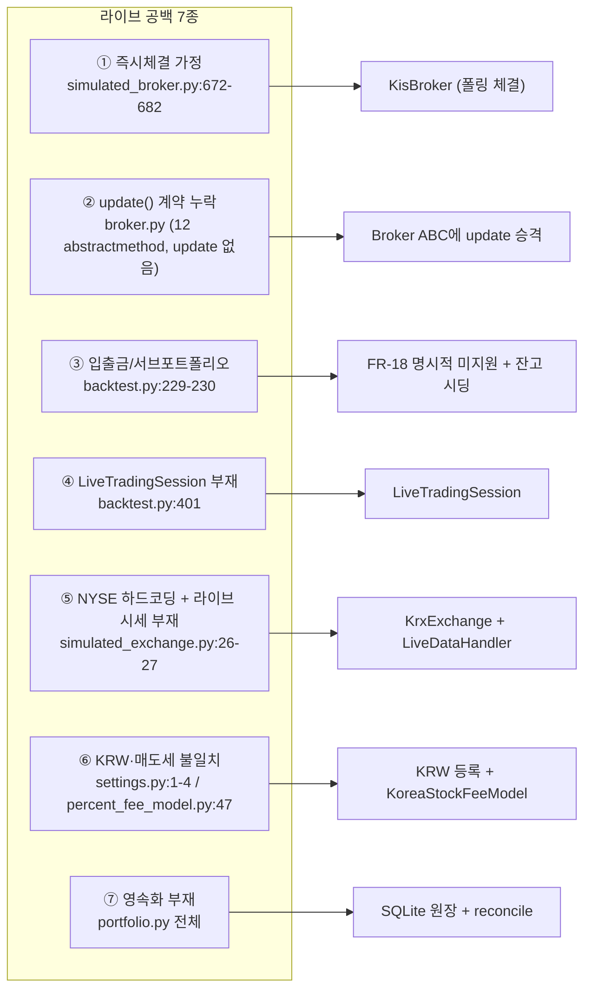
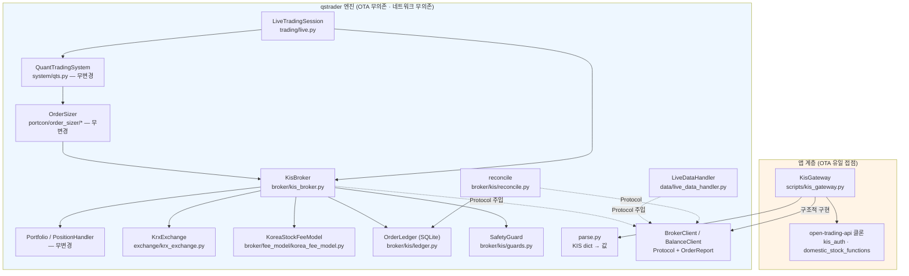
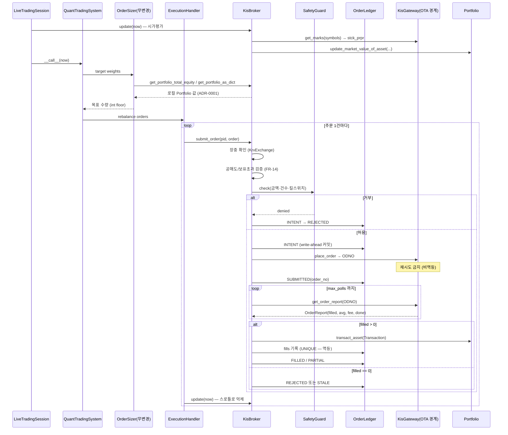

# 한국투자증권(KIS) 라이브 브로커 연동 — 설계안

| 항목 | 내용 |
| --- | --- |
| 문서 ID | `spec/kis-broker-design` |
| 작성일 | 2026-08-19 |
| 관점 | Software Architect |
| 상태 | **설계 초안 — 미구현** |
| 근거 스펙 | [kis-broker.md](kis-broker.md) (FR/NFR/C 번호는 이 문서를 가리킨다) |
| 설계 결정 | [ADR-0001 ~ ADR-0005](../adr/) — §4 참조 |
| 참조 구현 | `vm-quant-lab` — `packages/adapters/live/`, `packages/brokers/kis/` (가동 중) |

---

## 1. 요약

**결론: 엔진 코어는 거의 손대지 않는다. 라이브는 신규 모듈 8개와 기존 파일 4곳의 국소 변경으로 붙는다.**

| 구분 | 대상 | 내용 | 근거 요구 |
| --- | --- | --- | --- |
| **신규** | `qstrader/broker/kis/client.py` | `BrokerClient` Protocol + `OrderReport` 데이터클래스 (KIS SDK 무의존) | FR-2·FR-3, NFR-3 |
| **신규** | `qstrader/broker/kis/parse.py` | KIS 응답 dict → 값 파서 (lab `adapters/live/kis.py` 이식) | FR-3·FR-7, NFR-2 |
| **신규** | `qstrader/broker/kis_broker.py` | `Broker` ABC 구현체. 주문 큐 + 폴링 + `Portfolio` 갱신 | FR-1~FR-6 |
| **신규** | `qstrader/broker/kis/ledger.py` | SQLite 주문 원장 (write-ahead, append-only) | FR-16, NFR-6 |
| **신규** | `qstrader/broker/kis/reconcile.py` | 기동 시·주기적 잔고 대조 | FR-7·FR-8 |
| **신규** | `qstrader/broker/fee_model/korea_fee_model.py` | 매도 전용 거래세 모델 | FR-13 |
| **신규** | `qstrader/exchange/krx_exchange.py` | KRX 장운영시간·휴장일 | FR-9 |
| **신규** | `qstrader/data/live_data_handler.py` | KIS 현재가 → `DataHandler` 계약 | FR-10 |
| **신규** | `qstrader/trading/live.py` | `LiveTradingSession` | FR-17 |
| **신규** | `qstrader/broker/kis/guards.py` | 주문 한도·킬스위치 | FR-19 |
| **신규(저장소 밖 경계)** | `scripts/kis_gateway.py` | OTA를 import하는 **유일한** 파일. `BrokerClient` 실구현 | NFR-3, C-1 |
| **변경** | `qstrader/broker/broker.py` | `update(dt)`를 추상 메서드로 승격 | [ADR-0004](../adr/0004-promote-update-to-abc.md) |
| **변경** | `qstrader/settings.py:1-4` | `SUPPORTED['CURRENCIES']`에 `'KRW'` 추가 | FR-12 |
| **변경** | `qstrader/execution/execution_handler.py:83-86` | 주문마다 `update(dt)` 호출하는 루프의 재검토 | [ADR-0002](../adr/0002-blocking-fill-polling.md) |
| **변경** | `qstrader/trading/backtest.py:342,349` | ABC 밖 접근 2곳을 ABC 경유로 (선택) | FR-6 |

**변경하지 않는 것**: `OrderSizer` 2종, `PortfolioConstructionModel`, `AlphaModel` 전체, `Portfolio`/`Position`/`PositionHandler`, `Transaction`, 통계 계층. 이들이 그대로 재사용되는 것이 이 연동의 목적이다(스펙 §1.1).

---

## 2. 현행 구조가 라이브를 가로막는 지점

### 2.1 동기 즉시체결 가정

`SimulatedBroker.update()`는 거래소 개장을 확인한 뒤 큐의 주문을 **그 자리에서 전부 체결**한다.

```
simulated_broker.py:672    if self.exchange.is_open_at_datetime(self.current_dt):
simulated_broker.py:681-682    for portfolio, order in sorted_orders:
                                   self._execute_order(dt, portfolio, order)
```

`_execute_order`(`:543-612`)는 데이터 핸들러의 호가로 가격을 정하고(`:567-569`), 요청 수량 그대로 `Transaction`을 만들어(`:599-602`) 포트폴리오에 반영한다. **부분체결·미체결·거부라는 상태가 존재하지 않는다.** `scaled_quantity`라는 변수명이 남아 있지만 실제로는 스케일링하지 않고 `order.quantity`를 그대로 쓴다(`:589`).

현금 부족도 체결을 막지 못한다 — 경고만 출력하고 음수 잔고로 진행한다(`:590-596`, 그리고 `portfolio.py:220-226`에서 한 번 더). 라이브에서는 그 주문이 브로커에서 거부된다(C-11).

### 2.2 `update()`가 ABC 계약에 없다

`broker.py`의 `@abstractmethod`는 **12개**(grep 실측)이고 그중 `update`는 없다. 그런데 호출부는 두 곳에서 이를 사용한다.

| 호출부 | 위치 |
| --- | --- |
| `ExecutionHandler.__call__` | `execution_handler.py:86` — 주문 제출 **직후마다** |
| `BacktestTradingSession.run` | `backtest.py:408` — 이벤트 루프 매 틱 |

즉 **암묵 계약**이다. `Broker`를 상속한 새 클래스가 `update`를 빠뜨려도 인스턴스화는 성공하고, 실행 중 `AttributeError`로 터진다. 라이브 브로커에게 `update()`는 폴링·시가평가·reconciliation의 진입점이므로 계약 누락을 방치할 수 없다. → [ADR-0004](../adr/0004-promote-update-to-abc.md)

같은 성격의 계약 누출이 두 건 더 있다.

| 누출 | 위치 | 내용 |
| --- | --- | --- |
| `get_account_total_equity()["master"]` | `backtest.py:342` | 반환 dict에 `"master"` 키가 있다는 문서화되지 않은 가정 |
| `broker.portfolios[id]` | `backtest.py:349` | ABC에 없는 **속성**에 직접 접근 |
| `broker.fee_model` | `long_short.py:146`, `dollar_weighted.py:156` | 사이저가 브로커의 **속성**을 직접 읽는다 |

라이브 브로커는 이 셋을 모두 만족해야 한다 (FR-5·FR-6).

### 2.3 입출금·서브포트폴리오 개념이 KIS에 없다

ABC 12개 중 **4개가 자금 이동**이다: `subscribe_funds_to_account`(`:30`), `withdraw_funds_from_account`(`:45`), `subscribe_funds_to_portfolio`(`:127`), `withdraw_funds_from_portfolio`(`:143`). 시뮬레이션에서는 마스터 현금 계정과 서브포트폴리오 사이의 내부 이체다(`simulated_broker.py:396-397`, `:440-443`).

KIS 계좌에는 이런 계층이 없다. 하나의 계좌에 하나의 예수금이 있을 뿐이다. 그리고 백테스트 세션은 초기 자본을 **이 API로** 넣는다.

```
backtest.py:229-230    broker.create_portfolio(self.portfolio_id, self.portfolio_name)
                       broker.subscribe_funds_to_portfolio(self.portfolio_id, self.initial_cash)
```

라이브에서 같은 호출을 하면 로컬 현금만 늘어나고 브로커에는 아무 일도 일어나지 않는다 — **즉시 불일치**다. 그래서 FR-18은 이 4개를 예외로 막고, 초기 자본은 잔고 조회로 채운다.

### 2.4 `LiveTradingSession`이 없다 — 그리고 `SimulationEngine`은 대체재가 아니다

`TradingSession` ABC(`trading/trading_session.py`)의 구현체는 `BacktestTradingSession` 하나다. 그 실행 루프는 **미리 계산된 타임스탬프 시퀀스**를 순회한다.

```
backtest.py:114     self.sim_engine = self._create_simulation_engine()
backtest.py:245-247 return DailyBusinessDaySimulationEngine(self.start_dt, self.end_dt, ...)
backtest.py:401     for event in self.sim_engine:
```

`DailyBusinessDaySimulationEngine._generate_business_days`(`simulation/daily_bday.py:51`)는 `pd.date_range(..., freq=BDay())`로 **전 구간을 즉시 생성**한다(`:61-63`). 미래 타임스탬프를 미리 아는 구조이므로 라이브에 그대로 쓸 수 없다. 라이브는 "지금이 몇 시인가"를 벽시계에서 읽고 다음 이벤트까지 **대기**해야 한다.

### 2.5 거래소 캘린더가 NYSE 하드코딩이고, 라이브 `DataHandler`가 없다

```
simulated_exchange.py:24     # TODO: Eliminate hardcoding of NYSE
simulated_exchange.py:26-27  self.open_dt = datetime.time(14, 30)
                             self.close_dt = datetime.time(21, 00)
simulated_exchange.py:50-52  if dt.weekday() > 4: return False
                             return self.open_dt <= dt.time() and dt.time() < self.close_dt
```

UTC 기준 NYSE 시간이고, **tz-naive**이며, **휴장일 개념이 없다**(docstring이 `:35-37`에서 스스로 인정한다). KRX는 KST 09:00–15:30이며 한국 공휴일에 휴장한다.

데이터 쪽도 비어 있다. `BacktestDataHandler`(`data/backtest_data_handler.py`)만 존재하고, 그 소스는 `DataSource` ABC의 `get_bid`/`get_ask`/`get_assets_historical_closes` 3종(`data/data_source.py:22,43,64`)을 구현하는 일봉 기반 구현체뿐이다. 라이브 사이징은 **브로커 현재가**를 써야 한다.

### 2.6 통화·세금 모델이 한국과 맞지 않는다

| 불일치 | 위치 | 내용 |
| --- | --- | --- |
| 통화 | `settings.py:1-4`, `simulated_broker.py:93-98` | `SUPPORTED['CURRENCIES'] = ['USD','GBP','EUR']`. `KRW`는 `ValueError` |
| 통화 기본값 | `portfolio.py:37` | `currency="USD"` |
| 세금 방향 | `percent_fee_model.py:47-68` | `_calc_tax`가 `abs(consideration)`에 부과 — **매수에도 붙는다**. 한국 증권거래세는 매도 전용(C-9) |
| 미사용 플래그 | `asset/equity.py:32` | `tax_exempt`가 정의되어 있으나 어떤 `FeeModel`도 읽지 않는다 (사용처 0건) |

`FeeModel.calc_total_cost(asset, quantity, consideration, broker=None)`는 `quantity`를 받으므로(`fee_model.py:63`) **부호로 매수/매도를 구분할 수 있다.** 인터페이스 변경 없이 매도 전용 세금이 구현 가능하다 — 이것이 FR-13의 근거이자 [ADR-0005](../adr/0005-sell-side-transaction-tax.md)의 출발점이다.

### 2.7 상태 영속화·재시작 복구가 없다

`Portfolio`는 순수 인메모리다. `history`는 파이썬 리스트(`portfolio.py:54`)이고 저장 경로가 없으며, `history_to_df()`(`:324-333`)는 DataFrame 변환만 한다. `PositionHandler.positions`도 dict다.

백테스트는 프로세스가 끝나면 결과만 남기면 되므로 문제가 없다. 라이브는 다르다 — **주문을 낸 직후 프로세스가 죽으면 그 주문의 존재 자체가 소실된다.** 재기동 시 엔진은 자기가 무엇을 주문했는지 모르고, 브로커에는 체결된 포지션이 남는다.

### 2.8 종합



---

## 3. 제안 아키텍처

### 3.1 계층 경계

**핵심 원칙: KIS SDK(OTA) 의존은 `scripts/kis_gateway.py` 한 파일에만 존재한다.** 엔진은 `BrokerClient` Protocol만 안다 (NFR-3).

이는 lab에서 이미 검증된 경계다. lab의 `KisBrokerClient`는 앱 계층(`packages/brokers/kis/`)에 살고, 런타임 어댑터(`packages/adapters/live/execution.py`)는 Protocol만 참조한다. lab 문서가 그 이유를 명시한다 — *"OTA·네트워크 무 → OTA 없이 런타임 테스트 가능"*(`adapters/live/kis.py`).



주입 방향에 주의: **엔진이 게이트웨이를 import하지 않는다.** 호출부(운용 스크립트)가 `KisGateway`를 만들어 `KisBroker(client=gateway, ...)`로 넣는다. `pyproject.toml`에 OTA 의존이 추가되지 않는다.

### 3.2 신규 모듈의 책임

| 모듈 | 책임 | 하지 않는 것 |
| --- | --- | --- |
| `broker/kis/client.py` | `BrokerClient`·`BalanceClient` Protocol, `OrderReport` 데이터클래스 정의 | 네트워크 호출 |
| `broker/kis/parse.py` | KIS 응답 dict row → 스칼라/구조체. `stck_prpr`·`ODNO`·`tot_ccld_qty`·`avg_prvs`·`rmn_qty`·`tot_ccld_amt`·`pdno`·`hldg_qty`·`pchs_avg_pric`·`dnca_tot_amt` | pandas 사용, HTTP |
| `broker/kis_broker.py` | `Broker` ABC 구현. 주문 큐, 폴링, `Transaction` 생성, `Portfolio` 갱신, 시가평가 | KIS 필드명을 아는 것 (파서에 위임) |
| `broker/kis/ledger.py` | 주문 상태 전이의 write-ahead 영속화, 체결 멱등성(UNIQUE 제약) | 브로커 호출 |
| `broker/kis/reconcile.py` | 미종결 주문 재조회, 포지션 대조, 불일치 보고 | 자동 정정 주문 발행 |
| `broker/kis/guards.py` | 주문 금액·건수 상한, 킬스위치 | 전략 판단 |
| `broker/fee_model/korea_fee_model.py` | `quantity` 부호로 매수/매도 구분, 매도에만 거래세 | 세율 조회 (생성자 인자) |
| `exchange/krx_exchange.py` | KST 장운영시간 + 휴장일 집합 판정 | 시세 제공 |
| `data/live_data_handler.py` | `get_asset_latest_{bid,ask,bid_ask,mid}_price`를 브로커 현재가로 구현 | 과거 시계열 (신호용은 별도 소스) |
| `trading/live.py` | 벽시계 기반 리밸런싱 루프, 기동 시 reconcile, graceful shutdown | 사이징·알파 판단 |
| `scripts/kis_gateway.py` | OTA 인증(`svr`), `env_dv` 파생, 문자열 파라미터 변환, 레이트리밋 스로틀·재시도, DataFrame→dict | 도메인 판단 |

### 3.3 심볼 매핑

기존 엔진은 `'EQ:SPY'` 형식의 QSTrader 심볼을 쓴다(보고서 05 §2에서 역추출된 계약). KIS는 6자리 종목코드(`pdno`, 예: `005930`)를 쓴다. 게이트웨이 경계에서 `'EQ:005930' ↔ '005930'`을 변환한다 — **엔진은 항상 `EQ:` 접두 심볼만 본다.** 이렇게 두면 `StaticUniverse`·`Portfolio`·통계가 무변경으로 동작한다.

---

## 4. 핵심 설계 결정

각 결정은 별도 ADR로 기록한다. 아래는 요약이며, 맥락·대안·트레이드오프는 각 문서에 있다.

| ADR | 결정 | 핵심 근거 | 주요 트레이드오프 |
| --- | --- | --- | --- |
| [0001](../adr/0001-portfolio-source-of-truth.md) | 진실원본은 **로컬 `Portfolio`**, 브로커 잔고가 이를 정정한다 | 매번 조회하면 레이트리밋에 걸리고, KIS 잔고는 `unrealised_pnl` 등 FR-5 계약 필드를 주지 않는다 | 상태가 둘이므로 수렴 규칙이 필요하다 |
| [0002](../adr/0002-blocking-fill-polling.md) | 체결 폴링을 **`submit_order()` 안에서 블로킹**한다 | 주문 1건의 생애가 한 함수에서 끝나 원장 전이를 한곳에 둘 수 있다 | `submit_order`가 느려지고 ABC의 큐 모델에서 벗어난다 |
| [0003](../adr/0003-port-lab-code.md) | lab 코드는 **의존이 아니라 이식(port)** 한다 | 도메인 모델이 달라 의존하면 변환 계층이 늘고, 백지 재구현은 실계좌에서 얻은 함정 지식을 버린다 | 코드 중복 — 상류 수정이 자동 전파되지 않는다 |
| [0004](../adr/0004-promote-update-to-abc.md) | **`update(dt)`를 `Broker` ABC의 추상 메서드로 승격**한다 | 두 호출부가 이미 의존하는 암묵 계약이고, 라이브에서 누락은 조용한 상태 발산이다 | 외부 커스텀 `Broker` 구현이 깨진다 (파괴적 변경) |
| [0005](../adr/0005-sell-side-transaction-tax.md) | 매도 전용 거래세는 **`quantity` 부호로 판정**한다 (인터페이스 무변경) | `calc_total_cost`가 이미 `quantity`를 받는다 | 사이저가 부호를 잃으므로 국소 수정이 필요 — 유일한 코어 침습 |

---

## 5. 인터페이스 매핑

### 5.1 `Broker` ABC → KIS

| Broker ABC 메서드 | KIS API / 필드 | 비고 |
| --- | --- | --- |
| `subscribe_funds_to_account(amount)` | — | **FR-18: `NotImplementedError`**. KIS에 자금 이체 API 없음 |
| `withdraw_funds_from_account(amount)` | — | 동상 |
| `subscribe_funds_to_portfolio(id, amount)` | — | 동상. `backtest.py:230`과 달리 라이브는 잔고 조회로 시딩 |
| `withdraw_funds_from_portfolio(id, amount)` | — | 동상 |
| `get_account_cash_balance(currency=None)` | `inquire_balance` → output2 `dnca_tot_amt` (예수금총금액) | `{'KRW': x}` 또는 스칼라. **캐시 필수**(NFR-1). C-8: 주문가능금액과 다름 |
| `get_account_total_equity()` | 로컬 `Portfolio.total_equity` | **`"master"` 키 필수**(FR-6, `backtest.py:342`). 검증용으로 output2 `tot_evlu_amt` 대조 |
| `create_portfolio(id, name)` | — | 로컬 `Portfolio` 생성만. 계좌는 이미 존재 |
| `list_all_portfolios()` | — | 단일 포트폴리오 리스트 반환 |
| `get_portfolio_cash_balance(id)` | 로컬 `Portfolio.cash` (시딩·대조는 `dnca_tot_amt`) | [ADR-0001](../adr/0001-portfolio-source-of-truth.md) |
| `get_portfolio_total_equity(id)` | 로컬 `Portfolio.total_equity` | 사이저가 리밸런싱마다 호출(`long_short.py:73`) |
| `get_portfolio_as_dict(id)` | 로컬 `Portfolio.portfolio_to_dict()` (시딩은 output1 `pdno`·`hldg_qty`·`pchs_avg_pric`) | FR-5 계약 5개 필드 유지 |
| `submit_order(id, order)` | `order_cash` (`ord_dvsn="01"`, `ord_qty`=str, `ord_unpr="0"`, `excg_id_dvsn_cd="KRX"`) → `ODNO` | [ADR-0002](../adr/0002-blocking-fill-polling.md): 여기서 폴링까지 완료 |
| `update(dt)` **(신규 추상)** | `inquire_price` → `stck_prpr` (시가평가), 주기적 `inquire_balance` (대조) | [ADR-0004](../adr/0004-promote-update-to-abc.md). 스로틀 필요 |

### 5.2 폴링 응답 → 엔진 값

| KIS 필드 (`inquire_daily_ccld` output1) | 엔진 값 | 비고 |
| --- | --- | --- |
| `tot_ccld_qty` | `Transaction.quantity` (매도는 부호 반전) | 요청량이 아니라 **체결량** |
| `avg_prvs` | `Transaction.price` | 가중평균 체결가 |
| `tot_ccld_amt` | 수수료 추정 기준 | KIS가 주문 단위 수수료를 주는지 **미확인**(스펙 §8). lab은 `tot_ccld_amt × fee_rate`로 근사 |
| `rmn_qty` | 종결 판정 (`rmn_qty <= 0` and `tot_ccld_qty >= 요청량`) | 응답 행 없음 = 미체결 (거부와 구분 불가 — §7) |

`Transaction` 생성 시 `commission=` 인자에 위 수수료를 넣으면 `cost_with_commission`(`transaction.py:73`)이 이를 반영하고, `Portfolio.transact_asset`(`portfolio.py:204`)이 현금·포지션을 갱신한다. **이 경로는 백테스트와 완전히 동일하다** — 라이브 연동이 회계 코드를 건드리지 않는 이유다.

---

## 6. 주문 제출~체결 시퀀스



---

## 7. 실패 모드와 대응

| # | 실패 모드 | 탐지 | 대응 | 관련 요구 |
| --- | --- | --- | --- | --- |
| F1 | **주문 거부** (예수금 부족·거래정지·호가 범위) | `place_order` 예외 | 세션을 죽이지 않는다. 원장에 REJECTED, 경고 로그, **다음 주문 계속**. 다음 리밸런싱에서 자연 재산출 | FR-16 |
| F2 | **폴링 타임아웃** (`max_polls` 소진) | `done=False` | **부분체결분만** 반영, 원장 STALE, 경고. 잔량은 다음 기동 reconcile 대상. 취소 주문은 내지 않는다(비범위) | FR-3, C-7 |
| F3 | **부분체결** | `filled < requested` | 체결분으로만 `Transaction` 생성. 목표 미달은 다음 리밸런싱이 흡수 | FR-3 |
| F4 | **체결 0 vs 거부의 모호성** | `inquire_daily_ccld` 빈 응답 | **재시도하지 않는다** — 빈 응답이 정상 미체결이라 레이트리밋과 구분 불가(lab `client.py`). 미체결로 처리하고 폴링 계속 | NFR-1 |
| F5 | **토큰 만료** | 게이트웨이 호출 실패 | 게이트웨이가 재인증 후 1회 재시도. **주문 호출은 재인증 후에도 재시도 금지**(중복 위험) | C-2, NFR-1 |
| F6 | **네트워크 단절** | 예외 | 조회는 백오프 재시도(`call_with_retry` 이식), 주문은 즉시 실패 전파. 연속 오류 N회 시 킬스위치 | NFR-1, FR-19 |
| F7 | **접수 직후 프로세스 사망** | 재기동 시 원장에 SUBMITTED 잔존 | reconcile이 `order_no`로 재조회해 체결분을 **멱등 기록**(fills UNIQUE), 상태 수렴 | FR-7, NFR-6 |
| F8 | **INTENT 직후 사망** (주문번호 없음) | 재기동 시 원장에 INTENT + `order_no=None` | 대조 불가 → REJECTED로 정리 + **경보**. 실제로는 접수됐을 수 있으므로 **잔고 대조가 최종 방어선** | FR-7·FR-8 |
| F9 | **잔고 불일치 — 로컬 과대** (없는 주식을 팔려 든다) | reconcile 포지션 비교 | **매매 중단**. 로컬을 브로커 값으로 정정 후 수동 확인 요구 | FR-8 |
| F10 | **잔고 불일치 — 미추적 포지션** | reconcile | 경보만. 다른 경로(수동 매매)일 수 있으므로 중단하지 않는다 | FR-8 |
| F11 | **레이트리밋 (`EGW00201`)** | 빈 응답 | 조회: 선형 백오프 재시도. 주문: **주문 직전 정착 대기**로 예방(재시도 불가하므로 애초에 걸리지 않게 — lab `client.py`의 실증 근거) | NFR-1 |
| F12 | **장중 아님** | `KrxExchange.is_open_at_datetime` | 주문 접수 거부, 다음 개장까지 대기 | FR-9 |
| F13 | **시세 조회 실패** (마크 없음) | `parse_price` fail-loud | 해당 종목 주문 생략. **마크 0으로 진행하지 않는다** — 사이징 분모라 폭주 위험(lab `kis.py`) | FR-10 |
| F14 | **음수 현금** (백테스트는 허용, 라이브는 불가) | 사전 클램프 | 매수 수량을 가용 현금 기준으로 내림. 0주면 무주문 | C-11, FR-11 |

---

## 8. 테스트 전략

기존 구조(`tests/unit/broker/…`, `tests/integration/trading/…`)를 따른다. **전부 네트워크 없이 실행된다**(NFR-2).

| 계층 | 파일 | 대상 | 방법 |
| --- | --- | --- | --- |
| 단위 | `tests/unit/broker/kis/test_parse.py` | 필드 파싱 | KIS 응답 dict fixture. 빈 응답·결측 필드·문자열 숫자·공백 포함. **fail-loud 케이스 포함**(현재가 결측 시 예외) |
| 단위 | `tests/unit/broker/test_kis_broker.py` | `Broker` ABC 12+1 메서드 | **가짜 `BrokerClient` 주입**. 매수/매도 부호 매핑, 정수 내림(0.9→0, 1.4→1), 체결 0 무거래, 부분체결, FR-18 예외 4건 |
| 단위 | `tests/unit/broker/kis/test_ledger.py` | 원장 | 임시 SQLite. 전이 검증, fills UNIQUE 이중 반영 차단, append-only |
| 단위 | `tests/unit/broker/kis/test_reconcile.py` | 대조 | 원장·잔고 fixture 조합. F7~F10 각각의 판정 |
| 단위 | `tests/unit/broker/kis/test_guards.py` | 가드 | 금액 초과·건수 초과·킬스위치 |
| 단위 | `tests/unit/broker/fee_model/test_korea_fee_model.py` | 매도세 비대칭 | 동일 규모 매수/매도 비교 (기존 `test_percent_fee_model.py`와 나란히) |
| 단위 | `tests/unit/exchange/test_krx_exchange.py` | 캘린더 | 08:59/09:00/15:29/15:30/주말/휴장일 파라미터화 |
| 단위 | `tests/unit/data/test_live_data_handler.py` | 시세 계약 | `get_asset_latest_*` 4종 |
| 단위 | `tests/unit/test_abstract_base_classes.py` (기존) | `update` 승격 | ABC 목록에 이미 `Broker` 포함(`:49`) — 추상 메서드 수 변경이 여기서 드러난다 |
| 통합 | `tests/integration/trading/test_live_session_e2e.py` | 전 경로 | 가짜 브로커 + 가짜 시계 + 가짜 `sleep`. 목표비중→주문→부분체결→포트폴리오→자본곡선 |
| 통합 | `tests/integration/trading/test_live_restart.py` | 재기동 | 세션 중단 후 원장·잔고로 복구, 이중 반영 없음 |
| 회귀 | 기존 e2e 백테스트 | NFR-4 | 최종 자본 불변 |
| 수동 | `scripts/` 스모크 | A-3·A-4·A-5 | `vps` 계좌 2종목. **`prod`는 인수 범위 밖** |

**가짜 `BrokerClient` 설계**: `place_order`가 호출 인자를 기록하고 사전 정의된 `OrderReport` 시퀀스를 반환한다. `sleep`은 주입 가능해야 한다 — lab이 `KisExecution.sleep`을 필드로 둔 이유가 정확히 이것이다. 테스트가 실시간 대기 없이 폴링 로직을 검증한다.

**커버리지 목표**: 신규 모듈 각각 90% 이상. 브로커 연동은 실패 경로가 본질이므로, 정상 경로만 덮은 커버리지는 무의미하다 — 보고서 06이 실측한 교훈(e2e가 전면적 룩어헤드를 통과시켰다)이 그대로 적용된다. F1~F14 각각에 대응 테스트를 요구한다.

---

## 9. 단계별 구현 계획

### Phase 1 — 계약과 순수 로직 (네트워크 0)

| 산출물 | 내용 |
| --- | --- |
| `broker/kis/client.py` | Protocol + `OrderReport` |
| `broker/kis/parse.py` | 파서 (lab 이식) |
| `broker/fee_model/korea_fee_model.py` | 매도세 |
| `exchange/krx_exchange.py` | KRX 캘린더 |
| `settings.py` | `'KRW'` 추가 |
| `broker.py` | `update` 추상 승격 |
| 테스트 | 위 단위 테스트 6종 |

**여기까지면 무엇이 동작하는가**: 아직 주문은 못 낸다. 그러나 **KIS 응답을 값으로 바꾸고, 한국식 비용을 계산하고, 장중 여부를 판정할 수 있다.** KRW 백테스트가 실행 가능해진다 — 한국 종목 CSV로 매도세를 반영한 백테스트를 돌릴 수 있고, 이것만으로도 독립적 가치가 있다. ADR-0004의 파괴적 변경도 이 단계에서 격리 검증된다.

### Phase 2 — 브로커 구현 (가짜 클라이언트로 완주)

| 산출물 | 내용 |
| --- | --- |
| `broker/kis_broker.py` | `Broker` 구현. 폴링·클램프·공매도 거부 |
| `data/live_data_handler.py` | 라이브 시세 |
| `broker/kis/ledger.py` | SQLite 원장 |
| `broker/kis/guards.py` | 안전 가드 |
| 테스트 | 단위 + `test_live_session_e2e.py` (가짜 브로커 주입) |

**여기까지면**: 가짜 `BrokerClient`를 주입한 상태로 **주문 제출부터 포트폴리오 반영까지 전 경로가 통과**한다. 인수 기준 A-1·A-2 달성. 실제 KIS는 아직 붙지 않았지만, **엔진 쪽 위험은 전부 제거**된다. 이 시점에서 남은 위험은 순전히 KIS API 쪽이다.

### Phase 3 — 게이트웨이와 라이브 세션

| 산출물 | 내용 |
| --- | --- |
| `scripts/kis_gateway.py` | OTA 래핑, 인증, 스로틀·재시도, 심볼 변환 |
| `trading/live.py` | `LiveTradingSession` |
| `broker/kis/reconcile.py` | 기동 대조 |
| 문서 | 운용 가이드 (`docs/user/`) |
| 검증 | 모의투자 스모크 (A-3·A-4·A-5) |

**여기까지면**: `vps` 계좌에서 실제 리밸런싱이 돈다. 인수 기준 전건 달성.

### 순서의 근거

Phase 1→2는 **의존 방향**이 강제한다(브로커가 파서·캘린더·세금을 쓴다). Phase 2→3은 **위험 분리**가 이유다 — 게이트웨이를 먼저 만들면 엔진 버그와 API 버그가 섞여 디버깅이 어렵다. Phase 2 종료 시점에 엔진이 이미 검증돼 있으면, Phase 3의 실패는 전부 API 문제로 좁혀진다.

---

## 10. 미해결 질문 / 후속 과제

| # | 질문 | 영향 | 해결 시점 |
| --- | --- | --- | --- |
| Q1 | 한국 휴장일 캘린더를 어디서 얻는가? KIS API인가, `exchange_calendars` 패키지인가, 하드코딩 파일인가? | FR-9 구현 방식과 신규 런타임 의존 여부 | Phase 1 착수 전 |
| Q2 | KIS가 주문 단위 실수수료를 응답하는가? | 수수료를 추정에서 실측으로 승격 가능한지. 현재는 lab과 동일하게 근사 | Phase 3 스모크 |
| Q3 | 신호용 과거 시세를 어디서 얻는가? KIS 일봉 API인가, 기존 CSV인가? | 라이브에서도 `SMASignal` 등이 동작하려면 과거 데이터가 필요하다. 본 설계는 **시세(마크)만** 다루고 신호용 시계열은 미해결 | Phase 3 |
| Q4 | `ExecutionHandler:86`의 주문당 `update(dt)` 호출을 라이브에서 어떻게 억제할 것인가? 스로틀인가, `ExecutionHandler` 수정인가? | ADR-0002의 트레이드오프. API 호출 낭비 | Phase 2 |
| Q5 | 사이저의 `_estimate_trade_costs`가 부호를 잃는 문제(`long_short.py:145`)를 어떻게 고칠 것인가? | ADR-0005의 유일한 코어 침습. 백테스트 결과에 영향 → NFR-4와 충돌 가능 | Phase 1 |
| Q6 | 다중 프로세스/다중 전략이 같은 계좌를 쓸 때의 격리 | 현재 설계는 단일 프로세스·단일 전략 전제. lab은 `GroupCap`·`strategy` 귀속으로 해결했으나 본안 비범위 | 후속 |
| Q7 | 미체결 잔량의 취소·재시도 | 현재는 STALE로 두고 다음 리밸런싱이 흡수. 슬리피지 누적 시 재검토 | 후속 |
| Q8 | 실전(`prod`) 승격 기준 | A-1~A-5는 모의투자까지만 요구한다. 실전 전환 체크리스트가 별도로 필요 | 후속 |
| Q9 | 보고서 04의 L1(시간분할 실행 불가)이 라이브에서 더 아픈가? | 시장가 일괄 주문은 대형 리밸런싱에서 시장충격을 받는다. 실행 알고리즘 주입 지점은 v0.3.13에서 확보됨 | 후속 |
