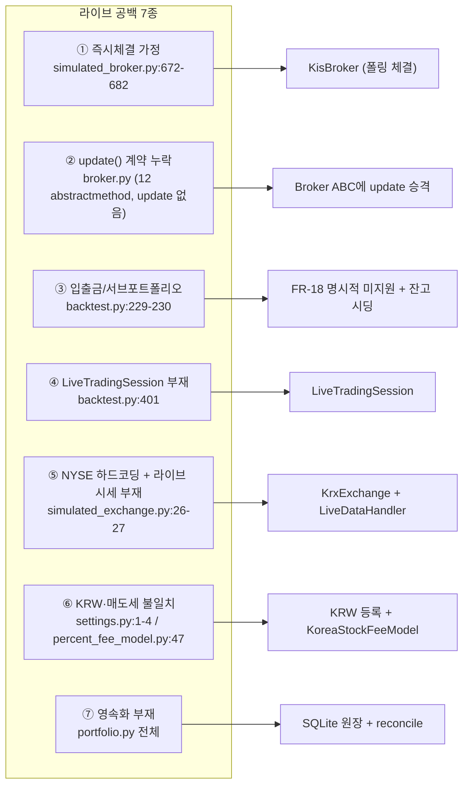
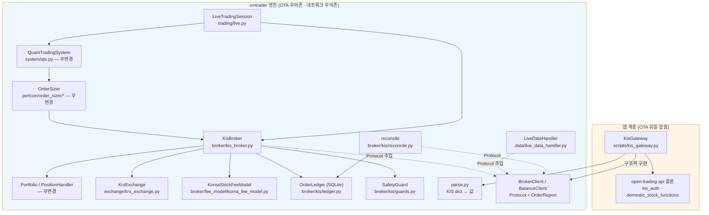
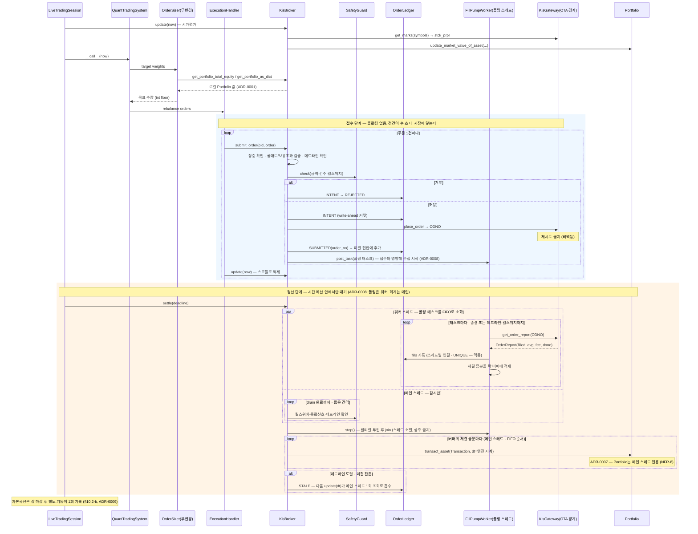
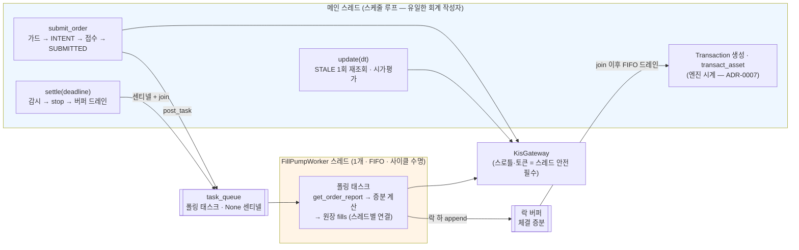

# 한국투자증권(KIS) 라이브 브로커 연동 — 설계안

| 항목 | 내용 |
| --- | --- |
| 문서 ID | `spec/kis-broker-design` |
| 작성일 | 2026-08-19 |
| 관점 | Software Architect |
| 상태 | **설계 초안 — 미구현** |
| 근거 스펙 | [kis-broker.md](kis-broker.md) (FR/NFR/C 번호는 이 문서를 가리킨다) |
| 설계 결정 | [ADR-0001 ~ ADR-0009](../adr/) — §4 참조 (0002는 폐기됨) |
| 참조 구현 | `vm-quant-lab` — `packages/adapters/live/`, `packages/brokers/kis/` (가동 중) |

---

## 1. 요약

**결론: 엔진 코어는 거의 손대지 않는다. 라이브는 신규 모듈 13개와 기존 파일 4곳의 국소 변경으로 붙는다.**

| 구분 | 대상 | 내용 | 근거 요구 |
| --- | --- | --- | --- |
| **신규** | `vmtrader/broker/kis/client.py` | `BrokerClient` Protocol + `OrderReport` 데이터클래스 (KIS SDK 무의존) | FR-2·FR-3, NFR-3 |
| **신규** | `vmtrader/broker/kis/parse.py` | KIS 응답 dict → 값 파서 (lab `adapters/live/kis.py` 이식) | FR-3·FR-7, NFR-2 |
| **신규** | `vmtrader/broker/kis_broker.py` | `Broker` ABC 구현체. 주문 큐 + 폴링 + `Portfolio` 갱신 | FR-1~FR-6 |
| **신규** | `vmtrader/broker/kis/ledger.py` | SQLite 주문 원장 (write-ahead, append-only) | FR-16, NFR-6 |
| **신규** | `vmtrader/broker/kis/reconcile.py` | 기동 시·주기적 잔고 대조 | FR-7·FR-8 |
| **신규** | `vmtrader/broker/fee_model/korea_fee_model.py` | 매도 전용 거래세 모델 | FR-13 |
| **신규** | `vmtrader/exchange/krx_exchange.py` | KRX 장운영시간·휴장일 | FR-9 |
| **신규** | `vmtrader/data/live_data_handler.py` | KIS 현재가 → `DataHandler` 계약 | FR-10 |
| **신규** | `vmtrader/trading/live.py` | `LiveTradingSession` | FR-17 |
| **신규** | `vmtrader/broker/kis/guards.py` | 주문 한도·킬스위치 | FR-19 |
| **신규** | `vmtrader/broker/kis/worker.py` | 단일 FIFO 태스크 큐 워커 — `smtm/worker.py` 이식 (lab `FillPumpWorker`로 검증됨) | FR-24, [ADR-0008](../adr/0008-task-queue-fill-pump.md) |
| **신규(저장소 밖 경계)** | `scripts/kis_gateway.py` | OTA를 import하는 **유일한** 파일. `BrokerClient` 실구현 | NFR-3, C-1 |
| **신규(엔진 밖·상주)** | `scripts/telegram_gateway.py` | 텔레그램 대화형 운용 데몬 — pandas·vmtrader·OTA 무의존, 원장 읽기 전용 + 킬스위치 플래그 쓰기 | FR-25, NFR-10, [ADR-0010](../adr/0010-telegram-gateway-plane.md) |
| **변경** | `vmtrader/broker/broker.py` | `update(dt)`를 추상 메서드로 승격 | [ADR-0004](../adr/0004-promote-update-to-abc.md) |
| **변경** | `vmtrader/settings.py:1-4` | `SUPPORTED['CURRENCIES']`에 `'KRW'` 추가 | FR-12 |
| **변경** | `vmtrader/execution/execution_handler.py:83-86` | 주문마다 `update(dt)` 호출하는 루프의 재검토 | [ADR-0006](../adr/0006-decouple-submit-from-fill.md) |
| **변경** | `vmtrader/trading/backtest.py:342,349` | ABC 밖 접근 2곳을 ABC 경유로 (선택) | FR-6 |

**변경하지 않는 것**: `OrderSizer` 2종, `PortfolioConstructionModel`, `AlphaModel` 전체, `Portfolio`/`Position`/`PositionHandler`, `Transaction`, 통계 계층. 이들이 그대로 재사용되는 것이 이 연동의 목적이다(스펙 §1.1).

---

## 2. 현행 구조가 라이브를 가로막는 지점

### 2.1 동기 즉시체결 가정

`SimulatedBroker.update()`는 거래소 개장을 확인한 뒤 큐의 주문을 **그 자리에서 전부 체결**한다.

```
simulated_broker.py:672    if self.exchange.is_open_at_datetime(self.current_dt):
simulated_broker.py:681-682    for portfolio, order in sorted_orders:
                                   self._execute_order(dt, portfolio, order)
```

`_execute_order`(`:543-612`)는 데이터 핸들러의 호가로 가격을 정하고(`:567-569`), 요청 수량 그대로 `Transaction`을 만들어(`:599-602`) 포트폴리오에 반영한다. **부분체결·미체결·거부라는 상태가 존재하지 않는다.** `scaled_quantity`라는 변수명이 남아 있지만 실제로는 스케일링하지 않고 `order.quantity`를 그대로 쓴다(`:589`).

현금 부족도 체결을 막지 못한다 — 경고만 출력하고 음수 잔고로 진행한다(`:590-596`, 그리고 `portfolio.py:220-226`에서 한 번 더). 라이브에서는 그 주문이 브로커에서 거부된다(C-11).

### 2.2 `update()`가 ABC 계약에 없다

`broker.py`의 `@abstractmethod`는 **12개**(grep 실측)이고 그중 `update`는 없다. 그런데 호출부는 두 곳에서 이를 사용한다.

| 호출부 | 위치 |
| --- | --- |
| `ExecutionHandler.__call__` | `execution_handler.py:86` — 주문 제출 **직후마다** |
| `BacktestTradingSession.run` | `backtest.py:408` — 이벤트 루프 매 틱 |

즉 **암묵 계약**이다. `Broker`를 상속한 새 클래스가 `update`를 빠뜨려도 인스턴스화는 성공하고, 실행 중 `AttributeError`로 터진다. 라이브 브로커에게 `update()`는 폴링·시가평가·reconciliation의 진입점이므로 계약 누락을 방치할 수 없다. → [ADR-0004](../adr/0004-promote-update-to-abc.md)

같은 성격의 계약 누출이 두 건 더 있다.

| 누출 | 위치 | 내용 |
| --- | --- | --- |
| `get_account_total_equity()["master"]` | `backtest.py:342` | 반환 dict에 `"master"` 키가 있다는 문서화되지 않은 가정 |
| `broker.portfolios[id]` | `backtest.py:349` | ABC에 없는 **속성**에 직접 접근 |
| `broker.fee_model` | `long_short.py:146`, `dollar_weighted.py:156` | 사이저가 브로커의 **속성**을 직접 읽는다 |

라이브 브로커는 이 셋을 모두 만족해야 한다 (FR-5·FR-6).

### 2.3 입출금·서브포트폴리오 개념이 KIS에 없다

ABC 12개 중 **4개가 자금 이동**이다: `subscribe_funds_to_account`(`:30`), `withdraw_funds_from_account`(`:45`), `subscribe_funds_to_portfolio`(`:127`), `withdraw_funds_from_portfolio`(`:143`). 시뮬레이션에서는 마스터 현금 계정과 서브포트폴리오 사이의 내부 이체다(`simulated_broker.py:396-397`, `:440-443`).

KIS 계좌에는 이런 계층이 없다. 하나의 계좌에 하나의 예수금이 있을 뿐이다. 그리고 백테스트 세션은 초기 자본을 **이 API로** 넣는다.

```
backtest.py:229-230    broker.create_portfolio(self.portfolio_id, self.portfolio_name)
                       broker.subscribe_funds_to_portfolio(self.portfolio_id, self.initial_cash)
```

라이브에서 같은 호출을 하면 로컬 현금만 늘어나고 브로커에는 아무 일도 일어나지 않는다 — **즉시 불일치**다. 그래서 FR-18은 이 4개를 예외로 막고, 초기 자본은 잔고 조회로 채운다.

### 2.4 `LiveTradingSession`이 없다 — 그리고 `SimulationEngine`은 대체재가 아니다

`TradingSession` ABC(`trading/trading_session.py`)의 구현체는 `BacktestTradingSession` 하나다. 그 실행 루프는 **미리 계산된 타임스탬프 시퀀스**를 순회한다.

```
backtest.py:114     self.sim_engine = self._create_simulation_engine()
backtest.py:245-247 return DailyBusinessDaySimulationEngine(self.start_dt, self.end_dt, ...)
backtest.py:401     for event in self.sim_engine:
```

`DailyBusinessDaySimulationEngine._generate_business_days`(`simulation/daily_bday.py:51`)는 `pd.date_range(..., freq=BDay())`로 **전 구간을 즉시 생성**한다(`:61-63`). 미래 타임스탬프를 미리 아는 구조이므로 라이브에 그대로 쓸 수 없다. 라이브는 "지금이 몇 시인가"를 벽시계에서 읽어야 한다. 단, **다음 이벤트까지의 대기를 프로세스 안에서 하지는 않는다** — 라이브의 하루 이벤트는 리밸런싱 1회와 장 마감 기록 1회뿐이므로, 이벤트 사이의 대기는 cron이 담당하고 프로세스는 기동 1회 = 사이클 1회로 끝난다 ([ADR-0009](../adr/0009-cron-oneshot-live-session.md)). 프로세스 안에 남는 대기는 정산 시간 예산(FR-23) 안의 사이클 내 대기뿐이다.

### 2.5 거래소 캘린더가 NYSE 하드코딩이고, 라이브 `DataHandler`가 없다

```
simulated_exchange.py:24     # TODO: Eliminate hardcoding of NYSE
simulated_exchange.py:26-27  self.open_dt = datetime.time(14, 30)
                             self.close_dt = datetime.time(21, 00)
simulated_exchange.py:50-52  if dt.weekday() > 4: return False
                             return self.open_dt <= dt.time() and dt.time() < self.close_dt
```

UTC 기준 NYSE 시간이고, **tz-naive**이며, **휴장일 개념이 없다**(docstring이 `:35-37`에서 스스로 인정한다). KRX는 KST 09:00–15:30이며 한국 공휴일에 휴장한다.

그리고 거래소 캘린더를 고쳐도 **리밸런싱 스케줄 계층이 별도로 NYSE 시각을 박아 두고 있다.**

```
system/rebalance/daily.py:53   return "14:30:00" if pre_market else "21:00:00"
```

`weekly.py:67`·`end_of_month.py:38`도 동형이다. 즉 시각 하드코딩은 `SimulatedExchange` 한 곳이 아니라 **두 계층**에 있다. 라이브에서 하루 중 언제 리밸런싱할지는 단순 치환이 아니라 설계 사안이다.

데이터 쪽도 비어 있다. `BacktestDataHandler`(`data/backtest_data_handler.py`)만 존재하고, 그 소스는 `DataSource` ABC의 `get_bid`/`get_ask`/`get_assets_historical_closes` 3종(`data/data_source.py:22,43,64`)을 구현하는 일봉 기반 구현체뿐이다. 라이브 사이징은 **브로커 현재가**를 써야 한다.

### 2.6 통화·세금 모델이 한국과 맞지 않는다

| 불일치 | 위치 | 내용 |
| --- | --- | --- |
| 통화 | `settings.py:1-4`, `simulated_broker.py:93-98` | `SUPPORTED['CURRENCIES'] = ['USD','GBP','EUR']`. `KRW`는 `ValueError` |
| 통화 기본값 | `portfolio.py:37` | `currency="USD"` |
| 세금 방향 | `percent_fee_model.py:47-68` | `_calc_tax`가 `abs(consideration)`에 부과 — **매수에도 붙는다**. 한국 증권거래세는 매도 전용(C-9) |
| 미사용 플래그 | `asset/equity.py:32` | `tax_exempt`가 정의되어 있으나 어떤 `FeeModel`도 읽지 않는다 (사용처 0건) |

`FeeModel.calc_total_cost(asset, quantity, consideration, broker=None)`는 `quantity`를 받으므로(`fee_model.py:63`) **부호로 매수/매도를 구분할 수 있다.** 인터페이스 변경 없이 매도 전용 세금이 구현 가능하다 — 이것이 FR-13의 근거이자 [ADR-0005](../adr/0005-sell-side-transaction-tax.md)의 출발점이다.

### 2.7 상태 영속화·재시작 복구가 없다

`Portfolio`는 순수 인메모리다. `history`는 파이썬 리스트(`portfolio.py:54`)이고 저장 경로가 없으며, `history_to_df()`(`:324-333`)는 DataFrame 변환만 한다. `PositionHandler.positions`도 dict다.

백테스트는 프로세스가 끝나면 결과만 남기면 되므로 문제가 없다. 라이브는 다르다 — **주문을 낸 직후 프로세스가 죽으면 그 주문의 존재 자체가 소실된다.** 재기동 시 엔진은 자기가 무엇을 주문했는지 모르고, 브로커에는 체결된 포지션이 남는다.

### 2.8 종합



---

## 3. 제안 아키텍처

### 3.1 계층 경계

**핵심 원칙: KIS SDK(OTA) 의존은 `scripts/kis_gateway.py` 한 파일에만 존재한다.** 엔진은 `BrokerClient` Protocol만 안다 (NFR-3).

이는 lab에서 이미 검증된 경계다. lab의 `KisBrokerClient`는 앱 계층(`packages/brokers/kis/`)에 살고, 런타임 어댑터(`packages/adapters/live/execution.py`)는 Protocol만 참조한다. lab 문서가 그 이유를 명시한다 — *"OTA·네트워크 무 → OTA 없이 런타임 테스트 가능"*(`adapters/live/kis.py`).



주입 방향에 주의: **엔진이 게이트웨이를 import하지 않는다.** 호출부(운용 스크립트)가 `KisGateway`를 만들어 `KisBroker(client=gateway, ...)`로 넣는다. `pyproject.toml`에 OTA 의존이 추가되지 않는다.

### 3.2 신규 모듈의 책임

| 모듈 | 책임 | 하지 않는 것 |
| --- | --- | --- |
| `broker/kis/client.py` | `BrokerClient`·`BalanceClient` Protocol, `OrderReport` 데이터클래스 정의 | 네트워크 호출 |
| `broker/kis/parse.py` | KIS 응답 dict row → 스칼라/구조체. `stck_prpr`·`ODNO`·`tot_ccld_qty`·`avg_prvs`·`rmn_qty`·`tot_ccld_amt`·`pdno`·`hldg_qty`·`pchs_avg_pric`·`dnca_tot_amt` | pandas 사용, HTTP |
| `broker/kis_broker.py` | `Broker` ABC 구현. 주문 큐, 폴링, `Transaction` 생성, `Portfolio` 갱신, 시가평가 | KIS 필드명을 아는 것 (파서에 위임) |
| `broker/kis/ledger.py` | 주문 상태 전이의 write-ahead 영속화, 체결 멱등성(UNIQUE 제약) | 브로커 호출 |
| `broker/kis/reconcile.py` | 미종결 주문 재조회, 포지션 대조, 불일치 보고 | 자동 정정 주문 발행 |
| `broker/kis/guards.py` | 주문 금액·건수 상한, 킬스위치 | 전략 판단 |
| `broker/kis/worker.py` | 폴링 전용 스레드 1개 + FIFO 태스크 큐. 센티넬 종료, `stop()`이 join, `join_tasks()` drain 배리어, `on_error` 보고 | `Portfolio` 접근, KIS 필드 해석, 태스크 내용 판단 (§10.6) |
| `broker/fee_model/korea_fee_model.py` | `quantity` 부호로 매수/매도 구분, 매도에만 거래세 | 세율 조회 (생성자 인자) |
| `exchange/krx_exchange.py` | KST 장운영시간 + 휴장일 집합 판정 | 시세 제공 |
| `data/live_data_handler.py` | `get_asset_latest_{bid,ask,bid_ask,mid}_price`를 브로커 현재가로 구현 | 과거 시계열 (신호용은 별도 소스) |
| `trading/live.py` | **cron 단발 엔트리** ([ADR-0009](../adr/0009-cron-oneshot-live-session.md)): 기동 시 reconcile → 리밸런싱 날 여부 판정 → 사이클 1회(벽시계 시각 검증·정산 시간 예산) → 종료. 장 마감 후 별도 기동은 자본곡선 기록·대조만 수행. graceful shutdown | 사이징·알파 판단, 이벤트 사이의 대기(cron 담당) |
| `scripts/kis_gateway.py` | OTA 인증(`svr`), `env_dv` 파생, 문자열 파라미터 변환, 레이트리밋 스로틀·재시도, DataFrame→dict | 도메인 판단 |
| `scripts/telegram_gateway.py` | **상주 데몬** ([ADR-0010](../adr/0010-telegram-gateway-plane.md)): `getUpdates` long-polling 수신(단일 `chat_id` 필터), 원장 **읽기 전용**(`mode=ro`) 조회 응답, 킬스위치 플래그 파일 쓰기·삭제 — smtm `message_handler.py` 수신 구조 이식 (§10.4) | 엔진 코드·pandas·OTA import(NFR-10), `Portfolio` 접근, KIS 주문, 명령의 오퍼레이터 직결 배선(§10.4) |

### 3.3 심볼 매핑

기존 엔진은 `'EQ:SPY'` 형식의 VMTrader 심볼을 쓴다(보고서 05 §2에서 역추출된 계약). KIS는 6자리 종목코드(`pdno`, 예: `005930`)를 쓴다. 게이트웨이 경계에서 `'EQ:005930' ↔ '005930'`을 변환한다 — **엔진은 항상 `EQ:` 접두 심볼만 본다.** 이렇게 두면 `StaticUniverse`·`Portfolio`·통계가 무변경으로 동작한다.

---

## 4. 핵심 설계 결정

각 결정은 별도 ADR로 기록한다. 아래는 요약이며, 맥락·대안·트레이드오프는 각 문서에 있다.

| ADR | 결정 | 핵심 근거 | 주요 트레이드오프 |
| --- | --- | --- | --- |
| [0001](../adr/0001-portfolio-source-of-truth.md) | 진실원본은 **로컬 `Portfolio`**, 브로커 잔고가 이를 정정한다 | 매번 조회하면 레이트리밋에 걸리고, KIS 잔고는 `unrealised_pnl` 등 FR-5 계약 필드를 주지 않는다 | 상태가 둘이므로 수렴 규칙이 필요하다 |
| [0002](../adr/0002-blocking-fill-polling.md) | ~~체결 폴링을 `submit_order()` 안에서 블로킹한다~~ | **폐기됨 (Superseded by 0006)** — §10.1 참조 | — |
| [0003](../adr/0003-port-lab-code.md) | lab 코드는 **의존이 아니라 이식(port)** 한다 | 도메인 모델이 달라 의존하면 변환 계층이 늘고, 백지 재구현은 실계좌에서 얻은 함정 지식을 버린다 | 코드 중복 — 상류 수정이 자동 전파되지 않는다 |
| [0004](../adr/0004-promote-update-to-abc.md) | **`update(dt)`를 `Broker` ABC의 추상 메서드로 승격**한다 | 두 호출부가 이미 의존하는 암묵 계약이고, 라이브에서 누락은 조용한 상태 발산이다 | 외부 커스텀 `Broker` 구현이 깨진다 (파괴적 변경) |
| [0005](../adr/0005-sell-side-transaction-tax.md) | 매도 전용 거래세는 **`quantity` 부호로 판정**한다 (인터페이스 무변경) | `calc_total_cost`가 이미 `quantity`를 받는다 | 사이저가 부호를 잃으므로 국소 수정이 필요 — 유일한 코어 침습 |
| [0006](../adr/0006-decouple-submit-from-fill.md) | **주문 접수와 체결 반영을 분리**한다 (ADR-0002 대체) | 블로킹은 주문을 직렬화해 스냅샷 충실도를 오히려 떨어뜨리고, 그동안 아무것에도 반응할 수 없다 | 리밸런싱에 시간 예산과 정산(settle) 단계가 필요해진다 |
| [0007](../adr/0007-engine-clock-timestamps.md) | 엔진 회계의 타임스탬프는 **단조 증가하는 엔진 시계**를 쓴다 (브로커 체결시각 아님) | `Portfolio`가 단조성을 강제하므로(`portfolio.py:208`) 체결시각을 쓰면 `ValueError`로 죽는다 | 체결 시각의 정밀도를 회계에서 잃는다 (원장에는 보존) |
| [0008](../adr/0008-task-queue-fill-pump.md) | 체결 수집의 실행 기반으로 **단일 FIFO 태스크 큐 워커**(smtm `worker.py` 이식)를 채택한다. `Portfolio` 변경은 메인 스레드 전용 | 접수와 폴링이 병행되고, 정산 중에도 메인 스레드가 킬스위치·데드라인에 반응한다. lab `PumpedKisExecution`이 같은 조합을 검증했다 | 스레드 1개 도입 — 락 버퍼, 스레드별 원장 연결, 게이트웨이 스레드 안전성(NFR-8)이 필요해진다 |
| [0009](../adr/0009-cron-oneshot-live-session.md) | `LiveTradingSession`은 **상주 프로세스가 아니라 cron 단발**이다 — 기동 1회 = 사이클 1회, 자본곡선은 장 마감 후 **별도 기동**이 기록한다 | 운용 호스트(C-15)의 관례·자원이 단발에 맞고, FR-7 재기동 복구와 ADR-0008 사이클 수명이 이미 단발을 전제한다 | 하루 2회 기동(리밸런싱·EOD)으로 갈라지고, 기동 간 상태는 원장·브로커 잔고로만 전달된다. 자본곡선 시계열의 영속화가 필요해진다 |
| [0010](../adr/0010-telegram-gateway-plane.md) | 대화형 운용(텔레그램 조회·킬스위치)은 **분리 평면의 경량 게이트웨이 데몬**이 제공한다 — 트레이딩 평면(0009)은 무변경 | 게이트웨이(추정 30~50MiB)는 가용 260~590MiB에서 무해하나 상주 엔진(추정 100~250MiB)은 동거 실계좌 봇의 집행 슬롯(14:30~15:20)과 겹친다. 결합을 원장 읽기·플래그 파일로 한정하면 ADR-0008 스레드 경계가 적용될 일이 없다 | 호스트 최초의 상주 프로세스가 생긴다(주문 없는 읽기 전용). 계좌 현황은 실시간이 아니라 원장 스냅샷이다 |

---

## 5. 인터페이스 매핑

### 5.1 `Broker` ABC → KIS

| Broker ABC 메서드 | KIS API / 필드 | 비고 |
| --- | --- | --- |
| `subscribe_funds_to_account(amount)` | — | **FR-18: `NotImplementedError`**. KIS에 자금 이체 API 없음 |
| `withdraw_funds_from_account(amount)` | — | 동상 |
| `subscribe_funds_to_portfolio(id, amount)` | — | 동상. `backtest.py:230`과 달리 라이브는 잔고 조회로 시딩 |
| `withdraw_funds_from_portfolio(id, amount)` | — | 동상 |
| `get_account_cash_balance(currency=None)` | `inquire_balance` → output2 **`prvs_rcdl_excc_amt`**(가수도정산금액 = 당일 거래 반영 예정 현금) | `{'KRW': x}` 또는 스칼라. **캐시 필수**(NFR-1). `dnca_tot_amt`는 D+2 결제 기준이라 원장과 원리적으로 불일치 — 참고값으로만 쓴다 (§10.5-⑥) |
| `get_account_total_equity()` | 로컬 `Portfolio.total_equity` | **`"master"` 키 필수**(FR-6, `backtest.py:342`). 검증용으로 output2 `tot_evlu_amt` 대조 |
| `create_portfolio(id, name)` | — | 로컬 `Portfolio` 생성만. 계좌는 이미 존재 |
| `list_all_portfolios()` | — | 단일 포트폴리오 리스트 반환 |
| `get_portfolio_cash_balance(id)` | 로컬 `Portfolio.cash` (시딩·대조는 `prvs_rcdl_excc_amt`) | [ADR-0001](../adr/0001-portfolio-source-of-truth.md), §10.5-⑥ |
| `get_portfolio_total_equity(id)` | 로컬 `Portfolio.total_equity` | 사이저가 리밸런싱마다 호출(`long_short.py:73`) |
| `get_portfolio_as_dict(id)` | 로컬 `Portfolio.portfolio_to_dict()` (시딩은 output1 `pdno`·`hldg_qty`·`pchs_avg_pric`) | FR-5 계약 5개 필드 유지 |
| `submit_order(id, order)` | `order_cash` (`ord_dvsn="01"`, `ord_qty`=str, `ord_unpr="0"`, `excg_id_dvsn_cd="KRX"`) → `ODNO` | [ADR-0006](../adr/0006-decouple-submit-from-fill.md): **접수만 하고 즉시 반환**. 체결은 `update(dt)`와 정산 단계가 수집 |
| `update(dt)` **(신규 추상)** | `inquire_daily_ccld` (미결 주문 체결 수집), `inquire_price` → `stck_prpr` (시가평가), 주기적 `inquire_balance` (대조) | [ADR-0004](../adr/0004-promote-update-to-abc.md)·[ADR-0006](../adr/0006-decouple-submit-from-fill.md). 스로틀 필요 |

### 5.2 폴링 응답 → 엔진 값

| KIS 필드 (`inquire_daily_ccld` output1) | 엔진 값 | 비고 |
| --- | --- | --- |
| `tot_ccld_qty` | `Transaction.quantity` (매도는 부호 반전) | 요청량이 아니라 **체결량** |
| `avg_prvs` | `Transaction.price` | 가중평균 체결가 |
| `tot_ccld_amt` | 수수료 추정 기준 | KIS가 주문 단위 수수료를 주는지 **미확인**(스펙 §8). lab은 `tot_ccld_amt × fee_rate`로 근사 |
| `rmn_qty` | 종결 판정 (`rmn_qty <= 0` and `tot_ccld_qty >= 요청량`) | 응답 행 없음 = 미체결 (거부와 구분 불가 — §7 F4) |
| `rjct_qty` | 거부 식별 | 주문 행이 조회되는 경우 거부 수량이 여기 나타난다 — F4의 모호성은 **빈 응답일 때만** 남는다 |
| `prsm_tlex_smtl` (output2) | 수수료 추정 후보 | KIS가 주는 **추정제비용합계**. lab의 요율 근사 대신 쓸 수 있으나 역시 추정치다 (스펙 §8) |

`Transaction` 생성 시 `commission=` 인자에 위 수수료를 넣으면 `cost_with_commission`(`transaction.py:73`)이 이를 반영하고, `Portfolio.transact_asset`(`portfolio.py:204`)이 현금·포지션을 갱신한다. **이 경로는 백테스트와 완전히 동일하다** — 라이브 연동이 회계 코드를 건드리지 않는 이유다.

---

## 6. 주문 제출~체결 시퀀스

[ADR-0006](../adr/0006-decouple-submit-from-fill.md)에 따라 **접수 단계(전건 연속 디스패치)와 정산 단계(체결 수집)가 분리**된다.



## 7. 실패 모드와 대응

| # | 실패 모드 | 탐지 | 대응 | 관련 요구 |
| --- | --- | --- | --- | --- |
| F1 | **주문 거부** (예수금 부족·거래정지·호가 범위) | `place_order` 예외 | 세션을 죽이지 않는다. 원장에 REJECTED, 경고 로그, **다음 주문 계속**. 다음 리밸런싱에서 자연 재산출 | FR-16 |
| F2 | **폴링 타임아웃** (`max_polls` 소진) | `done=False` | **부분체결분만** 반영, 원장 STALE, 경고. 잔량은 다음 기동 reconcile 대상. 취소 주문은 내지 않는다(비범위) | FR-3, C-7 |
| F3 | **부분체결** | `filled < requested` | 체결분으로만 `Transaction` 생성. 목표 미달은 다음 리밸런싱이 흡수 | FR-3 |
| F4 | **체결 0 vs 거부의 모호성** | `inquire_daily_ccld` 빈 응답 | **재시도하지 않는다** — 빈 응답이 정상 미체결이라 레이트리밋과 구분 불가(lab `client.py`). 미체결로 처리하고 폴링 계속. 주문 행이 조회되면 `rjct_qty`(거부수량)로 거부를 식별한다 | NFR-1 |
| F5 | **토큰 만료** | 게이트웨이 호출 실패 | 게이트웨이가 재인증 후 1회 재시도. **주문 호출은 재인증 후에도 재시도 금지**(중복 위험) | C-2, NFR-1 |
| F6 | **네트워크 단절** | 예외 | 조회는 백오프 재시도(`call_with_retry` 이식), 주문은 즉시 실패 전파. 연속 오류 N회 시 킬스위치 | NFR-1, FR-19 |
| F7 | **접수 직후 프로세스 사망** | 재기동 시 원장에 SUBMITTED 잔존 | reconcile이 `order_no`로 재조회해 체결분을 **멱등 기록**(fills UNIQUE), 상태 수렴 | FR-7, NFR-6 |
| F8 | **INTENT 직후 사망** (주문번호 없음) | 재기동 시 원장에 INTENT + `order_no=None` | 대조 불가 → REJECTED로 정리 + **경보**. 실제로는 접수됐을 수 있으므로 **잔고 대조가 최종 방어선** | FR-7·FR-8 |
| F9 | **잔고 불일치 — 로컬 과대** (없는 주식을 팔려 든다) | reconcile 포지션 비교 | **매매 중단**. 로컬을 브로커 값으로 정정 후 수동 확인 요구 | FR-8 |
| F10 | **잔고 불일치 — 미추적 포지션** | reconcile | 경보만. 다른 경로(수동 매매)일 수 있으므로 중단하지 않는다 | FR-8 |
| F11 | **레이트리밋 (`EGW00201`)** | 빈 응답 | 조회: 선형 백오프 재시도. 주문: **주문 직전 정착 대기**로 예방(재시도 불가하므로 애초에 걸리지 않게 — lab `client.py`의 실증 근거) | NFR-1 |
| F12 | **장중 아님** | `KrxExchange.is_open_at_datetime` | 주문 접수 거부, 다음 개장까지 대기 | FR-9 |
| F13 | **시세 조회 실패** (마크 없음) | `parse_price` fail-loud | 해당 종목 주문 생략. **마크 0으로 진행하지 않는다** — 사이징 분모라 폭주 위험(lab `kis.py`) | FR-10 |
| F14 | **음수 현금** (백테스트는 허용, 라이브는 불가) | 사전 클램프 | 매수 수량을 가용 현금 기준으로 내림. 0주면 무주문 | C-11, FR-11 |
| F15 | **체결 확인 순서 역전** — 늦게 확인한 체결의 브로커 시각이 앞선다 | `Portfolio.transact_asset`의 `ValueError`(`portfolio.py:208-214`) | 엔진 시계로 타임스탬프를 부여해 **애초에 발생시키지 않는다** | [ADR-0007](../adr/0007-engine-clock-timestamps.md), FR-22 |
| F16 | **리밸런싱 시간 예산 초과** | 정산 단계의 데드라인 | 신규 접수 중단, 미결은 STALE. 다음 `update(dt)`가 늦은 체결을 흡수 | FR-23, §10.5-③ |
| F17 | **현금 대조의 거짓 경보** — D+2 예수금과 즉시 반영 원장의 구조적 불일치 | 매일 발생 | 대조 기준을 `prvs_rcdl_excc_amt`로 둔다. `dnca_tot_amt`로 대조하지 않는다 | C-8, §10.5-⑥ |

---

## 8. 테스트 전략

기존 구조(`tests/unit/broker/…`, `tests/integration/trading/…`)를 따른다. **전부 네트워크 없이 실행된다**(NFR-2).

| 계층 | 파일 | 대상 | 방법 |
| --- | --- | --- | --- |
| 단위 | `tests/unit/broker/kis/test_parse.py` | 필드 파싱 | KIS 응답 dict fixture. 빈 응답·결측 필드·문자열 숫자·공백 포함. **fail-loud 케이스 포함**(현재가 결측 시 예외) |
| 단위 | `tests/unit/broker/test_kis_broker.py` | `Broker` ABC 12+1 메서드 | **가짜 `BrokerClient` 주입**. 매수/매도 부호 매핑, 정수 내림(0.9→0, 1.4→1), 체결 0 무거래, 부분체결, FR-18 예외 4건 |
| 단위 | `tests/unit/broker/kis/test_ledger.py` | 원장 | 임시 SQLite. 전이 검증, fills UNIQUE 이중 반영 차단, append-only |
| 단위 | `tests/unit/broker/kis/test_reconcile.py` | 대조 | 원장·잔고 fixture 조합. F7~F10 각각의 판정 |
| 단위 | `tests/unit/broker/kis/test_guards.py` | 가드 | 금액 초과·건수 초과·킬스위치(플래그 파일 존재 시 거부 — FR-19) |
| 단위 | `tests/unit/test_telegram_gateway.py` | 텔레그램 게이트웨이 | 가짜 텔레그램 HTTP + 임시 SQLite(읽기 전용 URI). 명령 3종 응답, 타 `chat_id` 무시, 플래그 생성·삭제, pandas·vmtrader import 부재 (FR-25, NFR-10) |
| 단위 | `tests/unit/broker/kis/test_worker.py` | 태스크 큐 워커 | FIFO 순서 보존, `None` 센티넬 종료(적재분 전부 소화 후 종료 — 유실 0), `join_tasks()` 배리어, `on_error` 경로, `stop()` 후 재기동 멱등. 스레드가 1개뿐이므로 동기화 테스트가 아니라 **순서 테스트**다 |
| 단위 | `tests/unit/broker/test_kis_broker_settle.py` | 정산 스레드 경계 | 가짜 클라이언트 + 주입 `sleep`·가짜 시계. (a) 접수·폴링 병행(FR-24), (b) 워커 경로 `transact_asset` 부재 — 버퍼 경유만(NFR-8), (c) 데드라인 조기 종료·STALE, (d) 킬스위치 중 정산 중단 |
| 단위 | `tests/unit/broker/fee_model/test_korea_fee_model.py` | 매도세 비대칭 | 동일 규모 매수/매도 비교 (기존 `test_percent_fee_model.py`와 나란히) |
| 단위 | `tests/unit/exchange/test_krx_exchange.py` | 캘린더 | 08:59/09:00/15:29/15:30/주말/휴장일 파라미터화 |
| 단위 | `tests/unit/data/test_live_data_handler.py` | 시세 계약 | `get_asset_latest_*` 4종 |
| 단위 | `tests/unit/test_abstract_base_classes.py` (기존) | `update` 승격 | ABC 목록에 이미 `Broker` 포함(`:49`) — 추상 메서드 수 변경이 여기서 드러난다 |
| 통합 | `tests/integration/trading/test_live_session_e2e.py` | 전 경로 | 가짜 브로커 + 가짜 시계 + 가짜 `sleep`. 목표비중→주문→부분체결→포트폴리오→자본곡선 |
| 통합 | `tests/integration/trading/test_live_restart.py` | 재기동 | 세션 중단 후 원장·잔고로 복구, 이중 반영 없음 |
| 회귀 | 기존 e2e 백테스트 | NFR-4 | 최종 자본 불변 |
| 수동 | `scripts/` 스모크 | A-3·A-4·A-5 | `vps` 계좌 2종목. **`prod`는 인수 범위 밖** |

**가짜 `BrokerClient` 설계**: `place_order`가 호출 인자를 기록하고 사전 정의된 `OrderReport` 시퀀스를 반환한다. `sleep`은 주입 가능해야 한다 — lab이 `KisExecution.sleep`을 필드로 둔 이유가 정확히 이것이다. 테스트가 실시간 대기 없이 폴링 로직을 검증한다.

**커버리지 목표**: 신규 모듈 각각 90% 이상. 브로커 연동은 실패 경로가 본질이므로, 정상 경로만 덮은 커버리지는 무의미하다 — 보고서 06이 실측한 교훈(e2e가 전면적 룩어헤드를 통과시켰다)이 그대로 적용된다. F1~F14 각각에 대응 테스트를 요구한다.

---

## 9. 단계별 구현 계획

### Phase 1 — 계약과 순수 로직 (네트워크 0)

| 산출물 | 내용 |
| --- | --- |
| `broker/kis/client.py` | Protocol + `OrderReport` |
| `broker/kis/parse.py` | 파서 (lab 이식) |
| `broker/fee_model/korea_fee_model.py` | 매도세 |
| `exchange/krx_exchange.py` | KRX 캘린더 |
| `settings.py` | `'KRW'` 추가 |
| `broker.py` | `update` 추상 승격 |
| 테스트 | 위 단위 테스트 6종 |

**여기까지면 무엇이 동작하는가**: 아직 주문은 못 낸다. 그러나 **KIS 응답을 값으로 바꾸고, 한국식 비용을 계산하고, 장중 여부를 판정할 수 있다.** KRW 백테스트가 실행 가능해진다 — 한국 종목 CSV로 매도세를 반영한 백테스트를 돌릴 수 있고, 이것만으로도 독립적 가치가 있다. ADR-0004의 파괴적 변경도 이 단계에서 격리 검증된다.

**상태: 완료 (2026-08-20).** 산출물 전건과 단위 테스트가 들어왔다 — `broker/kis/client.py`(Protocol·`OrderReport`·`Holding`·`AccountBalance`), `broker/kis/parse.py`, `broker/fee_model/korea_fee_model.py`, `exchange/krx_exchange.py`, `settings.py`의 `KRW`, `broker.py`의 `update(dt)` 추상 승격, 그리고 Q5 부호 규약 수정. 전체 스위트 **290건 → 358건 통과**(신규 68건), 백테스트 결과 불변(NFR-4). `SimulatedBroker`에 `KoreaStockFeeModel`을 물려 매수 1,065원 / 매도 13,845원(동일 규모)의 비대칭을 실측했다.

### Phase 2 — 브로커 구현 (가짜 클라이언트로 완주)

| 산출물 | 내용 |
| --- | --- |
| `broker/kis_broker.py` | `Broker` 구현. 폴링·클램프·공매도 거부 |
| `data/live_data_handler.py` | 라이브 시세 |
| `broker/kis/ledger.py` | SQLite 원장 |
| `broker/kis/guards.py` | 안전 가드 |
| `broker/kis/worker.py` | 태스크 큐 워커 — lab `FillPumpWorker` 이식 (ADR-0003·0008) |
| 테스트 | 단위 + `test_live_session_e2e.py` (가짜 브로커 주입) |

**여기까지면**: 가짜 `BrokerClient`를 주입한 상태로 **주문 제출부터 포트폴리오 반영까지 전 경로가 통과**한다. 인수 기준 A-1·A-2 달성. 실제 KIS는 아직 붙지 않았지만, **엔진 쪽 위험은 전부 제거**된다. 이 시점에서 남은 위험은 순전히 KIS API 쪽이다.

**상태: 완료 (2026-08-20).** `broker/kis_broker.py`(접수/정산 분리·엔진 시계·클램프), `broker/kis/guards.py`(플래그 파일 킬스위치), `broker/kis/ledger.py`(SQLite·체결 멱등), `broker/kis/worker.py`(FIFO 워커), `data/live_data_handler.py`가 들어왔고 `tests/integration/trading/test_live_session_e2e.py`가 전 경로를 돈다. 전체 스위트 **358건 → 402건 통과**. 구현 중 확인된 두 가지: ① Q4의 답은 브로커 내부 스로틀(위 표), ② 워커 스레드는 SQLite 연결을 공유할 수 없어 원장 팩토리가 스레드별 연결을 연다(§10.6.3 규칙 ②).

### Phase 3 — 게이트웨이와 라이브 세션

| 산출물 | 내용 |
| --- | --- |
| `scripts/kis_gateway.py` | OTA 래핑, 인증, 스로틀·재시도, 심볼 변환 |
| `trading/live.py` | `LiveTradingSession` |
| `broker/kis/reconcile.py` | 기동 대조 |
| 문서 | 운용 가이드 (`docs/user/`) — cron 엔트리 2종(리밸런싱·EOD)의 슬롯 선정, flock 잠금 파일, 동거 봇 슬롯 회피는 **운용 사안**으로 여기에 기록한다 (ADR-0009 결과) |
| 검증 | 모의투자 스모크 (A-3·A-4·A-5) |

**여기까지면**: `vps` 계좌에서 실제 리밸런싱이 돈다. 인수 기준 전건 달성.

**상태: 코드 완료 (2026-08-20) · 스모크 대기.** `scripts/kis_gateway.py`(OTA 유일 접점 — 인증·스로틀·심볼 변환·재시도 정책), `trading/live.py`(cron 단발 — 리밸런싱 기동 A / 장마감 기동 B), `broker/kis/reconcile.py`(기동 대조 — F7~F10), `docs/user/kis-live-operations.md`(운용 가이드)가 들어왔다. 전체 스위트 **402건 → 436건 통과**. **남은 것은 A-3~A-5 모의투자 스모크뿐이며, 이는 실제 `vps` 자격증명이 필요해 운용자만 수행할 수 있다.** 구현 중 확인: 대조의 중단 사유는 과대계상뿐 아니라 **주문번호 없는 의도**도 포함된다(접수 중 사망 — 그 주문이 살아 있을 수 있으므로 재시도가 중복을 만든다).

### 순서의 근거

Phase 1→2는 **의존 방향**이 강제한다(브로커가 파서·캘린더·세금을 쓴다). Phase 2→3은 **위험 분리**가 이유다 — 게이트웨이를 먼저 만들면 엔진 버그와 API 버그가 섞여 디버깅이 어렵다. Phase 2 종료 시점에 엔진이 이미 검증돼 있으면, Phase 3의 실패는 전부 API 문제로 좁혀진다.

---

## 10. 시간 모델과 비동기 체결 — 아키텍처 재검토

> 이 절은 최초 설계안(2026-08-19)에 대한 **사후 검토**다. "vmtrader는 스케줄 구동 엔진인데 실제 체결은 비동기"라는 지적에 답한다. 결론적으로 **[ADR-0002](../adr/0002-blocking-fill-polling.md)는 폐기**되고 [ADR-0006](../adr/0006-decouple-submit-from-fill.md)으로 대체된다.

### 10.1 판정

**ADR-0002(블로킹 폴링)를 폐기하고, 주문 접수와 체결 반영을 분리한다.**

| 근거 | 내용 |
| --- | --- |
| 블로킹은 원자성을 **보존하지 못한다** | 사이저는 이미 스냅샷 하나로 목표 수량 전건을 산출했다. 블로킹은 그 주문들을 **직렬화**해, 20번째 주문을 첫 주문보다 수십 분 늦게 시장에 내보낸다 — 백테스트가 한 순간에 낸 것에서 **더 멀어진다** |
| 블로킹 중에는 아무것에도 반응할 수 없다 | 킬스위치(FR-19), 장 마감, 거래정지가 폴링 루프에 갇힌다 |
| 대조군이 같은 결론에 도달했다 | `smtm`은 디스패치와 체결 수집을 분리한다 (§10.4) |

### 10.2 시간 모델이 갈라지는 지점

백테스트는 타임스탬프 하나가 리밸런싱 전체를 관통한다.

```
system/qts.py:167              def __call__(self, dt, stats=None)
system/qts.py:185                rebalance_orders = self.portfolio_construction_model(dt, ...)
system/qts.py:188                self.execution_handler(dt, rebalance_orders)
execution/execution_handler.py:85-86   submit_order(...) ; broker.update(dt)
```

백테스트에서 이 사슬은 **한 순간**이다. 라이브에서는 실제 시간 구간을 점유한다. 세 가지 물음에 답해야 한다.

#### (a) 라이브에서 `Transaction`의 `dt`는 무엇인가

**엔진 시계(단조 증가하는 벽시계)다. 브로커 체결시각이 아니다.** → [ADR-0007](../adr/0007-engine-clock-timestamps.md)

이것은 취향 문제가 아니라 **크래시 회피**다. `Portfolio`가 단조성을 강제한다.

```
broker/portfolio/portfolio.py:208-214    if txn.dt < self.current_dt: raise ValueError(...)
broker/portfolio/portfolio.py:311-317    if current_dt < self.current_dt: raise ValueError(...)
broker/portfolio/position.py:119-125     동형
```

브로커 체결시각을 그대로 쓰면 다음 시나리오에서 **`ValueError`로 세션이 죽는다**.

1. 주문 A가 09:31에 체결, 주문 B가 09:33에 체결된다.
2. 폴링이 B를 먼저 확인해 반영한다 → `current_dt = 09:33`.
3. 이어 A를 반영하려 한다 → `txn.dt = 09:31 < 09:33` → **`ValueError`**.

폴링은 주문 집합을 순회하므로 **체결 순서와 확인 순서가 일치한다는 보장이 없다.** 시가평가(`update_market_value_of_asset`)와 체결 반영이 섞이면 같은 예외가 더 쉽게 난다.

#### (b) 자본곡선은 언제 기록하는가

**장 마감 후 1회.** 이건 새로 정할 것이 없다 — 백테스트가 이미 그렇게 한다.

```
trading/backtest.py:437-442    if event.event_type == "market_close":
                                   self._update_equity_curve(dt)
```

리밸런싱 종료 시점에 기록하면 백테스트와 다른 시계열이 나온다. 라이브도 `market_close` 상당 시각에 한 번만 기록해야 통계 계층이 백테스트와 같은 의미를 갖는다. 단발 모델([ADR-0009](../adr/0009-cron-oneshot-live-session.md))에서 이 기록은 리밸런싱 기동이 아니라 장 마감(15:30) 후의 **별도 기동**이 수행한다 — 리밸런싱 프로세스가 마감까지 살아 있기를 요구하지 않기 위해서다. 백테스트의 자본곡선은 인메모리 리스트지만 라이브는 기동이 매번 죽으므로, 이 시계열은 **영속 저장**(원장 DB의 별도 테이블)에 append한다.

#### (c) 리밸런싱이 시간 구간을 점유할 때 `Portfolio.current_dt`의 의미

**"이 포트폴리오가 반영한 마지막 사건의 엔진 시각"** 이다. 백테스트에서는 리밸런싱 시각과 같지만, 라이브에서는 리밸런싱 시작 시각보다 뒤에 있고 계속 전진한다. `dt`를 "리밸런싱 시각"으로 읽는 코드가 있다면 라이브에서 의미가 달라진다 — 현재 그런 코드는 통계 계층에 없으나, 향후 추가 시 주의 사항이다.

### 10.3 세 가지 아키텍처 대안

| 기준 | A. 블로킹 어댑터 (ADR-0002) | B. smtm식 워커 루프 + 콜백 | **C. 접수/체결 분리 (채택)** |
| --- | --- | --- | --- |
| 주문이 시장에 닿는 시각 | 첫 주문 t0, 마지막 주문 **t0+수십 분** | 전건 수 초 내 | 전건 **수 초 내** |
| 스냅샷 충실도 | **낮음** (직렬화) | 높음 | **높음** |
| 코어 침습도 | 없음 | **큼** — 별도 스레드·큐·콜백 계약 신설, `Broker` ABC 밖 구조 | 작음 — `submit_order` 의미 변경 + `update()` 확장 |
| 블로킹 중 제어 | **불가** | 가능 | 가능 |
| 테스트 용이성 | 가짜 `sleep` 주입 필요 | 스레드 동기화 테스트 필요 | 가짜 클라이언트만으로 충분 |
| ABC docstring 정합 | **위배** (`broker.py:20-21` "queue of open orders") | 위배 | **정합** |
| NFR-4(백테스트 무회귀) 위험 | 낮음 | 중간 | 낮음 |
| 구현 비용 | 낮음 | 높음 | 중간 |

**대안 A의 기각 논리 재검토.** ADR-0002는 대안 C를 *"호출 형태가 어차피 같다"*는 이유로 기각했다. 이 논리는 **틀렸다.** `ExecutionHandler`가 주문마다 `update(dt)`를 부르는 것은 사실이지만(`execution_handler.py:85-86`), 그 `update`가 *무엇을 하느냐*가 다르다. A에서는 `submit_order`가 체결까지 기다리므로 20번째 주문의 접수가 지연되고, C에서는 `submit_order`가 즉시 반환하므로 20건이 연달아 접수된 뒤 체결이 수집된다. **호출 형태는 같아도 주문이 시장에 닿는 시각이 다르다** — 그리고 그것이 이 설계에서 유일하게 중요한 차이다.

**대안 B를 채택하지 않는 이유.** smtm의 구조는 옳지만 그 맥락은 24시간 시장·고정 간격(60초) 루프다. 우리는 **일~주 단위 리밸런싱**(스펙 §2)이고, 코어가 이미 스케줄 구동이다. 별도 스레드와 콜백 계약을 도입하면 `Broker` ABC 밖에 두 번째 제어 흐름이 생겨 백테스트와 라이브의 코드경로가 갈라진다 — 이 연동의 목적(§1.1)에 정면으로 반한다. C는 B의 이득(즉시 디스패치, 반응성)을 스케줄 구동 안에서 얻는다.

**재검토 — B의 기각은 유지하되, B의 부품 하나는 채택한다.** 위 기각은 B **전체**(상주 워커 루프 + `send_request(list, callback)` 콜백 계약 + 고정 주기 타이머)에 대한 것이다. 그러나 그 구성 부품인 `smtm/worker.py` 자체는 콜백 지옥이 아니라 **스레드 1개가 `queue.Queue`를 FIFO로 소화하는 직렬화 프리미티브**다(`worker.py:57-80` — `get`(`:62`), `None` 센티넬 종료(`:64-70`), 예외 시 강제 정지(`:75-80`)). "스레드 동기화 복잡성"은 락 다발이 아니라 **큐 하나와 순서**로 축소된다. 이 부품을 콜백 계약 없이 채택안 C의 정산(settle) 단계 **실행 기반**으로 쓴다 — `Broker` ABC와 백테스트 코드경로는 그대로다. → [ADR-0008](../adr/0008-task-queue-fill-pump.md), §10.6. `vm-quant-lab`이 정확히 이 조합(`FillPumpWorker` + `PumpedKisExecution`)을 이미 배선해 두었다 (§10.6.1).

### 10.4 대조군 `smtm`이 실제로 한 것

`/home/claude/github.com/smtm` — 가동 중인 라이브 암호화폐 자동매매 시스템. 확인한 구조는 다음과 같다.

| 요소 | 위치 | 내용 |
| --- | --- | --- |
| 거래 루프 | `smtm/trading_operator.py:127-138` | `threading.Timer(interval)` → `worker.post_task({"runnable": self._execute_trading})`. **체결을 기다리지 않는다** |
| 체결 전달 | `smtm/trader/trader.py:16` | `send_request(request_list, callback)` — 반환값이 아니라 **콜백** |
| 2단계 상태 | `smtm/trader/trader.py:40` | `state: requested → done`. 호출부는 `requested`를 무시한다(`trading_operator.py:105-107`) |
| 미결 주문 추적 | `smtm/trader/upbit_trader.py:227`, `:236-281` | `order_map`에 미결 주문 보관, 별도 타이머가 순회하며 종결분만 콜백 |
| 폴링 주기 | `smtm/trader/base_exchange_trader.py:24,110-111` | `RESULT_CHECKING_INTERVAL = 5`초. 미결이 남아 있는 동안만 재무장(`upbit_trader.py:280-281`) |
| **실행 기반 = 단일 스레드 태스크 큐** | `smtm/worker.py:23`, `:36-43`, `:57-80`, `:85-95` | 스레드 1개가 FIFO 큐를 순차 소화. `None` 센티넬로 종료(적재분 전부 소화 후), `stop()`이 센티넬 투입+`join`. **콜백 지옥이 아니라 직렬화 프리미티브**다 |
| 상태 변경의 큐 직렬화 (와 그 한계) | `smtm/trading_operator.py:22,48-49,131-132`, `base_exchange_trader.py:48-49,87-93,103-113` | 타이머는 **적재만** 하고 파이프라인·주문 집행·체결 확인은 각자의 워커 큐에서 돈다 — 컴포넌트 내부 상태는 큐로 직렬화. 단, 오퍼레이터와 트레이더가 **각자** 워커를 가져 체결 콜백이 스레드 경계를 넘는다(`trading_operator.py:101-105`의 `strategy.update_result`가 트레이더 워커에서 실행). **완전한 단일 직렬화가 아니므로 이 이음새는 이식하지 않는다** (§10.6.3 규칙 ①) |
| 시뮬레이션 동형성 | `smtm/trader/simulation_trader.py:48-50` | 같은 인터페이스에서 콜백을 **즉시** 호출 |
| 타임스탬프 분기 | `smtm/trader/trader.py:41` | *"거래 체결 시간, 시뮬레이션 모드에서는 request의 시간"* |
| 취소 | `smtm/trader/trader.py:46,52` | `cancel_request` / `cancel_all_requests`가 **ABC 1급 시민** |
| 텔레그램 수신 구조 (와 그 한계) | `controller/telegram/message_handler.py:9-16, 30, 89-104, 130-133, 146-149`, `controller/telegram/telegram_controller.py:38, 82-96` | 텔레그램 SDK 없이 `requests`+표준 라이브러리만 import(`:9-16`), daemon 스레드의 `getUpdates` long-polling(`timeout=10`, `:30`·`:146-149`, 루프 `:89-104`), 단일 `chat_id` 필터(`:130-131`), 송신은 워커 큐 비동기. **단, 명령 콜백(`operator.chat`)이 폴링 스레드에서 실행되고(`telegram_controller.py:38, 85-96`) 메인 스레드는 sleep만 한다(`:82-83`)** — 수신 구조는 게이트웨이에 이식하되 이 직결 배선은 이식하지 않는다 ([ADR-0010](../adr/0010-telegram-gateway-plane.md)) |

두 가지가 특히 시사적이다.

1. **smtm은 시뮬레이션과 실거래를 같은 콜백 계약으로 묶었다.** vmtrader의 `Broker` ABC가 docstring으로 선언만 하고(`broker.py:6-10`) 이루지 못한 것을 실제로 달성한 사례다. 우리의 대응물은 콜백이 아니라 `Portfolio.transact_asset()`이다 — 계약의 형태는 다르지만 **"체결은 나중에 도착한다"**는 사실을 인터페이스가 인정해야 한다는 교훈은 같다.
2. **취소가 인터페이스에 있다.** 우리 스펙은 정정/취소를 비범위로 뒀는데(§2), 데드라인 초과 시 미체결 잔량을 어떻게 할 것인가라는 물음이 §10.5-③에서 되돌아온다.

**차이가 결론을 바꾸는 지점**: smtm은 24시간 시장이라 "장 마감"이라는 하드 데드라인이 없고, 암호화폐 시장가 체결은 거의 즉시다. KRX 주식은 15:30에 시장이 닫히고 D+2 결제가 있다. 따라서 우리는 smtm에 없는 **시간 예산(deadline)** 개념이 반드시 필요하다.

### 10.5 미검토 6건에 대한 설계

#### ① `dt` 원자성 → 엔진 시계

§10.2(a)대로 [ADR-0007](../adr/0007-engine-clock-timestamps.md)에서 결정한다. 브로커 체결시각은 **원장에만** 기록하고(감사용), 엔진 회계에는 단조 증가 엔진 시계를 쓴다.

#### ② 라이브 리밸런싱 시각

`DailyRebalance` 등이 하드코딩한 NYSE 시각(`daily.py:53`)은 라이브에서 쓸 수 없다. 그리고 단순 치환(KST 09:00/15:30)도 부적절하다.

| 후보 | 문제 |
| --- | --- |
| 개장 직후 (09:00~09:05) | 시가 변동성이 가장 크고 VI 발동이 잦다. 시장가 주문의 슬리피지 최악 구간 |
| 종가 근처 (15:20~15:30) | 체결 확실성은 높으나 **데드라인 여유가 없다** — 미체결이 곧 다음날로 넘어간다 |
| **장중 안정 구간 (10:00 KST 권고)** | 시가 변동성이 가라앉고, 마감까지 5시간 이상 남아 데드라인 여유가 크다 |

**결정**: 라이브 세션은 리밸런싱 시각을 **설정값**으로 받고 기본값을 10:00 KST로 한다. `Rebalance` 클래스들의 시각 하드코딩은 KRX 시각으로 교체하되, 라이브 세션은 자체 스케줄을 갖는다 (FR-21).

#### ③ 데드라인 초과

리밸런싱 1회에 **시간 예산**을 부여한다 (기본: 리밸런싱 시각 + 60분, 그리고 장 마감 10분 전 중 이른 쪽).

| 시점 | 동작 |
| --- | --- |
| 예산 내 | 미결 주문을 계속 폴링해 체결 반영 |
| 예산 초과 | **신규 접수 중단**. 미결 주문은 원장 STALE로 표시하고 폴링을 종료 |
| 다음 `update(dt)` | STALE 주문을 재조회해 **늦은 체결을 반영**(엔진 시계 기준). 이것이 A안에는 없던 능력이다 |
| 다음 리밸런싱 | 남은 목표 미달분을 자연 흡수 |

미체결 잔량의 **취소는 여전히 비범위**로 두되, 스펙 §2의 근거를 "구현하지 않는다"에서 "**데드라인 설계로 대체한다**"로 바꾼다.

#### ④ 엔진이 요청하지 않은 이벤트 (VI·거래정지·조기종료)

정직하게 말해 **스케줄 구동 루프는 이 이벤트를 받을 자리가 없다.** 폴링은 "내가 낸 주문"만 본다. 세 층으로 대응한다.

| 층 | 대응 | 한계 |
| --- | --- | --- |
| 사전 | 주문 직전 `inquire_price` 응답으로 이상 감지 (거래정지 종목의 응답 형태는 **미확인**) | KIS가 정지 여부를 어떤 필드로 주는지 확인 필요 |
| 사후 | 주문 거부(F1)로 나타나면 해당 종목만 건너뛴다 | 이미 낸 주문에는 소급 불가 |
| 최종 | 연속 거부·연속 조회실패가 임계를 넘으면 **킬스위치**(FR-19) | 사람의 개입 필요 |

**조기종료**는 다르다 — 예측 가능한 일정이므로 `KrxExchange`의 캘린더가 흡수해야 한다(FR-9의 확장, C-6의 미확인 항목에 포함).

#### ⑤ 블로킹 중 킬스위치·graceful shutdown

**대안 C를 채택하면 대부분 자동으로 해결된다.** `submit_order`가 즉시 반환하므로 주문과 주문 사이에 제어권이 돌아온다. 남는 설계는 두 가지다.

- 체결 수집(워커의 폴링 태스크)은 **매 반복마다** 킬스위치·종료 신호·데드라인을 확인한다. 메인 스레드는 정산 중 폴링 `sleep`에 갇히지 않고 감시 루프만 돈다 (§10.6) — lab도 시그널 핸들러가 플래그만 세우고(`run.py:143-146`) 접수 루프가 매 건 확인한다(`pumped.py:147-149`).
- 종료 시 미결 주문은 **취소하지 않고** 원장에 STALE로 남긴다. 다음 기동의 reconcile(F7)이 흡수한다. 종료 경로에서 주문을 내는 것(취소도 주문이다)은 실패 시 처리가 없으므로 하지 않는다.

#### ⑥ D+2 결제와 잔고 대조

**설계안 §5.1의 매핑이 틀렸다.** `get_account_cash_balance`를 `dnca_tot_amt`(예수금총금액)에 대응시켰는데, 이 값은 **D+2 결제 기준이라 당일 거래가 반영되지 않는다.** 로컬 원장은 체결 즉시 현금을 차감하므로 둘은 **원리적으로 불일치**하고, 대조하면 매일 거짓 경보가 난다.

lab이 이미 이 문제를 풀어 뒀다.

```
vm-quant-lab/.../adapters/live/broker_parse.py:39-45
    원장 현금(체결 즉시 반영)의 대조 대상은 당일 거래를 반영한 예정 현금(projected_cash)이다
    — 결제 예수금(settled_cash)은 D+2 라 당일 원장과 원리적으로 불일치한다.
```

**수정**: 현금 대조 기준을 `prvs_rcdl_excc_amt`(가수도정산금액 = 예정 현금)로 바꾼다. `dnca_tot_amt`는 참고값으로만 쓴다. F8의 "잔고 대조가 최종 방어선"은 **이 필드를 쓸 때만** 성립한다.

포지션(`hldg_qty`)이 당일 매수분을 즉시 반영하는지는 **미확인**이며, Phase 3 스모크(A-3)에서 확인할 항목이다.

### 10.6 체결 수집의 실행 기반 — `smtm/worker.py` 이식 ([ADR-0008](../adr/0008-task-queue-fill-pump.md))

> 이 절은 §10.3의 재검토 결과다. "worker.py를 응용하라"는 지시에 대한 답: **채택안 C는 유지되고, worker.py는 C의 정산 단계를 실행하는 기반이 된다.** 대안 B의 콜백 계약·상주 루프는 여전히 기각이다.

#### 10.6.1 참조 구현 — lab이 이미 같은 조합을 검증했다

`vm-quant-lab`은 smtm `worker.py`를 명시적으로 이식했고(`adapters/live/worker.py:1` — "Portions derived from smtm"), 의도적 차이 3건을 기록했다(`worker.py:10-14`): ① daemon=False + `stop()`이 join(상주 금지), ② 표준 logging, ③ 태스크 예외 시 액터가 죽지 않고 `on_error` 콜백(`:92-96` — smtm은 강제 정지). 이 워커를 얹은 `PumpedKisExecution`(`adapters/live/pumped.py`)이 우리 ADR-0006과 동일한 접수/체결 분리를 실행한다.

| lab의 규칙 | 위치 | 우리 설계에의 적용 |
| --- | --- | --- |
| 접수 전건 즉시, 폴링은 워커 위임 후 drain | `pumped.py:7-8`, `:10-11` | `submit_order`가 접수 직후 폴링 태스크를 적재 (§6 다이어그램) |
| 워커는 실행 사이클 안에서 나고 죽는다 | `pumped.py:138-144`(생성·start), `:165-168`(`join_tasks` → `stop`) | 리밸런싱 사이클 단위 수명 (아래 10.6.2) |
| **회계는 메인 스레드만** — 워커는 락 버퍼에 적재만 | `pumped.py:109-114`, `:247-251`, 가드 통지도 메인 적용 `:170-175` | `Portfolio`·`Transaction`은 메인 전용 (10.6.3 규칙 ①) |
| SQLite는 스레드별 연결 (WAL 직렬화) | `pumped.py:91-93`, `:234`(`ledger_factory`) | 원장 연결 팩토리 주입 |
| 누적 스냅샷 → 증분 환산 + 멱등키 `주문번호:누적수량` | `pumped.py:41-62`, `:65-77` | fills UNIQUE 멱등(NFR-6)과 결합 |
| 종료 신호는 플래그, 접수 루프가 매 건 확인 | `run.py:143-150`, `pumped.py:147-149` | §10.5-⑤ |
| 비동기 모드는 **명시 선택**, 기본은 동기 | `run.py:672-675`, `:690-699` | 구현 순서: 메인 스레드 정산을 먼저, 워커는 같은 계약의 두 번째 구현으로 (Phase 2 내 증분) |
| 틱 시간 예산 · "중간에 자르지 않는다" | `traversal.py:1-17`(`TickBudget`) | FR-23과 동사상 |

#### 10.6.2 모듈 배치와 수명주기

- **모듈**: `vmtrader/broker/kis/worker.py` — lab `FillPumpWorker` 이식(ADR-0003). `Portfolio`도 KIS 필드도 모르는 순수 프리미티브.
- **소유**: `KisBroker`가 사이클마다 워커를 생성한다. 첫 `submit_order`에서 lazy 기동, `settle(deadline)` 종료부에서 `stop()`(센티넬 + join). **상주 스레드 없음** — 세션 프로세스에 리밸런싱 사이클보다 오래 사는 스레드가 없다.
- **큐에 들어가는 태스크는 한 종류뿐**: 폴링 태스크 `{runnable, order_no, order_key, symbol, requested, deadline}`. 태스크는 종결·데드라인·킬스위치까지 폴링하고, 체결 증분을 (a) 스레드별 원장 연결에 기록, (b) 락 버퍼에 적재한다. 종료 센티넬은 `None`. **원장 기록 등 부수 작업의 별도 비동기화는 하지 않는다** — 태스크 종류가 늘면 순서 추론이 무너진다(lab도 단일 FIFO·PriorityQueue 금지를 명시, `worker.py:16-17`).
- **종료 시퀀스** (정상/데드라인/킬스위치 공통 골격): 접수 중단 → 잔여 태스크가 데드라인·플래그를 보고 빠르게 소진 → `stop()`(적재분 전부 소화 후 join — 유실 0) → 메인 스레드가 버퍼를 FIFO로 드레인해 `Transaction` 생성·`transact_asset`(엔진 시계) → 미결 잔존분 STALE. **취소 주문은 내지 않는다**(§10.5-⑤).

#### 10.6.3 스레드 경계와 직렬화 규칙 (NFR-8)

`Portfolio`는 스레드 안전하지 않다 — 락이 없고 단조성 가드(`portfolio.py:208-214`, `:311-317`, `position.py:119-125`)가 순서에 민감하다. smtm의 답("상태 변경을 워커 큐 하나로 직렬화")을 우리는 **"회계 변경은 전부 메인 스레드"**로 옮겨 적용한다. smtm 자신도 오퍼레이터·트레이더가 각자 워커를 가져 콜백이 스레드 경계를 넘는데(§10.4 표), 그 이음새는 이식하지 않는다.

1. **`Portfolio`·`Position`·엔진 시계는 메인 스레드 전용.** 워커는 `Transaction`을 만들지 않고 `transact_asset`을 부르지 않는다. 단일 작성자이므로 ADR-0007의 단조 클램프가 한곳에서 성립한다.
2. **공유 상태는 둘뿐**: 락 버퍼(체결 증분), SQLite 원장(스레드별 연결 + WAL).
3. **게이트웨이는 양 스레드 동시 호출** — 메인의 `place_order`와 워커의 체결조회가 병행하므로 스로틀 카운터·토큰 캐시에 락이 필요하다. lab `ratelimit.py`에는 이 보호가 없고 OTA `smart_sleep`의 스레드 안전성은 **미확인** — Phase 3 확인 항목이자 본 저장소가 lab보다 강화해야 할 유일한 지점.



#### 10.6.4 정직한 한계

- **head-of-line 지연**: 단일 FIFO라 앞 주문의 폴링이 길면 뒤 주문 확인이 늦어진다. 태스크가 공유 데드라인을 보므로 최악 지연은 시간 예산(FR-23)으로 절단되고, 시장가 주문(스펙 §2)은 대부분 첫 폴에 종결된다. 잔여는 STALE → `update(dt)` 흡수로 이미 설계에 있다.
- **`update(dt)`의 STALE 흡수는 워커를 쓰지 않는다** — 메인 스레드의 1회성 조회다. 워커를 사이클 밖으로 연장하면 상주 스레드가 된다.
- 백테스트 경로에는 스레드가 **전혀 도입되지 않는다**(NFR-4). 워커는 `KisBroker` 내부 구현 세부이며 `Broker` ABC에 나타나지 않는다.

---

## 11. 미해결 질문 / 후속 과제

이 표가 **정본**이다. 미해소 항목은 GitHub 이슈로도 추적하되(`decision-gate`·`enhancement` 라벨), 이슈는 이 표를 **참조만** 하고 내용을 복사하지 않는다 — 같은 말을 하는 문서가 둘이 되면 하나가 조용히 낡는다.

**착수 규율**: Phase 이슈는 자기를 막는 Q를 결정 게이트로 명시하고, 미해소 항목이 남아 있으면 `blocked` 라벨을 유지한다. 게이트를 걸지 않은 Q4는 Phase 2 구현 도중 결함으로 나타났고, 게이트를 걸었던 Q5는 그러지 않았다.

| # | 질문 | 영향 | 해결 시점 |
| --- | --- | --- | --- |
| Q1 | ~~한국 휴장일 캘린더를 어디서 얻는가?~~ **해소 (2026-08-19)** — KIS `chk_holiday`(국내휴장일조회, TR `CTCA0903R`)가 제공, 개장일여부는 `opnd_yn`. 1일 1회 호출 권고라 일 1회 조회 + 캐시로 구현 (C-6) | FR-9에 신규 런타임 의존 불필요 | 해소 |
| Q2 | KIS가 주문 단위 실수수료를 응답하는가? — **부분 해소 (2026-08-19)**: `inquire_daily_ccld` output2에 `prsm_tlex_smtl`(추정제비용합계)이 있다. 실측이 아니라 추정이므로 근사 전제는 유지 | 요율 계산 대신 KIS 추정치를 쓸지 Phase 2에서 결정 | Phase 3 스모크(실측 대조) |
| Q3 | 신호용 과거 시세를 어디서 얻는가? KIS 일봉 API인가, 기존 CSV인가? | 라이브에서도 `SMASignal` 등이 동작하려면 과거 데이터가 필요하다. 본 설계는 **시세(마크)만** 다루고 신호용 시계열은 미해결 | Phase 3 |
| Q4 | ~~`ExecutionHandler`의 주문당 `update(dt)` 호출을 라이브에서 어떻게 억제할 것인가?~~ **해소 (2026-08-20, 구현됨)** — **브로커 내부 스로틀**을 택했다(`KisBroker.update(dt, force=False)`, 기본 60초). 코어(`ExecutionHandler`)는 건드리지 않는다 | 억제하지 않으면 (a) 레이트리밋을 대기자 없는 응답에 소모하고(NFR-1), (b) 마지막 종목이 접수되기도 전에 첫 종목의 체결이 반영된다 — 체결 수집은 `settle`의 책임이다(ADR-0006) | 해소 |
| Q5 | ~~사이저의 `_estimate_trade_costs`가 부호를 잃는 문제를 어떻게 고칠 것인가?~~ **해소 (2026-08-20, 구현됨)** — 델타를 `abs()`로 뭉개는 대신 **부호를 보존해** `calc_total_cost(asset, ±quantity, ±consideration)`으로 넘긴다. 브로커가 이미 부호 있는 인자로 호출하므로(`broker/simulated_broker.py:574-582`) 이는 규약 통일이다 | **NFR-4 무영향 확인** — 기존 `FeeModel`은 전부 `abs(consideration)`을 쓰므로 금액이 불변이고, 전체 스위트 통과 | 해소 |
| Q6 | 다중 프로세스/다중 전략이 같은 계좌를 쓸 때의 격리 | 현재 설계는 단일 프로세스·단일 전략 전제. lab은 `GroupCap`·`strategy` 귀속으로 해결했으나 본안 비범위 | 후속 |
| Q7 | 미체결 잔량의 취소·재시도 | 현재는 STALE로 두고 다음 리밸런싱이 흡수. 슬리피지 누적 시 재검토 | 후속 |
| Q8 | 실전(`prod`) 승격 기준 | A-1~A-5는 모의투자까지만 요구한다. 실전 전환 체크리스트가 별도로 필요 | 후속 |
| Q9 | 보고서 04의 L1(시간분할 실행 불가)이 라이브에서 더 아픈가? | 시장가 일괄 주문은 대형 리밸런싱에서 시장충격을 받는다. 실행 알고리즘 주입 지점은 v0.3.13에서 확보됨 | 후속 |
| Q10 | ~~`LiveTradingSession`은 **상주 프로세스**인가, **cron 단발**인가?~~ **해소 (2026-08-19)** — [ADR-0009](../adr/0009-cron-oneshot-live-session.md)가 **cron 단발**로 결정. 호스트(스펙 C-15)의 관례·자원, FR-7 재기동 복구, ADR-0008의 사이클 수명이 근거. 자본곡선은 장 마감 후 별도 기동이 영속 저장에 기록(§10.2-b) | `trading/live.py`는 대기 루프가 아니라 단발 엔트리가 된다 (§3.2) | 해소 |
| Q11 | ~~대화형 운용(텔레그램 계좌·주문 조회, 거래 중지)은 어느 평면이 제공하는가 — Q10의 단발 결정과 충돌하지 않는가?~~ **해소 (2026-08-20)** — [ADR-0010](../adr/0010-telegram-gateway-plane.md)이 **분리 평면의 경량 게이트웨이 데몬**으로 결정. 트레이딩 평면(ADR-0009)은 무변경, 결합은 원장 읽기·킬스위치 플래그 파일뿐 | `scripts/telegram_gateway.py` 신설(FR-25, NFR-10). 킬스위치 매체가 플래그 파일로 확정(FR-19) | 해소 |
